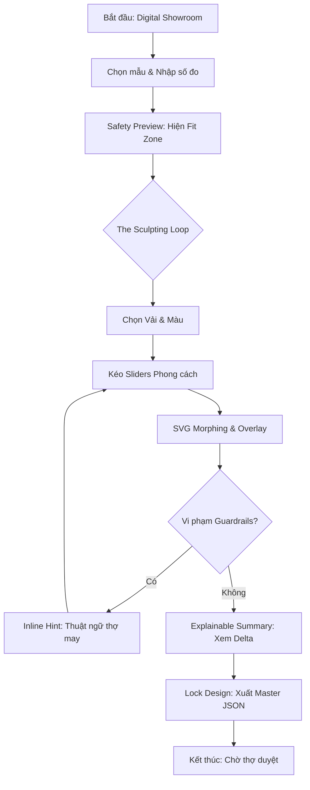
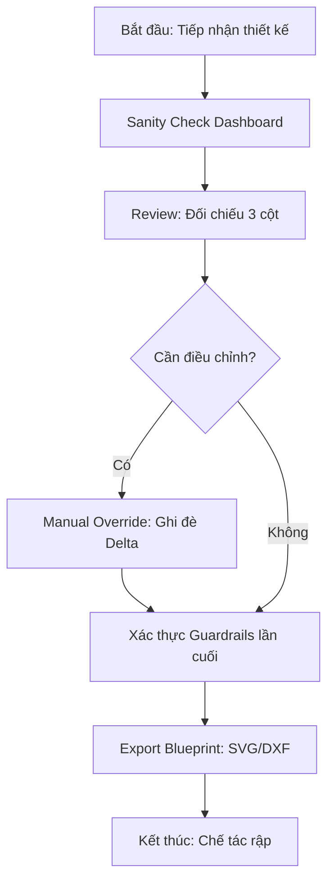
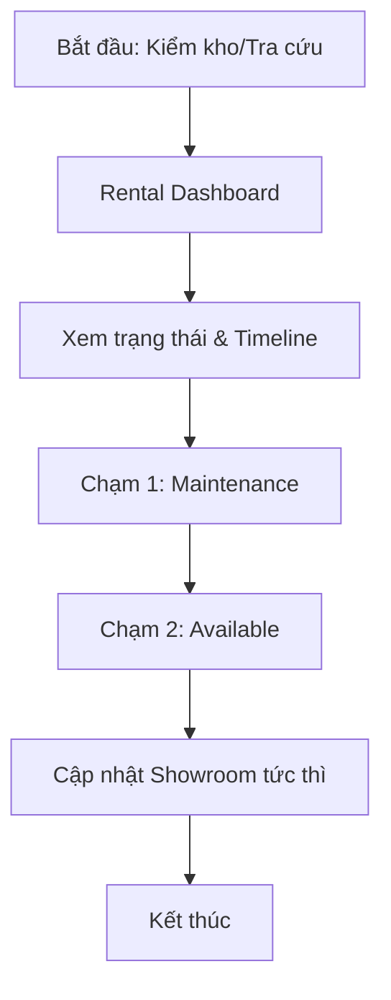

# UX Design Specification tailor_project

**Author:** Lem
**Date:** Saturday, February 21, 2026

---

## Executive Summary

### Project Vision
Xây dựng một "Giao thức giao tiếp mới" dựa trên AI, chuyển đổi ngôn ngữ cảm xúc của khách hàng thành thông số kỹ thuật chính xác. Dự án không chỉ là một công cụ may đo mà còn là một hệ sinh thái bảo tồn di sản tri thức của các nghệ nhân, mang lại sự vừa vặn hoàn hảo cả về vật lý lẫn thẩm mỹ.

### Target Users
1. **The Physical Outliers & Aesthetic Perfectionists:** Những khách hàng khao khát sự độc bản và vừa vặn tuyệt đối, muốn trực tiếp tham gia vào quá trình "lập trình" phong cách cá nhân.
2. **The Modern Makers (F2 Tailors):** Những người thợ trẻ kế thừa tri thức di sản thông qua hỗ trợ của dữ liệu số để tối ưu hóa việc sản xuất.
3. **Heritage Custodians (Founders):** Các nghệ nhân muốn số hóa bí kíp nghề nghiệp và quản lý tiệm may hiệu quả trong kỷ nguyên số.

### Key Design Challenges
- **Định lượng hóa cảm xúc:** Thiết kế các Sliders và Trụ cột phong cách sao cho phản ánh đúng trực giác người dùng nhưng vẫn ánh xạ chính xác sang Geometric Delta.
- **Minh bạch dữ liệu hình học:** Hiển thị các thay đổi phức tạp trên bản vẽ rập một cách đơn giản, dễ hiểu đối với cả khách hàng và thợ may.
- **Cân bằng Human-AI:** Duy trì vai trò của nghệ nhân trong vòng lặp (Human-in-the-loop) thông qua các tính năng Manual Override và Rule Editor.

### Design Opportunities
- **Adaptive Canvas:** Tạo ra không gian sáng tạo chung giữa khách hàng và AI, nơi mọi thay đổi đều được phản hồi trực quan theo thời gian thực.
- **Atelier Academy Experience:** Thiết kế quy trình "dạy" AI cho nghệ nhân một cách tự nhiên, biến việc nhập dữ liệu thành quá trình chia sẻ tri thức đầy cảm hứng.
- **Digital Showroom Integration:** Kết hợp liền mạch giữa việc thuê đồ sẵn có và đặt may mới, tạo ra một hành trình khách hàng xuyên suốt.

## 2. Core User Experience

### 2.1 Defining Experience: "The Sculpting Loop"
Trải nghiệm "chữ ký" của dự án là **"Vòng lặp Điêu khắc"** (The Sculpting Loop). Đây là sự kết hợp cân bằng giữa **60% Chính xác (Precision)** và **40% Cảm xúc (Emotion)**, giữ vững tính chuyên nghiệp của một công cụ Bespoke.
- **Haptic Golden Points:** Các hiệu ứng dừng "vật lý" hoặc đổi màu thanh trượt khi đạt tỷ lệ vàng của nghệ nhân.
- **Geometric Elasticity:** Morphing rập SVG có độ trễ vật lý nhẹ để mô phỏng sự co dãn của vải sống, duy trì kết nối hành động - thị giác mượt mà.

### 2.2 User Mental Model: "Parameterized Truth"
Xây dựng niềm tin thông qua sự minh bạch kép:
- **Visual Trust:** So sánh trực quan sự biến đổi qua Comparison Overlay (so với mẫu rập chuẩn).
- **Numerical Trust:** Hiển thị các con số ΔG biến thiên cực nhỏ (sai số ≤ 1mm) tinh tế ngay cạnh thanh điều chỉnh để khẳng định độ chính xác tuyệt đối.

### 2.3 Success Criteria & Performance Strategy
- **Fluidity (< 200ms):** Sử dụng `requestAnimationFrame` và tác động trực tiếp lên thuộc tính `path` của SVG (không trigger React state liên tục) để đảm bảo sự mượt mà tối đa (NFR10).
- **Non-intrusive Guardrails:** Cảnh báo dưới dạng **Inline Hint** hoặc **Contextual Tooltip** sử dụng thuật ngữ nghề may, tuyệt đối không dùng Modal để không phá vỡ dòng chảy (flow) sáng tạo.
- **Perceived Latency Strategy (The Weaving of Vision):** Chuyển đổi 15 giây chờ đợi suy luận AI (NFR1) thành trải nghiệm "kể chuyện hình học" (Storytelling Geometry), mô phỏng quá trình dệt vải và vẽ rập tay để duy trì sự gắn kết cảm xúc.

### 2.4 Novel UX Patterns: "Digital Pottery"
Ẩn dụ "Nặn gốm số" được giữ tinh tế dưới bề mặt, ưu tiên tính "vừa vặn" hơn là tính "giải trí". Sử dụng **Comparison Overlay** làm Baseline đối chiếu không đổi.

### 2.5 Experience Mechanics (Step-by-Step)
- **Step 0: Safety Preview (Baseline):** Hiển thị Base Pattern và Expected Fit Zone làm điểm tựa trước khi bắt đầu chỉnh sửa.
- **Step 1: Initiation:** Chọn Style Pillar (vd: Minimalist) → Hệ thống nạp bộ thông số Delta và Smart Rules tương ứng.
- **Step 2: Interaction:** Linh kéo Sliders (α) → Frontend tính toán tọa độ (x,y) thời gian thực dựa trên số đo khách và đặc tính vật liệu (Φ).
- **Step 3: Feedback:** Overlay bóng mờ rập chuẩn + Inline Guardrails giải thích lý do kỹ thuật bằng thuật ngữ thợ may (vd: "Hạ nách hơi cao, có thể gây cấn tay").
- **Step 4: Completion:** Nhấn "Lock Design" → Đóng gói toàn bộ dữ liệu vào **Master Geometry JSON (SSOT)** sẵn sàng cho sản xuất.

## Visual Design Foundation

### Color System: "Heritage Palette"
Hệ thống màu sắc được thiết kế để cân bằng giữa sự thâm trầm của di sản và sự tinh khiết của công nghệ hiện đại.
- **Màu chủ đạo (Primary):** **Indigo Depth (#1A2B4C)** - Màu chàm sâu sắc, mang lại cảm giác an tâm và chuyên nghiệp.
- **Màu bổ trợ (Secondary):** **Silk Ivory (#F9F7F2)** - Màu trắng ngà của tơ tằm, tạo không gian thoáng đãng, sang trọng.
- **Màu điểm nhấn (Accent):** **Heritage Gold (#D4AF37)** - Dùng cho các "Haptic Golden Points" và các tương tác quan trọng.
- **Màu chức năng:** Success (Green), Warning (Amber/Gold), Error (Red).

### Typography System: "Dual-Tone"
Sự kết hợp giữa vẻ đẹp cổ điển và độ chính xác kỹ thuật:
- **Headings (Tiêu đề):** Sử dụng phông chữ Serif (**Cormorant Garamond**) - Thanh lịch, mang tính di sản.
- **Body & Data (Nội dung & Dữ liệu):** Sử dụng phông chữ Monospaced (**JetBrains Mono**) hoặc Sans-serif (**Inter**) - Đảm bảo sự rõ ràng (CAD feel).

### Spacing & Layout Foundation: "Flexible Mode"
- **Hệ lưới:** Sử dụng hệ lưới 8px tiêu chuẩn.
- **Adaptive Density:**
    - **Customer Mode:** Bố cục thoáng đãng (Airy), nhiều khoảng trắng.
    - **Artisan Mode:** Mật độ thông tin cao hơn (Dense), tối ưu hóa hiển thị dữ liệu kỹ thuật.

### Accessibility Considerations
- **Độ tương phản:** Đảm bảo đạt tiêu chuẩn WCAG 2.1 (AA).
- **Kích thước mục tiêu:** Nút bấm và Sliders đạt tối thiểu 44x44px cho tương tác chạm.

## Design System Foundation

### 1.1 Design System Choice
Hệ thống thiết kế được lựa chọn là **Themeable System (Tailwind CSS kết hợp Headless UI/Radix UI)**.

### Rationale for Selection
1.  **Hiệu năng tối thượng (NFR10):** Tối ưu hóa dung lượng file và tốc độ render cho PWA.
2.  **Sự cân bằng Boutique & CAD:** Headless UI/Radix UI cung cấp các logic tương tác vững chắc (Sliders, Modals, Tooltips) nhưng hoàn toàn tự do về thẩm mỹ cao cấp.
3.  **Khả năng tùy biến cao:** Dễ dàng xây dựng các component đặc thù như Adaptive Canvas và Comparison Overlay.

### Implementation Approach
- **Công nghệ:** React/Next.js + Tailwind CSS.
- **Thành phần:** Radix UI (complex) + Headless UI (basic).
- **Vi chuyển động:** Framer Motion cho hiệu ứng mượt mà tinh tế.

## Design Direction Decision

### Design Directions Explored
Chúng ta đã khám phá 3 hướng thiết kế chủ đạo:
1.  **The Heritage Atelier:** Ưu tiên di sản và cảm xúc thương hiệu.
2.  **The Precision Lab:** Ưu tiên tính hiện đại và dữ liệu kỹ thuật.
3.  **Balanced Masterpiece:** Sự cân bằng linh hoạt thông qua mô hình **Dual-Mode UI**.

### Chosen Direction
Quyết định cuối cùng là **Hướng 3: Balanced Masterpiece**. Đây là hướng đi tối ưu để hiện thực hóa triết lý **"Sự sang trọng của Dữ liệu"**.

### Design Rationale
- **Tính thích ứng:** Sử dụng hệ thống **Mode Switch** để thay đổi mật độ thông tin tùy theo đối tượng người dùng mà vẫn giữ nhất quán về thương hiệu.
- **Xây dựng niềm tin:** Kết hợp giữa vẻ đẹp bay bổng (Serif) và sự minh bạch của thông số (Monospaced), tạo cảm giác vừa được thấu hiểu gu thẩm mỹ, vừa được bảo vệ về mặt kỹ thuật.
- **Tôn vinh giá trị:** Điểm nhấn Heritage Gold tạo kết nối vô hình giữa công nghệ và truyền thống may đo.

## Desired Emotional Response

### Primary Emotional Goals
Mục tiêu cảm xúc cốt lõi là **Sự An Tâm Tuyệt Đối (The Peace of Mind of a Perfect Fit)**.
- **Sự An Tâm & Tin Cậy:** Bảo chứng bởi Guardrails và sai số cực thấp (ΔG≤1mm).
- **Sự Kết Nối Di Sản:** Nghệ nhân cảm thấy tri thức được số hóa trường tồn.
- **Sự Tự Tin (Empowered):** Khách hàng có quyền năng "điêu khắc", thợ may tự tin thực thi mẫu rập phức tạp.

## UX Pattern Analysis & Inspiration

### Inspiring Products Analysis
Hệ thống được thiết kế theo mô hình **Giao diện Hai lớp (Dual-Mode Interface)**:
- **Adobe Lightroom (Instant Preview):** Cảm hứng cho phản hồi tức thì và chế độ Before/After.
- **Figma (Geometric Trust):** Cảm hứng cho Inspector Panel và Progressive Disclosure.
- **Apple Health (Contextual Alerts):** Cảm hứng cho các "Insight" theo vùng.
- **Tesla Configurator (Visualization):** Cảm hứng cho Fabric Cards mô phỏng độ rủ và lý tính vật liệu.

## User Journey Flows

### 1. Hành trình của Linh: "Điêu khắc sự Vừa vặn" (Bespoke Flow)
Hành trình trọng tâm nơi khách hàng biến cảm xúc thành hình học minh bạch.

### 2. Hành trình của Minh: "Sản xuất Chính xác" (Artisan Flow)
Hành trình đảm bảo tính thực thi và bảo tồn tri thức nghệ nhân.

### 3. Hành trình của Cô Lan: "Quản trị Di sản" (Heritage Admin Flow)
Tối ưu hóa vận hành thông qua tương tác "2 chạm" đơn giản.

## Component Strategy

### Design System Components
Tận dụng **Radix UI** và **Headless UI** cho các thành phần nền tảng: Navigation, Form Controls, Dialogs, Tooltips, Feedback.

### Custom Components
1. **Adaptive Canvas:** Không gian tương tác hiển thị rập SVG và Comparison Overlay.
2. **Heritage Slider:** Thanh điều chỉnh phong cách với Haptic Golden Points và trị số ΔG.
3. **Sanity Check Dashboard:** Bảng đối soát 3 cột minh bạch cho thợ Minh.
4. **Fabric Experience Card:** Hiển thị lý tính vải qua Texture và Animation độ rủ.
5. **2-Touch Status Badge:** Cập nhật trạng thái đồ thuê nhanh chóng cho Cô Lan.
6. **The Weaving of Vision (Loading Engine):** Hệ thống hiển thị tiến trình AI dưới dạng hoạt họa vẽ rập tay và dệt vải chàm.

## UX Consistency Patterns

### Button Hierarchy
- **Primary (Heritage Gold):** Hành động tiến tới (vd: *Lock Design*).
- **Secondary (Indigo Outline):** Hành động thay thế (vd: *Save Draft*).
- **Tool (Ghost):** Công cụ bổ trợ trên Canvas.

### Feedback Patterns: "Consultative Alerts"
- **Inline Guardrail Hints:** Cảnh báo dưới dạng tooltip cạnh Slider, không dùng Modal.
- **Real-time Geometric Indicators:** Hiển thị sai số ΔG (mm) biến thiên tức thì.
- **Micro-Toasts:** Xác nhận các hành động ngầm ngắn gọn.

### Navigation & Disclosure
- **Dual-Mode Toggle:** Nút chuyển đổi Boutique/CAD cố định.
- **Progressive Disclosure:** Tiết lộ thông tin kỹ thuật lũy tiến theo yêu cầu hoặc cảnh báo.

## Responsive Design & Accessibility

### Responsive Strategy: "Dual-Device Synergy"
- **Tablet/Desktop (Artisan):** Ưu tiên giao diện **Split-view** để đối soát dữ liệu rập song song với Canvas. Tối ưu cho bút Stylus và cảm ứng.
- **Mobile (Customer):** Ưu tiên bố cục dọc với **Bottom Sheet Interaction**. Tối ưu thao tác bằng một tay.

### Breakpoint Strategy
- **Mobile (< 768px):** Chế độ "Sculpting" rút gọn.
- **Tablet (768px - 1024px):** Kích hoạt Dual-Mode UI cơ bản.
- **Desktop (> 1024px):** Chế độ CAD toàn phần.

### Accessibility Strategy (WCAG 2.1 AA)
- **Visual Contrast:** Indigo/Ivory đạt tỷ lệ 4.5:1.
- **Touch Targets:** Sliders và Buttons tối thiểu 44x44px.
- **Semantic ARIA:** Hỗ trợ Screen Reader cho các biến đổi ΔG.
- **Heritage Legibility:** serif fonts được tối ưu độ giãn dòng cho người lớn tuổi.

### Testing Strategy
- Kiểm thử thực tế trên iPad và Smartphone đa dạng.
- Stress test hiệu năng mạng và SVG morphing.
- Tự động kiểm tra A11y bằng Lighthouse và axe-core.

## Micro-Experience: The Weaving of Vision

Đây là chiến lược xử lý độ trễ (Latency) 15 giây, biến quá trình suy luận của AI thành một trải nghiệm thương hiệu đậm chất di sản.

### 1. Phân rã giai đoạn (The Sequence)

| Thời gian | Giai đoạn | Hiệu ứng thị giác (Visual) | Micro-copy & Proverb |
| :--- | :--- | :--- | :--- |
| **0s - 3s** | Lắng nghe | Các tính từ chùm (Indigo silk threads) bay vào tâm Canvas. | "Đang cảm thụ phong cách của bạn..."   *“Người thợ giỏi lắng nghe bằng cả trái tim.”* |
| **3s - 10s** | Điêu khắc | Đường rập SVG mờ hiện ra, các node di chuyển theo hiệu ứng "vẽ tay" (sketching). | "Đang điêu khắc hình học dựa trên số đo..."   *“Cầm kéo vững tay, đo lòng khách thấu.”* |
| **10s - 15s** | Bảo chứng | Dấu ấn Heritage Gold Seal quét qua bản vẽ để kiểm tra Guardrails. | "Nghệ nhân đang thẩm định bản vẽ..."   *“Đường kim đi trước, niềm tin theo sau.”* |

### 2. Nguyên tắc Tương tác
- **Smooth Transition:** Sử dụng `framer-motion` để chuyển cảnh mượt mà giữa các câu châm ngôn.
- **Visual Continuity:** Bản vẽ Blueprint hiện ra dần dần từ những nét vẽ phác thảo của giai đoạn 2, tạo sự nhất quán tuyệt đối.
- **Soft Audio:** Tiếng lướt lụa (silk rustle) nhẹ nhàng tăng dần sự tò mò của khách hàng.

<!-- UX design content will be appended sequentially through collaborative workflow steps -->
