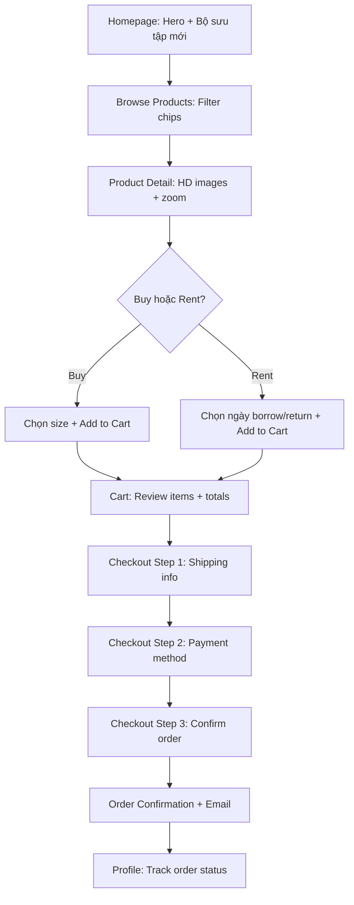
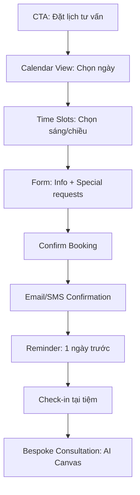
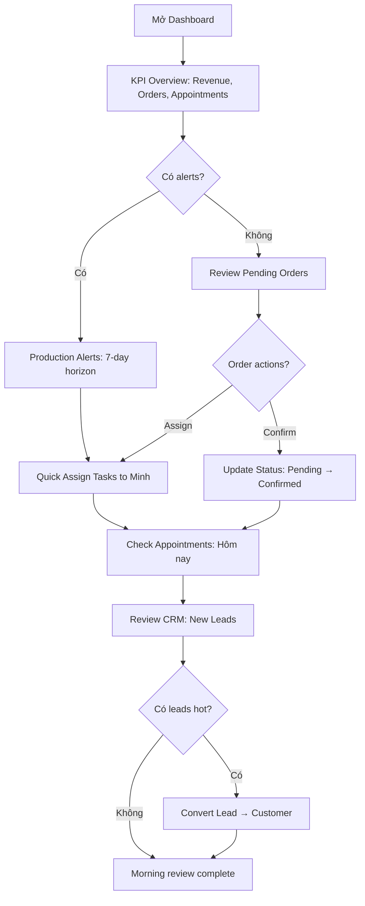
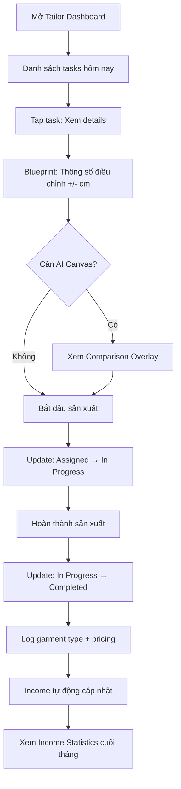
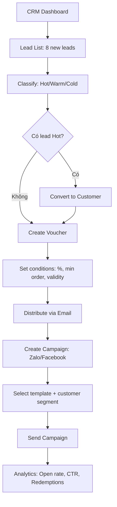

# UX Design Specification tailor_project (Revision 2)

**Author:** Lem
**Date:** Monday, March 10, 2026
**Revision Note:** Major UX revision to align with PRD pivot (March 10, 2026) — expanded from AI Bespoke Tool to full E-commerce + Booking + AI Bespoke Platform.

---

## Executive Summary

### Project Vision
Xây dựng nền tảng tổng hợp kết hợp AI Bespoke Engine với E-commerce và Operations backbone, cho phép tiệm may di sản Áo dài Việt Nam số hóa toàn bộ hoạt động — từ bán hàng, cho thuê, quản lý đơn hàng, đặt lịch tư vấn, đến tối ưu sản xuất và CRM — mà không đánh mất chất lượng nghệ thuật thủ công truyền thống.

### Target Users
1. **Customer (Linh):** Duyệt bộ sưu tập, mua/thuê Áo dài online, đặt lịch tư vấn Bespoke, theo dõi đơn hàng và lịch trả đồ. Cần trải nghiệm E-commerce mượt mà kết hợp với công cụ AI tùy chỉnh phong cách đặc biệt.
2. **Tailor (Minh F2):** Nhận task được giao, thực thi sản xuất theo AI-guided Blueprint, cập nhật trạng thái công việc, theo dõi thu nhập theo tháng. Cần giao diện CAD-grade rõ ràng, hiệu quả.
3. **Owner (Cô Lan):** Quản lý tổng hợp Revenue, Orders, Appointments, Products, Inventory, Tasks, Leads, Vouchers, Campaigns. Cần dashboard thông minh giảm tải nhận thức nhưng vẫn toàn diện.

### Key Design Challenges
- **Dual Identity:** Platform vừa là E-commerce thân thiện (Customer) vừa là production tool (Tailor/Owner) — UX phải phục vụ cả hai mà không gây confuse.
- **Role Complexity:** 15+ modules chức năng yêu cầu hệ thống Information Architecture vững chắc và navigation rõ ràng.
- **Purchase Psychology Gap:** Cầu nối giữa hành vi mua nhanh (Browse → Buy) và trải nghiệm sâu (Bespoke Consultation) — hai tâm lý hoàn toàn khác biệt.
- **Mobile E-commerce + Desktop CAD:** Mobile-first cho E-commerce (≥375px) nhưng Desktop-priority cho AI Canvas.
- **Owner Cognitive Overload:** Dashboard tổng hợp Revenue, Orders, Appointments, Tasks, CRM, Vouchers — cần thiết kế giảm tải nhận thức.

### Design Opportunities
- **"Seamless Craft-to-Commerce" Journey:** Hành trình xuyên suốt Browse → Buy → Book → Bespoke → Follow-up — điểm khác biệt cạnh tranh duy nhất.
- **Smart Hub & Spoke Dashboard:** Tổng quan (Hub) + deep-dive modules (Spokes) cho Owner, giữ giao diện sạch sẽ nhưng toàn diện.
- **Contextual Role Adaptation:** Giao diện tự động thích ứng theo vai trò đăng nhập — Adaptive Density phù hợp từng persona.
- **Heritage E-commerce Branding:** Kết hợp thẩm mỹ di sản vào trải nghiệm mua sắm — tạo cảm giác "boutique luxury" thay vì "generic marketplace".

## Core User Experience

### Defining Experience: "Tam Giác Vàng" (The Golden Triangle)
Trải nghiệm cốt lõi của tailor_project được xây dựng trên **ba trụ cột hành động song hành**, mỗi trụ cột phục vụ một nhu cầu khác nhau nhưng cùng hướng đến một đích đến duy nhất — **First-Fit Perfection:**

1. **Commerce Flow (Browse → Buy/Rent):** Hành vi mua sắm nhanh, cảm xúc — phổ biến nhất về số lượng user. Mục tiêu: tối thiểu friction, tối đa chuyển đổi.
2. **Booking Flow (Discover → Book Bespoke):** Cầu nối giữa digital và physical — biến traffic online thành cuộc tư vấn thực tại cửa tiệm.
3. **Operations Flow (Manage → Produce → Deliver):** Nhịp đập hàng ngày của Owner và Tailor — đảm bảo vận hành mượt mà từ đơn hàng đến sản phẩm hoàn thiện.

Cả ba flow đều là "Make or Break" — không có flow nào được phép yếu vì chúng tạo thành vòng lặp kinh doanh khép kín: **Commerce brings customers → Booking deepens relationships → Operations delivers value → Customer returns.**

### Platform Strategy

| Ngữ cảnh | Thiết bị ưu tiên | Chiến lược |
|:---|:---|:---|
| **E-commerce Pages** (Homepage, Product List, Detail, Cart, Checkout) | **Mobile-first** (≥375px) | Tối ưu thao tác một tay, lazy loading, bottom navigation |
| **Owner Dashboard** (Revenue, Orders, Appointments, CRM) | **Desktop/Tablet-first** | Split-view, data-dense layout, adaptable cho mobile |
| **Tailor Dashboard** (Tasks, Production, Income) | **Desktop/Tablet-first** | Tối ưu hiển thị thông số kỹ thuật, status updates nhanh |
| **AI Canvas** (Sculpting Loop, Bespoke — Phase sau) | **Desktop/Tablet-priority** | Stylus-friendly, SVG rendering performance |
| **Booking** | **Cross-platform** | Calendar responsive, hoạt động tốt trên mọi thiết bị |

Không yêu cầu offline functionality ở MVP. Mọi thao tác đều cần kết nối mạng.

### Effortless Interactions
Triết lý "Zero-Thought" được áp dụng xuyên suốt — mọi hành động chính phải cảm thấy tự nhiên và không cần hướng dẫn:

- **Browse → Cart → Checkout:** Tối đa 3 bước từ sản phẩm đến xác nhận đơn hàng. Không redirect không cần thiết, không form dư thừa.
- **Booking:** Chọn ngày/giờ → Điền info → Xác nhận. Calendar trực quan, slot sáng/chiều rõ ràng, confirmation tức thời.
- **Owner Morning Glance:** Mở Dashboard → Thấy ngay Revenue hôm nay, Pending Orders, Upcoming Appointments, Production Alerts. Không cần click thêm bất kỳ thao tác nào.
- **Tailor Task Flow:** Mở Dashboard → Thấy danh sách task → Tap status update. 1-2 thao tác cho mỗi task.
- **Product Management (Owner):** CRUD sản phẩm với form thông minh — auto-fill Season tags, image upload kéo thả, inventory status toggle.

### Critical Success Moments

**🏆 The Ultimate Moment: "Sự Thấu Hiểu" (The Understanding)**

Khoảnh khắc thành công quan trọng nhất là khi **Linh nhận được bộ Áo dài vừa vặn cả về số đo lẫn thẩm mỹ ngay lần đầu tiên (First-Fit)**. Đây không đơn thuần là sự vừa vặn vật lý — mà là bằng chứng rằng **Physical-Emotional Compiler** đã thành công trong việc dịch thuật cảm xúc thành hình học. Linh không chỉ nhận được một món đồ, mà nhận được **sự thấu hiểu từ nghệ nhân thông qua công nghệ** — giá trị khác biệt cạnh tranh lớn nhất. Target: >90% First-fit rate.

**Các Success Moments phụ trợ (theo thứ tự hành trình):**

1. **"Discovery Delight"** — Linh lần đầu vào Homepage, thấy bộ sưu tập đẹp, cảm giác "đây là nơi mình muốn mua Áo dài."
2. **"Effortless Purchase"** — Checkout hoàn tất, nhận confirmation — không gặp friction nào.
3. **"Appointment Confidence"** — Booking xác nhận, Linh biết chính xác lúc nào đến, gặp ai.
4. **"Morning Command"** — Cô Lan mở Dashboard sáng sớm, 5 giây nắm được toàn cảnh hoạt động.
5. **"Artisan Achievement"** — Minh hoàn thành task cuối ngày, thấy thu nhập tháng tăng.

### Experience Principles

1. **"Zero-Thought Commerce"** — Mọi hành động mua sắm phải tự nhiên đến mức user không cần hướng dẫn. Nếu user phải dừng lại nghĩ "bước tiếp theo là gì?", thiết kế đã thất bại.
2. **"First Glance = Full Picture"** — Dashboard Owner/Tailor phải truyền tải thông tin quan trọng nhất trong 5 giây đầu tiên, không cần click thêm.
3. **"Heritage-Tech Harmony"** — Mọi điểm chạm giao diện phải kết hợp hài hòa giữa thẩm mỹ di sản và sức mạnh công nghệ — không quá "vintage" cũng không quá "techy".
4. **"Emotional Translation Transparency"** — Khi AI can thiệp (Bespoke flow), quá trình dịch thuật cảm xúc → hình học phải minh bạch và trực quan — user phải **thấy** và **hiểu** AI đang làm gì.
5. **"Role-Native Interface"** — Giao diện phải cảm thấy như được thiết kế riêng cho từng vai trò — Customer thấy E-commerce boutique, Owner thấy Command Center, Tailor thấy Production Workstation.

## Desired Emotional Response

### Primary Emotional Goals

Mỗi vai trò có một "cảm xúc đích" khác nhau, nhưng tất cả đều hướng đến một cảm giác chung: **"Nơi này hiểu tôi."**

| Vai trò | Cảm xúc chính | Cảm xúc phụ | Biểu hiện UX |
|:---|:---|:---|:---|
| **Linh (Customer)** | Được thấu hiểu (Understood) | An tâm (Reassured) | Sản phẩm phù hợp ngay lần đầu, checkout mượt mà, thông tin rõ ràng |
| **Minh (Tailor)** | Tự tin (Confident) | Thành tựu (Accomplished) | Blueprint dễ đọc, task list rõ ràng, income tracking minh bạch |
| **Cô Lan (Owner)** | Kiểm soát (In Control) | Yên tâm (At Ease) | Dashboard toàn cảnh, alerts chủ động, CRM hiệu quả |

**Cảm xúc Word-of-Mouth (khiến user kể cho bạn bè):**
- "Lần đầu mua Áo dài online mà vừa khít luôn!" — WOW factor từ First-Fit
- "Mua đồ ở đây đẹp và sang, không giống Shopee" — Premium Heritage Feel
- "Đặt lịch rồi đến tiệm, mọi thứ đã sẵn sàng chờ mình" — Seamless O2O Experience

### Emotional Journey Mapping

| Giai đoạn | Cảm xúc mục tiêu | Anti-pattern (tránh) |
|:---|:---|:---|
| **Discovery** (lần đầu vào Homepage) | Tò mò + Ấn tượng ("Đẹp quá, muốn xem thêm") | Nhàm chán, generic |
| **Browsing** (xem sản phẩm) | Hứng thú + Tin tưởng ("Chất lượng thật sự") | Nghi ngờ, thiếu thông tin |
| **Purchase/Rent** (Cart → Checkout) | Tự tin + Dễ dàng ("Nhanh gọn quá") | Lo lắng, confuse |
| **Booking** (đặt lịch tư vấn) | An tâm + Chờ đợi ("Biết chính xác sẽ được gì") | Không chắc chắn |
| **Bespoke Consultation** (AI Canvas) | Kinh ngạc + Kiểm soát ("AI hiểu mình thật!") | Mất kiểm soát, black-box |
| **Delivery & First-Fit** | Hạnh phúc + Tự hào ("Đúng là bộ đồ của mình") | Thất vọng |
| **Return Visit** | Quen thuộc + Trung thành ("Chỉ muốn mua ở đây") | Lãng quên |
| **Error/Failure** | Được hỗ trợ + Vẫn kiểm soát ("Không sao, hệ thống đang xử lý") | Hoang mang, bất lực |

### Micro-Emotions

Bốn cặp micro-emotion cốt lõi được ưu tiên thiết kế:

1. **✅ Confidence vs ❌ Confusion:** Mọi bước trong flow phải rõ ràng — user không bao giờ tự hỏi "mình đang ở đâu?" hoặc "bước tiếp theo là gì?"
2. **✅ Trust vs ❌ Skepticism:** Thông tin sản phẩm minh bạch (ảnh thật, size chart chi tiết, reviews), chính sách rõ ràng, payment security visible.
3. **✅ Delight vs ❌ Boredom:** Micro-animations, Heritage visual touches, và premium feel tại mọi điểm chạm — không bao giờ cho phép giao diện cảm thấy "nhạt".
4. **✅ Accomplishment vs ❌ Frustration:** Mỗi hành động hoàn thành đều có feedback tích cực — toast notifications, progress indicators, celebration moments.

### Design Implications

| Cảm xúc mục tiêu | Chiến lược UX |
|:---|:---|
| **Được thấu hiểu** | Personalization hints, AI explanation panels, "For You" recommendations |
| **An tâm** | Progress bars, order tracking, confirmation emails, transparent policies |
| **Tự tin** | Clear CTAs, consistent navigation, predictable interactions, undo capability |
| **Kiểm soát** | Dashboard KPIs at-a-glance, filter/sort everywhere, batch actions |
| **Thành tựu** | Income charts with trends, task completion celebrations, streak indicators |
| **Premium Feel** | Heritage typography, curated color palette, smooth transitions, HD imagery |

**Chiến lược Error Handling — "Graceful Recovery":**
- Không bao giờ hiển thị technical error messages. Luôn dùng ngôn ngữ tự nhiên.
- Cung cấp hành động tiếp theo rõ ràng ("Thử lại" / "Liên hệ hỗ trợ" / "Xem đơn hàng").
- Giữ trạng thái user (form data, cart) — không bao giờ mất dữ liệu khi có lỗi.
- Skeleton loading thay vì spinner để duy trì spatial context.

### Emotional Design Principles

1. **"Understood, Not Served"** — User phải cảm thấy được thấu hiểu như khách VIP, không phải "một trong hàng ngàn" — mỗi tương tác phản ánh sự quan tâm cá nhân.
2. **"Confidence Through Clarity"** — Sự tự tin không đến từ tính năng nhiều, mà từ sự rõ ràng tuyệt đối — mỗi element trên màn hình đều có lý do tồn tại.
3. **"Graceful Always"** — Cả khi thành công lẫn thất bại, hệ thống luôn giữ phong thái điềm tĩnh và sang trọng — error states cũng phải đẹp.
4. **"Heritage Warmth"** — Công nghệ phải cảm thấy ấm áp và nhân văn, không lạnh lẽo — mỗi pixel phải mang hơi thở di sản Việt Nam.

## UX Pattern Analysis & Inspiration

### Inspiring Products Analysis

Hệ thống được thiết kế dựa trên cảm hứng từ 6 sản phẩm hàng đầu, mỗi sản phẩm đóng góp một khía cạnh UX khác nhau:

**1. Zara / UNIQLO Online (E-commerce Premium)**
- **Điểm mạnh:** Product grid tối giản nhưng ấn tượng — ảnh lớn, ít text, để sản phẩm tự nói. Mobile-first navigation với bottom tabs. Checkout tối ưu 2-3 bước.
- **Bài học:** Mật độ thông tin vừa phải cho Customer — không nhồi nhét, để hình ảnh Áo dài chiếm spotlight. Filter chips thay vì sidebar filter trên mobile.

**2. Booksy / Calendly (Booking + O2O)**
- **Điểm mạnh:** Calendar view trực quan với time slots rõ ràng. Booking confirmation flow: chọn → điền → xác nhận trong 3 bước. Reminder system tự động (email + push).
- **Bài học:** Áp dụng trực tiếp cho Appointment Booking — calendar grid với available/unavailable slots, confirmation instant, và reminder workflow.

**3. Shopify Admin (Operations Dashboard)**
- **Điểm mạnh:** Dashboard mở ra = thấy ngay KPIs (doanh thu, đơn hàng, visitors). Sidebar navigation phân cấp rõ ràng. Order management với status pipeline visual.
- **Bài học:** Mô hình "Hub & Spoke" cho Owner Dashboard — overview page + deep-dive modules. Status badges màu sắc cho order flow. Quick actions trên mỗi row.

**4. Adobe Lightroom / Figma (AI-Powered Tool)**
- **Điểm mạnh:** Real-time preview khi kéo slider. Before/After comparison (split view). Inspector panel hiển thị thông số chi tiết. Non-destructive editing.
- **Bài học:** Giữ nguyên từ UX v1 — áp dụng cho AI Bespoke Canvas. Slider interactions với instant SVG morphing. Comparison Overlay. Progressive disclosure cho thông số kỹ thuật.

**5. Hermès Online (Heritage Luxury)**
- **Điểm mạnh:** Storytelling qua visual — mỗi sản phẩm là một câu chuyện. Typography thanh lịch kết hợp Serif + Sans-serif. Transition mượt mà giữa các trang. Cảm giác "boutique" chứ không phải "marketplace".
- **Bài học:** Heritage visual language cho toàn bộ platform — Cormorant Garamond cho headings, micro-animations tinh tế, color palette thâm trầm (Indigo + Ivory + Gold). Trang About/Brand Story phải đẹp như editorial.

**6. Linear / Notion (Task Management)**
- **Điểm mạnh:** Task list clean với status badges. Keyboard shortcuts cho power users. Progress tracking visual. Minimalist nhưng information-dense.
- **Bài học:** Áp dụng cho Tailor Dashboard — task list với status chips (Assigned/In Progress/Completed), production timeline visual, income summary cards. Quick status toggle không cần mở detail.

### Transferable UX Patterns

**Navigation Patterns:**
- **Bottom Tab Bar (Zara)** → E-commerce mobile navigation cho Customer: Home, Products, Cart, Bookings, Profile
- **Sidebar Navigation (Shopify)** → Owner/Tailor Dashboard: collapsible sidebar với section grouping
- **Breadcrumb + Back (UNIQLO)** → Product detail navigation, luôn có đường về

**Interaction Patterns:**
- **Filter Chips (Zara/UNIQLO)** → Product filtering: Season, Color, Material, Size — chips thay vì dropdown trên mobile
- **Calendar Grid (Booksy/Calendly)** → Appointment booking: visual time slots, available/booked states
- **Slider + Live Preview (Lightroom)** → AI Canvas: kéo slider = SVG morphing tức thì
- **Quick Status Toggle (Linear)** → Task/Order status update: tap để cycle qua states
- **Drag & Drop (Notion)** → Product image upload, task reordering

**Visual Patterns:**
- **Hero Product Image (Hermès)** → Product detail: ảnh HD chiếm 60% viewport, zoom gesture
- **KPI Cards (Shopify)** → Dashboard overview: Revenue, Orders, Appointments trong cards có trend indicators
- **Split View (Figma)** → AI Canvas: pattern view + inspector panel song song
- **Status Pipeline (Shopify)** → Order flow visualization: Pending → Confirmed → Production → Shipped → Delivered

### Anti-Patterns to Avoid

1. **❌ "Shopee Syndrome"** — Giao diện nhồi nhét banner, flash sale, pop-up khuyến mãi. tailor_project là boutique, không phải marketplace.
2. **❌ "Dashboard Overload"** — Hiển thị tất cả metrics trên một trang. Phải progressive disclosure — chỉ show essentials, detail khi click.
3. **❌ "Generic Calendar"** — Booking calendar nhạt nhẽo kiểu form HTML. Phải visual, interactive, có feedback tức thì.
4. **❌ "Tech-First Language"** — Error messages kiểu "Error 500" hoặc technical jargon. Luôn dùng ngôn ngữ tự nhiên.
5. **❌ "Infinite Scroll Hell"** — Product listing không có anchor points. Phải có pagination hoặc "Load more" với position memory.
6. **❌ "Black-Box AI"** — AI recommendations không giải thích. Luôn hiển thị reasoning: "Đề xuất vải Silk-Crepe vì phù hợp với style 'Thanh tao' và dáng người của bạn."

### Design Inspiration Strategy

**What to Adopt (Áp dụng nguyên bản):**
- Calendar booking flow (Booksy/Calendly) → Appointment Booking module
- KPI dashboard layout (Shopify Admin) → Owner Dashboard overview
- Task list with status chips (Linear) → Tailor task management
- Filter chips pattern (Zara) → Product listing mobile

**What to Adapt (Điều chỉnh cho phù hợp):**
- Product grid (Zara/UNIQLO) → Thêm buy/rent toggle và Heritage visual treatment (Hermès)
- Before/After comparison (Lightroom) → Customize cho SVG pattern overlay với thuật ngữ Việt Nam
- Sidebar navigation (Shopify) → Điều chỉnh cho 3 roles khác nhau, ẩn/hiện theo RBAC
- Status pipeline (Shopify) → Mở rộng cho cả Order và Rental flows

**What to Avoid (Không áp dụng):**
- Marketplace-style layout (Shopee/Tiki) → Quá generic cho Heritage brand
- Complex onboarding wizards (Salesforce) → Quá nặng cho Cô Lan
- Gamification elements (Duolingo) → Không phù hợp với premium feel
- Chat-first support (Intercom) → Phase sau, MVP dùng email + phone

## Design System Foundation

### 1.1 Design System Choice
Hệ thống thiết kế được lựa chọn là **Themeable System (Tailwind CSS v4 + Radix UI + Headless UI + Framer Motion)**.

### Rationale for Selection
1. **Full Visual Control:** Radix UI và Headless UI là headless components — cung cấp logic tương tác vững chắc (accessible, keyboard navigation) nhưng hoàn toàn tự do về thẩm mỹ. Cho phép xây dựng Heritage visual language mà không bị ràng buộc bởi design system có sẵn.
2. **Performance (NFR17):** Headless architecture tối ưu bundle size — chỉ import logic cần thiết, không carry theo CSS/styles không dùng. Phù hợp cho Canvas < 200ms response.
3. **Tailwind CSS v4 Native:** Đã xác định trong project tech stack. Radix UI và Headless UI đều tích hợp tối ưu với Tailwind — không conflict, không wrapper overhead.
4. **Accessibility Built-in:** Cả Radix UI và Headless UI đều đạt WCAG 2.1 AA out-of-the-box — keyboard navigation, ARIA labels, focus management — đáp ứng NFR20.
5. **Framer Motion cho Heritage Feel:** Micro-animations mượt mà, page transitions tinh tế, loading states có hồn — biến giao diện từ "functional" thành "experiential".

### Implementation Approach

**Component Architecture:**

```
Tailwind CSS v4 (Design Tokens + Utilities)
    ├── Radix UI Primitives
    │   ├── Dialog / AlertDialog (Modals, confirmations)
    │   ├── DropdownMenu (Context menus, actions)
    │   ├── Tooltip (Inline hints, guardrail warnings)
    │   ├── Tabs (Dashboard sections, product detail tabs)
    │   ├── Accordion (FAQ, product specs)
    │   ├── Slider (Style intensity, AI Canvas controls)
    │   ├── Select (Filters, form selects)
    │   └── Toast (Notifications, status updates)
    ├── Headless UI
    │   ├── Menu (Navigation menus)
    │   ├── Switch (Toggles: buy/rent, status)
    │   ├── Listbox (Dropdown selects)
    │   ├── Combobox (Search + select: customer lookup)
    │   └── Disclosure (Collapsible sections)
    ├── Framer Motion
    │   ├── Page Transitions (fade, slide between routes)
    │   ├── Micro-interactions (button press, card hover)
    │   ├── Loading States ("Weaving of Vision" AI loading)
    │   ├── Layout Animations (list reorder, filter results)
    │   └── Scroll Animations (Homepage hero, product reveals)
    └── Custom Components (Domain-specific)
        ├── Heritage Slider (Style intensity + Haptic Golden Points)
        ├── Adaptive Canvas (SVG pattern + Comparison Overlay)
        ├── KPI Card (Revenue/Orders with trend indicators)
        ├── Status Badge (Order/Task/Rental status chips)
        ├── Booking Calendar (Time slot grid with availability)
        ├── Product Card (Buy/Rent toggle + Heritage visual)
        └── Task Row (Quick status toggle + deadline indicator)
```

### Customization Strategy

**Design Tokens (Tailwind CSS v4 config):**
- Colors: Heritage Palette (Indigo Depth, Silk Ivory, Heritage Gold, functional colors)
- Typography: Dual-Tone system (Cormorant Garamond headings, Inter body, JetBrains Mono data)
- Spacing: 8px grid system
- Shadows: Subtle, layered shadows cho depth mà không nặng nề
- Border Radius: Consistently rounded (8px default) — soft nhưng không quá tròn
- Transitions: Smooth defaults (200ms ease-out) — Heritage feel

**Component Theming Layers:**
1. **Base Layer:** Radix/Headless primitives — logic + accessibility
2. **Style Layer:** Tailwind utilities — spacing, colors, typography
3. **Animation Layer:** Framer Motion — transitions, micro-interactions
4. **Variant Layer:** Role-based variants — Customer (airy), Owner/Tailor (dense)

## Defining Core Experience

### Defining Experience per Role

**Customer (Linh): "Browse → Buy/Book → First-Fit"**
Trải nghiệm xuyên suốt: **"Tôi tìm thấy bộ Áo dài đẹp, mua nhanh gọn, đặt lịch tư vấn, và nhận được sản phẩm vừa vặn cả số đo lẫn tâm hồn ngay lần đầu."**

**Owner (Cô Lan): "Morning Command Center"**
Mỗi sáng mở Dashboard, **5 giây đã biết**: hôm nay có bao nhiêu đơn, doanh thu bao nhiêu, ai cần chú ý, task nào cần assign.

**Tailor (Minh): "Production Flow"**
Task list rõ ràng, Blueprint chi tiết, update status 1 tap. **"Nhận task → Xem Blueprint → Done."**

### User Mental Model

| Vai trò | Mental Model | Ẩn dụ | Pattern |
|:---|:---|:---|:---|
| **Customer** | Mua sắm online nhưng premium hơn | Đi vào boutique, không phải siêu thị | **Novel:** E-commerce instant + Bespoke appointment trong cùng hành trình |
| **Owner** | Sổ tay kinh doanh số hóa | Đọc báo cáo buổi sáng | **Established:** KPI Dashboard (Shopify) + Quick Actions (Linear) |
| **Tailor** | Bảng công việc hàng ngày | Nhận phiếu giao việc | **Established:** Task board (Linear) + Technical specs display |

### Success Criteria for Core Experience

- **Customer:** Từ Homepage đến Order Confirmation trong **≤ 3 phút** (không đếm thời gian duyệt sản phẩm). Conversion rate > 3%.
- **Owner:** Từ mở app đến nắm toàn cảnh trong **≤ 5 giây**. Mọi task assign trong **≤ 2 taps**.
- **Tailor:** Từ nhận task đến bắt đầu sản xuất trong **≤ 30 giây** (xem Blueprint + hiểu yêu cầu).
- **Booking:** Từ CTA đến confirmation trong **≤ 60 giây** (3 bước: ngày/giờ → info → xác nhận).

### Novel UX Patterns

**Sự kết hợp "Commerce + Craft" trong cùng một hành trình** là điểm khác biệt lớn nhất:
- Khách hàng có thể mua Áo dài có sẵn (instant) HOẶC đặt lịch tư vấn Bespoke (deep) — cả hai trong cùng giao diện.
- CTA "Book Bespoke" xuất hiện contextual trên Product Detail — không tách biệt mà liền mạch.
- Owner Dashboard tổng hợp cả E-commerce orders và Bespoke appointments trên cùng timeline.

### Experience Mechanics

**Customer Commerce Flow:**
1. **Initiation:** Homepage hero → Browse bộ sưu tập → Filter (Season/Color/Size)
2. **Interaction:** Tap product → Xem HD images + zoom → Chọn Buy/Rent + Sizes → Add to Cart
3. **Feedback:** Cart badge update + micro-animation. Checkout: progress indicator 3 bước
4. **Completion:** Order confirmation → Email → Tracking page

**Customer Booking Flow:**
1. **Initiation:** CTA "Đặt lịch tư vấn" → Calendar view
2. **Interaction:** Chọn ngày → Chọn slot sáng/chiều → Điền info + requests
3. **Feedback:** Confirmation instant + countdown đến ngày hẹn
4. **Completion:** Reminder 1 ngày trước → Check-in tại tiệm

**Owner Morning Routine:**
1. **Initiation:** Mở app → Dashboard auto-load
2. **Interaction:** Scan KPI cards → Tap "Pending Orders" → Quick assign tasks
3. **Feedback:** Real-time status badges, production alerts with countdown
4. **Completion:** Tất cả tasks đã assign → Confidence to start the day

**Tailor Production Flow:**
1. **Initiation:** Mở Tailor Dashboard → Danh sách tasks hôm nay
2. **Interaction:** Tap task → Xem Blueprint + điểm điều chỉnh (+/- cm) → Bắt đầu sản xuất
3. **Feedback:** Status update (Assigned → In Progress) + income preview
4. **Completion:** Mark Completed → Income tự động cập nhật → Achievement feeling

## Visual Design Foundation

### Color System: "Heritage Palette v2"

Hệ thống màu sắc kế thừa từ v1 và mở rộng cho E-commerce + Operations:

| Token | Màu | Hex | Sử dụng |
|:---|:---|:---|:---|
| **Primary** | Indigo Depth | `#1A2B4C` | Header, sidebar, primary buttons, text headings |
| **Surface** | Silk Ivory | `#F9F7F2` | Background chính, cards, content areas |
| **Accent** | Heritage Gold | `#D4AF37` | CTAs quan trọng (Buy, Book, Lock Design), highlights |
| **Background** | Pure White | `#FFFFFF` | Dashboard backgrounds, form areas |
| **Text Primary** | Deep Charcoal | `#1A1A2E` | Body text, labels |
| **Text Secondary** | Warm Gray | `#6B7280` | Placeholder, secondary info |
| **Success** | Jade Green | `#059669` | Completed, Available, Payment success |
| **Warning** | Amber | `#D97706` | Pending, nearing deadline, guardrail hints |
| **Error** | Ruby Red | `#DC2626` | Failed, overdue, constraint violations |
| **Info** | Slate Blue | `#3B82F6` | Links, informational messages |

### Typography System: "Dual-Tone v2"

Sự kết hợp giữa vẻ đẹp cổ điển và độ chính xác kỹ thuật:

| Role | Font | Weight | Sử dụng |
|:---|:---|:---|:---|
| **Display/H1** | Cormorant Garamond | 600 | Page titles, Hero headings, Brand statements |
| **H2-H3** | Cormorant Garamond | 500 | Section headings, Product names |
| **Body** | Inter | 400/500 | Body text, descriptions, form labels |
| **Data/Numbers** | JetBrains Mono | 400 | Prices, measurements, KPI values, ΔG values |
| **Button/CTA** | Inter | 600 | Button text, navigation items |
| **Caption** | Inter | 400 | Help text, timestamps, metadata |

### Spacing & Layout Foundation

- **Base Unit:** 8px grid
- **Adaptive Density:**
    - **Customer Mode:** Spacious (16-24px gaps) — boutique feel, nhiều khoảng trắng
    - **Dashboard Mode (Owner/Tailor):** Dense (8-12px gaps) — tối ưu hiển thị dữ liệu
- **Border Radius:** 8px (default), 12px (cards), 24px (buttons), full (avatars)
- **Shadows:** 3-level system:
    - `sm`: Subtle elevation cho interactive elements
    - `md`: Card elevation cho content containers
    - `lg`: Modal/dropdown elevation cho overlays
- **Grid System:**
    - Mobile: Single column, bottom padding cho nav
    - Tablet: 2-column layout, sidebar collapsible
    - Desktop: 12-column grid, fixed sidebar

### Accessibility Considerations

- **Contrast Ratios:**
    - Indigo `#1A2B4C` trên Ivory `#F9F7F2` = **11.2:1** (vượt AA & AAA)
    - Heritage Gold `#D4AF37` trên Indigo `#1A2B4C` = **4.8:1** (đạt AA)
    - Deep Charcoal `#1A1A2E` trên White `#FFFFFF` = **16.7:1** (vượt AAA)
- **Touch Targets:** Minimum 44x44px cho mọi interactive elements (NFR20)
- **Focus Rings:** Heritage Gold outline (2px solid) cho keyboard navigation
- **Font Sizing:** Base 16px, minimum 14px cho body text
- **Heritage Legibility:** Cormorant Garamond được tối ưu line-height (1.6) và letter-spacing cho độc giả mọi lứa tuổi

## Design Direction Decision

### Design Directions Explored

Ba hướng thiết kế đã được khám phá:
1. **Heritage Boutique:** Ưu tiên di sản, editorial-style, Hermès-inspired. Premium feel nhưng khó áp dụng cho data-dense dashboards.
2. **Modern Efficiency:** Clean, card-based, Shopify-inspired. Hiệu quả cao nhưng thiếu "soul" — giống mọi SaaS khác.
3. **Balanced Masterpiece:** Dual-Mode UI kết hợp Heritage visual cho Customer và Efficient layout cho Dashboard.

### Chosen Direction

Quyết định cuối cùng: **Hướng 3 — Balanced Masterpiece**. Kế thừa triết lý Dual-Mode UI từ UX v1 và mở rộng cho toàn bộ platform mới.

**Dual-Mode UI Architecture:**

| Mode | Đối tượng | Visual Style | Density | Typography |
|:---|:---|:---|:---|:---|
| **Boutique Mode** | Customer (Linh) | Ivory background, Heritage Gold accents, editorial layout | Spacious (16-24px) | Serif headings dominant |
| **Command Mode** | Owner (Cô Lan), Tailor (Minh) | White background, Indigo sidebar, card grid | Dense (8-12px) | Sans-serif dominant, Mono cho data |

**Shared Elements (cả hai modes):**
- Heritage Palette (Indigo, Ivory, Gold) — nhất quán thương hiệu
- 8px grid system
- Radix UI components (shared logic, different styling)
- Framer Motion transitions
- Toast notifications và status badges

### Design Rationale

1. **Tính thích ứng:** Hệ thống Mode Switch tự động thay đổi mật độ thông tin tùy theo vai trò mà vẫn giữ nhất quán về thương hiệu.
2. **Experience Principle alignment:** "Role-Native Interface" — Customer thấy boutique, Owner thấy command center, Tailor thấy production workstation.
3. **Tôn vinh giá trị:** Heritage Palette phát huy cả hai hướng — Indigo/Ivory tạo premium feel, functional colors tạo clarity cho data.
4. **Technical feasibility:** Tailwind CSS variant system + Radix UI cho phép 2 modes share cùng component codebase, chỉ khác styling layer.

### Implementation Approach

**Variant System trong Tailwind:**
```
// Boutique Mode (Customer pages)
<div class="bg-ivory text-charcoal space-y-6">
  <h1 class="font-serif text-4xl">Bộ sưu tập Tết</h1>
</div>

// Command Mode (Dashboard pages)
<div class="bg-white text-charcoal space-y-3">
  <h1 class="font-sans text-2xl font-semibold">Dashboard</h1>
</div>
```

**Route-based Mode Detection:**
- `/` , `/products/*`, `/booking/*`, `/about` → Boutique Mode
- `/dashboard/*`, `/admin/*` → Command Mode
- Mode context provided via React Context + layout wrappers

## User Journey Flows

### 1. Hành trình Linh: "From Browsing to Purchase" (Commerce Flow)


```mermaid
graph TD
    A[Homepage: Hero + Bộ sưu tập mới] --> B[Browse Products: Filter chips]
    B --> C[Product Detail: HD images + zoom]
    C --> D{Buy hoặc Rent?}
    D -- Buy --> E[Chọn size + Add to Cart]
    D -- Rent --> F[Chọn ngày borrow/return + Add to Cart]
    E --> G[Cart: Review items + totals]
    F --> G
    G --> H[Checkout Step 1: Shipping info]
    H --> I[Checkout Step 2: Payment method]
    I --> J[Checkout Step 3: Confirm order]
    J --> K[Order Confirmation + Email]
    K --> L[Profile: Track order status]
```

### 2. Hành trình Linh: "Book Bespoke Consultation" (Booking Flow)


```mermaid
graph TD
    A["CTA: Đặt lịch tư vấn"] --> B[Calendar View: Chọn ngày]
    B --> C[Time Slots: Chọn sáng/chiều]
    C --> D["Form: Info + Special requests"]
    D --> E[Confirm Booking]
    E --> F["Email/SMS Confirmation"]
    F --> G["Reminder: 1 ngày trước"]
    G --> H["Check-in tại tiệm"]
    H --> I["Bespoke Consultation: AI Canvas"]
```

### 3. Hành trình Cô Lan: "Morning Command Center" (Owner Dashboard)


```mermaid
graph TD
    A[Mở Dashboard] --> B["KPI Overview: Revenue, Orders, Appointments"]
    B --> C{Có alerts?}
    C -- Có --> D["Production Alerts: 7-day horizon"]
    D --> E[Quick Assign Tasks to Minh]
    C -- Không --> F[Review Pending Orders]
    F --> G{Order actions?}
    G -- Confirm --> H["Update Status: Pending → Confirmed"]
    G -- Assign --> E
    E --> I["Check Appointments: Hôm nay"]
    I --> J["Review CRM: New Leads"]
    J --> K{Có leads hot?}
    K -- Có --> L["Convert Lead → Customer"]
    K -- Không --> M[Morning review complete]
    L --> M
    H --> I
```

### 4. Hành trình Minh: "Production Flow" (Tailor Dashboard)


```mermaid
graph TD
    A[Mở Tailor Dashboard] --> B[Danh sách tasks hôm nay]
    B --> C[Tap task: Xem details]
    C --> D["Blueprint: Thông số điều chỉnh +/- cm"]
    D --> E{Cần AI Canvas?}
    E -- Có --> F[Xem Comparison Overlay]
    E -- Không --> G[Bắt đầu sản xuất]
    F --> G
    G --> H["Update: Assigned → In Progress"]
    H --> I[Hoàn thành sản xuất]
    I --> J["Update: In Progress → Completed"]
    J --> K[Log garment type + pricing]
    K --> L[Income tự động cập nhật]
    L --> M[Xem Income Statistics cuối tháng]
```

### 5. Hành trình Cô Lan: "CRM & Marketing" (Voucher + Campaign)


```mermaid
graph TD
    A[CRM Dashboard] --> B["Lead List: 8 new leads"]
    B --> C["Classify: Hot/Warm/Cold"]
    C --> D{Có lead Hot?}
    D -- Có --> E[Convert to Customer]
    D -- Không --> F[Create Voucher]
    E --> F
    F --> G["Set conditions: %, min order, validity"]
    G --> H[Distribute via Email]
    H --> I["Create Campaign: Zalo/Facebook"]
    I --> J[Select template + customer segment]
    J --> K[Send Campaign]
    K --> L["Analytics: Open rate, CTR, Redemptions"]
```

### Journey Patterns (Reusable)

- **Progressive Forward Navigation:** Mọi journey đều follow pattern "luôn biết bước tiếp theo, luôn có thể quay lại". Breadcrumbs + Back buttons + progress indicators.
- **Visual Decision Cues:** Mọi quyết định đều có visual rõ ràng — Buy/Rent toggle, status badges, calendar slots, filter chips.
- **Instant Feedback:** Mỗi hành động = instant visual feedback — cart badge animation, status color change, toast notification, progress bar.
- **Graceful Error Recovery:** Mọi error state đều có "next action" rõ ràng — "Thử lại", "Chọn phương thức khác", "Liên hệ hỗ trợ".
- **Contextual CTAs:** CTA "Book Bespoke" xuất hiện contextual trên Product Detail — không tách biệt mà liền mạch với Commerce flow.

## Component Strategy

### Design System Components (Từ Radix UI + Headless UI)

| Component | Nguồn | Sử dụng trong Journey |
|:---|:---|:---|
| Dialog / AlertDialog | Radix UI | Confirm order, delete product, assign task |
| DropdownMenu | Radix UI | Quick actions (order row, task row) |
| Tooltip | Radix UI | Measurement hints, guardrail warnings |
| Tabs | Radix UI | Product detail tabs, Dashboard sections |
| Accordion | Radix UI | Product specs, FAQ, order history |
| Slider | Radix UI | AI Canvas: style intensity control |
| Select | Radix UI | Filters, form selects |
| Toast | Radix UI | Notifications: order confirmed, task assigned |
| Menu | Headless UI | Navigation menus, user menu |
| Switch | Headless UI | Buy/Rent toggle, status toggle, settings |
| Listbox | Headless UI | Dropdown selects: category, size |
| Combobox | Headless UI | Customer search/lookup, product search |
| Disclosure | Headless UI | Collapsible sidebar sections |

### Custom Components

**1. ProductCard**
- **Purpose:** Hiển thị sản phẩm trong grid — ảnh, tên, giá, Buy/Rent badge
- **States:** Default, Hover (zoom ảnh + shadow), Out of Stock (grayed), Loading (skeleton)
- **Variants:** Grid (2-col mobile, 3-col tablet, 4-col desktop), List (horizontal)
- **Unique:** Buy/Rent toggle ngay trên card, Heritage Gold accent cho "Bestseller" badge

**2. BookingCalendar**
- **Purpose:** Calendar grid cho đặt lịch hẹn tư vấn
- **States:** Available (green), Booked (gray), Selected (gold outline), Today (indigo dot)
- **Variants:** Week view (mobile), Month view (desktop)
- **Unique:** Time slot chips (Sáng/Chiều) dưới mỗi ngày, instant feedback khi chọn

**3. KPICard**
- **Purpose:** Hiển thị KPI metrics trên Dashboard Owner
- **States:** Default (with trend arrow ↑↓), Loading (skeleton), Alert (warning border)
- **Variants:** Revenue (₫ + chart), Orders (count + status), Appointments (count + today)
- **Unique:** Trend indicator với micro-chart (sparkline), click để deep-dive

**4. StatusBadge**
- **Purpose:** Status chips cho Orders, Tasks, Rentals, Appointments
- **States:** Pending (amber), Confirmed (blue), In Progress (indigo), Completed (green), Cancelled (red), Overdue (red pulse)
- **Variants:** Order status, Task status, Rental status, Appointment status
- **Unique:** Tap để quick-cycle status (Owner/Tailor only)

**5. TaskRow**
- **Purpose:** Hiển thị task trong danh sách Tailor Dashboard
- **States:** Assigned, In Progress, Completed, Overdue
- **Content:** Task name, customer name, garment type, deadline, status badge, income preview
- **Unique:** Quick status toggle — tap badge để cycle, swipe left cho more actions

**6. OrderTimeline**
- **Purpose:** Visual pipeline cho order flow trên Owner Dashboard
- **States:** Pending → Confirmed → Production → Quality Check → Shipped → Delivered
- **Variants:** Compact (dashboard table row), Expanded (order detail page)

**7. LeadCard (CRM)**
- **Purpose:** Hiển thị lead trong CRM module
- **Content:** Name, phone, source, classification (Hot/Warm/Cold), last contact, notes
- **Actions:** Convert to Customer, Add Note, Schedule Follow-up

### Component Implementation Strategy

- **Phase 1 (MVP Core):** ProductCard, BookingCalendar, StatusBadge, KPICard
- **Phase 2 (Operations):** TaskRow, OrderTimeline, LeadCard
- **Phase 3 (AI Bespoke):** Heritage Slider, Adaptive Canvas, Comparison Overlay
- Mọi custom components đều sử dụng Tailwind design tokens + Radix UI primitives bên dưới
- Variant system cho Boutique/Command mode qua React Context
## UX Patterns

### 1. Dual-Mode Interaction Pattern
- **Mô tả:** Giao diện tự động chuyển giữa *Boutique Mode* (Customer) và *Command Mode* (Owner/Tailor) dựa trên vai trò.
- **Kỹ thuật:** React Context + Tailwind variant classes (`mode-boutique`, `mode-command`).
- **Lợi ích:** Heritage feel cho khách hàng, data-dense layout cho nhân viên.

### 2. Progressive Disclosure
- **Mô tả:** Thông tin chi tiết chỉ hiển thị khi người dùng yêu cầu (click, hover, expand).
- **Áp dụng:** Product specs accordion, KPI drill-down, Order timeline expansion.
- **Kết quả:** Giảm tải nhận thức, giữ UI sạch sẽ.

### 3. Instant Feedback & Micro-Animations
- **Mô tả:** Mỗi hành động (add-to-cart, status change, booking) có phản hồi ngay lập tức.
- **Thư viện:** Framer Motion `AnimatePresence`, Tailwind `transition` utilities.
- **Mục tiêu:** Tăng cảm giác "đúng" và giảm lo lắng.

### 4. Contextual CTA
- **Mô tả:** CTA "Book Bespoke" xuất hiện ngay trên trang chi tiết sản phẩm, không tách rời.
- **Cơ chế:** Conditional rendering dựa trên `product.isBespoke`.
- **Hiệu quả:** Tối đa hoá conversion từ browsing → booking.

### 5. Role-Based Navigation
- **Customer:** Bottom tab bar (Home, Shop, Book, Profile).
- **Owner/Tailor:** Collapsible left sidebar (Dashboard, Orders, Production, CRM).
- **Thực hiện:** Next.js layout groups + Tailwind responsive classes.

### 6. Data-Driven Card Grid
- **Mô tả:** `ProductCard`, `KPICard`, `LeadCard` dùng cấu trúc dữ liệu chung: `title`, `subtitle`, `icon`, `status`, `action`.
- **Lợi ích:** Tái sử dụng component, giảm duplication.

### 7. Error-Recovery Flow
- **Mô tả:** Khi lỗi (network, validation) hiển thị modal với thông báo chi tiết + nút "Retry" và "Contact Support".
- **Tiêu chuẩn:** ARIA role `alertdialog`, focus trap.

### 8. Accessibility-First Form Pattern
- **Mô tả:** Mỗi form sử dụng Zod schema → Radix `Label` + `Input`.
- **Kiểm tra:** Contrast ≥ 4.5:1, focus outline, keyboard navigation.

### 9. Visual Consistency Tokens
- **Mô tả:** Tokens (color, spacing, shadow) khai báo trong `tailwind.config.js` qua class utilities.
- **Ví dụ:** `bg-primary`, `text-secondary`, `p-4`, `shadow-md`.

### 10. Internationalisation (i18n) Hook
- **Mô tả:** Wrapper `useTranslate` cho tất cả string UI, hỗ trợ tiếng Việt và tiếng Anh.
- **Cơ chế:** JSON locale files, lazy-load theo `Accept-Language`.

## Responsive Design & Accessibility

### Responsive Strategy
- **Mobile‑first** approach aligns with our Boutique experience for customers and ensures fast load on low‑end devices.
- **Customer (Boutique) UI:** Bottom navigation, single‑column cards, generous whitespace.
- **Owner/Tailor (Command) UI:** Persistent sidebar, multi‑column dashboards, dense data tables.
- **Adaptive Layout:** React Context `mode` toggles layout variants via Tailwind `mode-boutique` / `mode-command` classes.

### Breakpoint Strategy
| Breakpoint | Width (px) | Layout Adjustments |
|:---|:---|:---|
| **Mobile** | 320‑767 | Single column, full‑width cards, bottom nav, collapsible menus |
| **Tablet** | 768‑1023 | Two‑column grid for product listings, sidebar collapses into drawer, increased spacing |
| **Desktop** | 1024+ | 12‑column grid, persistent sidebar, detailed tables, additional KPI widgets |

### Accessibility Strategy
- **WCAG AA** compliance (legal & inclusive).
- **Contrast Ratios:** Primary text ≥ 4.5:1, UI elements ≥ 3:1 (Indigo/Gold on Ivory meets AAA).
- **Keyboard Navigation:** All interactive elements focusable; focus ring `outline-2 outline-gold`.
- **ARIA:** Use Radix UI primitives (Dialog, Menu) which provide proper roles/labels.
- **Touch Targets:** Minimum 44 × 44 px for buttons and tappable elements.
- **Skip Links:** Top‑of‑page skip to main content for screen‑reader users.

### Testing Strategy
- **Responsive Testing:** Chrome DevTools device mode, real devices (iPhone 13, iPad, 15‑inch laptop).
- **Automated Accessibility:** `axe-core` CI integration, nightly scans.
- **Manual Screen‑Reader:** VoiceOver (iOS), NVDA (Windows), JAWS (Windows).
- **Keyboard‑Only:** Tab navigation through all flows, ensure focus order logical.
- **Color‑Blindness Simulation:** Use simulators to verify information not conveyed by color alone.

### Implementation Guidelines
- **Tailwind:** Use `sm`, `md`, `lg` utilities; define custom breakpoints if needed in `tailwind.config.js`.
- **Units:** `rem` for typography, `em` for spacing, `vw/vh` for full‑width elements.
- **Responsive Utilities:** `flex`, `grid`, `container` classes for layout.
- **Focus Management:** Apply `focus-visible` utilities, ensure visible outline.
- **ARIA Labels:** Add descriptive `aria-label`/`aria-labelledby` to custom components.
- **Testing Hooks:** Include `data-testid` attributes for automated tests.

## Hoàn thiện UX Design (Step 14)

### Tổng kết
- **Revision:** 2 (cập nhật theo PRD pivot)
- **Tổng số bước hoàn thành:** 14/14
- **Nội dung bao gồm:**
    - Executive Summary & Discovery
    - Core Experience & Emotional Response
    - Inspiration & Design System Foundation
    - Defining Core Experience & Visual Foundation
    - Design Direction Decision & User Journey Flows
    - Component Strategy & UX Patterns
    - Responsive Design & Accessibility

### Hành động tiếp theo
1. **Architecture Design** — Tạo kiến trúc hệ thống dựa trên UX spec này
2. **Epic & Story Planning** — Chia nhỏ thành epics/stories cho sprint planning
3. **Component Development** — Bắt đầu với Phase 1 components (ProductCard, BookingCalendar, StatusBadge, KPICard)
4. **Design Token Setup** — Cấu hình Tailwind CSS v4 với Heritage Palette tokens

### Trạng thái
✅ UX Design Specification Rev 2 — **HOÀN THÀNH**
