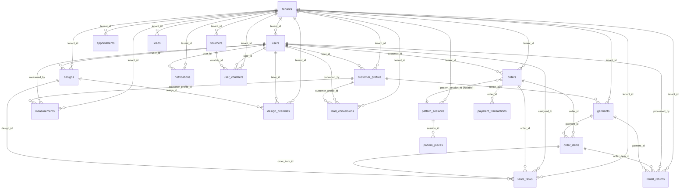

# Chương 04 — Cơ sở dữ liệu

## 4.1. Tổng quan

| Thuộc tính | Giá trị |
|---|---|
| **DBMS** | PostgreSQL 17 |
| **Extension** | pgvector 0.8.x |
| **Driver async** | asyncpg (qua SQLAlchemy 2.0 async) |
| **Số bảng (tables)** | 22 (gồm `pattern_sessions` + `pattern_pieces` mới của Epic 11) |
| **Số foreign key** | 39+ |
| **Số file migration** | 30 (`001_create_users_tables.sql` → `030_pattern_tables.sql`) |
| **Naming convention** | `snake_case`, plural (`orders`, `users`, `pattern_sessions`) |
| **Multi-tenancy** | `tenant_id UUID` trên hầu hết tables |

## 4.2. Phân nhóm bảng theo domain

### 4.2.1 Auth & Users

| Table | Mô tả |
|---|---|
| `users` | Tài khoản hệ thống — 3 role: Owner, Tailor, Customer |
| `staff_whitelist` | Danh sách email nhân viên được phép đăng ký role Tailor/Owner |
| `otp_codes` | Mã OTP cho đăng ký, xác thực email, khôi phục mật khẩu (rate-limited) |

### 4.2.2 Multi-tenant

| Table | Mô tả |
|---|---|
| `tenants` | Mỗi tenant = 1 tiệm may, cách ly hoàn toàn dữ liệu giữa các tiệm |

### 4.2.3 Customer & Profiles

| Table | Mô tả |
|---|---|
| `customer_profiles` | Hồ sơ khách hàng (per-tenant) — họ tên, SĐT, địa chỉ shipping autofill |
| `measurements` | Số đo cơ thể khách (versioned: 1 customer có nhiều bộ số đo theo thời gian) |

### 4.2.4 Designs (AI Bespoke — Epic 12-14)

| Table | Mô tả |
|---|---|
| `designs` | Thiết kế áo dài (Master Geometry JSON) |
| `design_overrides` | Điều chỉnh thủ công của thợ may (delta_key, original_value, overridden_value) |

### 4.2.5 Garments (Sản phẩm)

| Table | Mô tả |
|---|---|
| `garments` | Kho áo dài: bán + cho thuê. Tracking trạng thái Available / Rented / Maintenance / Retired; `material`, `rental_price`, `sale_price` |

### 4.2.6 Orders & Payments

| Table | Mô tả |
|---|---|
| `orders` | Đơn hàng — `service_type` (buy/rent/bespoke), `status` pipeline, `payment_status`, `security_type`/`security_value`, `pickup_date`/`return_date`, `deposit_amount`/`remaining_amount`, `voucher_discount`, `pattern_session_id` (FK Epic 11) |
| `order_items` | Chi tiết từng sản phẩm — `transaction_type` (buy/rent), unit_price, total_price |
| `payment_transactions` | Giao dịch thanh toán đa-step: `payment_type` ∈ {full, deposit, remaining, security_deposit}, `method`, `status`, `gateway_ref` |

### 4.2.7 Appointments (Đặt lịch)

| Table | Mô tả |
|---|---|
| `appointments` | Lịch tư vấn Bespoke — `appointment_date`, `slot` (morning/afternoon), `status`, customer info |

### 4.2.8 Rentals

| Table | Mô tả |
|---|---|
| `rental_returns` | Theo dõi trả đồ thuê — `return_condition` (Good/Damaged/Lost), `deposit_deduction`, processed_by |

### 4.2.9 Production

| Table | Mô tả |
|---|---|
| `tailor_tasks` | Phân công cho thợ may — `assigned_to` (FK users), `status` (assigned → in_progress → completed), `piece_rate` (lương theo sản phẩm), liên kết `order_item_id` và `design_id` |

### 4.2.10 CRM

| Table | Mô tả |
|---|---|
| `leads` | Khách hàng tiềm năng — `classification` (hot/warm/cold), `source` |
| `lead_conversions` | Lịch sử convert lead → customer |

### 4.2.11 Marketing

| Table | Mô tả |
|---|---|
| `vouchers` | Mã giảm giá — `type` (percent/fixed), `value`, `expiry_date`, `is_active`, `visibility` |
| `user_vouchers` | Gán voucher cho user, tracking `is_used` |
| `campaigns` (021) | Chiến dịch marketing (email/Zalo/FB) |

### 4.2.12 Notifications

| Table | Mô tả |
|---|---|
| `notifications` | Thông báo in-app — `type`, `title`, `is_read`, gắn user và tenant |

### 4.2.13 Pattern Engine (Epic 11 — mới)

| Table | Mô tả |
|---|---|
| `pattern_sessions` | Phiên sinh rập kỹ thuật — chứa snapshot 10 số đo (immutable), `garment_type` (extensible), `status` (draft/completed/exported) |
| `pattern_pieces` | 3 mảnh rập kết quả — `piece_type` (front_bodice/back_bodice/sleeve), `svg_data` TEXT, `geometry_params` JSONB |

## 4.3. Snapshot 10 cột số đo trong `pattern_sessions`

| Cột | Đơn vị | Diễn giải tiếng Việt | Range hợp lệ (FR99) |
|---|---|---|---|
| `do_dai_ao` | NUMERIC(5,1) | Độ dài áo | (theo Pydantic min/max) |
| `ha_eo` | NUMERIC(5,1) | Hạ eo (eo cao/thấp) | |
| `vong_co` | NUMERIC(5,1) | Vòng cổ | |
| `vong_nach` | NUMERIC(5,1) | Vòng nách | |
| `vong_nguc` | NUMERIC(5,1) | Vòng ngực | |
| `vong_eo` | NUMERIC(5,1) | Vòng eo | |
| `vong_mong` | NUMERIC(5,1) | Vòng mông | |
| `do_dai_tay` | NUMERIC(5,1) | Độ dài tay | |
| `vong_bap_tay` | NUMERIC(5,1) | Vòng bắp tay | |
| `vong_co_tay` | NUMERIC(5,1) | Vòng cổ tay | |

> **Quy ước SCP 2026-04-03:** giữ tên cột tiếng Việt — KHÔNG dịch sang tiếng Anh.

## 4.4. Migration history (30 file)

| File | Ngày & nội dung |
|---|---|
| `001_create_users_tables.sql` | Bảng `users`, `staff_whitelist` |
| `002_add_user_profile_fields.sql` | Mở rộng users (full_name, phone, address) |
| `003_create_otp_codes_table.sql` | OTP cho registration & password recovery |
| `004_add_otp_rate_limiting.sql` | Rate limiting OTP (chống brute force) |
| `005_create_customer_profiles_and_measurements.sql` | `customer_profiles` + `measurements` |
| `006_multi_tenant_infrastructure.sql` | Story 1.6 — tenants table + tenant_id propagation |
| `006b_create_designs_table.sql` | `designs` table với master_geometry JSONB |
| `007_create_design_overrides_table.sql` | Override của thợ may |
| `008_create_garments_table.sql` | Inventory áo dài |
| `009_add_rental_tracking_to_garments.sql` | Trạng thái cho thuê + renter_id |
| `010_add_material_column_to_garments.sql` | Material classification |
| `011_create_orders_tables.sql` | `orders` + `order_items` |
| `012_create_appointments_table.sql` | Booking với morning/afternoon slot |
| `013_create_payment_transactions.sql` | Multi-transaction payment model |
| `014_create_tailor_tasks.sql` | Phân công thợ + piece_rate |
| `015_rental_management_tables.sql` | `rental_returns` |
| `016_create_notifications_table.sql` | In-app notifications |
| `017_create_vouchers_tables.sql` | `vouchers` + `user_vouchers` |
| `018_add_is_internal_to_orders.sql` | Đơn nội bộ (Owner tự tạo) |
| `019_create_leads_table.sql` | CRM leads |
| `020_create_lead_conversions_table.sql` | Lead → Customer history |
| `021_create_campaigns_tables.sql` | Marketing campaigns |
| `022_add_avatar_experience_substep.sql` | Avatar + experience substep cho pipeline |
| `023_add_voucher_discount_to_orders.sql` | Voucher_discount column |
| `024_add_visibility_to_vouchers.sql` | Voucher public/private visibility |
| `025_unified_order_workflow.sql` | **Epic 10** — service_type, security_type, deposit_amount, remaining_amount |
| `026_order_preparation_step.sql` | Sub-steps Cleaning/Altering/Packaging/QC |
| `027_add_shipping_address_autofill_to_users.sql` | Autofill shipping address |
| `028_add_rental_lifecycle_columns.sql` | Story 10.7 — pickup_date, return_date, condition_inspected_at |
| `029_add_payment_method_to_transactions.sql` | Lưu method per-transaction |
| `030_pattern_tables.sql` | **Epic 11** — `pattern_sessions` + `pattern_pieces` |

## 4.5. Sơ đồ ERD (Mermaid — trích từ README)

> Để xem ERD đầy đủ:
> - Mermaid: `_bmad-output/erd.mmd` (paste vào https://mermaid.live)
> - DBML: `_bmad-output/erd.dbml` (paste vào https://dbdiagram.io)
> - Graphviz: `dot -Tpng _bmad-output/erd.dot -o erd.png`
> - Interactive HTML: `xdg-open _bmad-output/schema.html`



## 4.6. Multi-tenancy strategy

- **Cách ly cấp ứng dụng (shared schema, tenant_id column)** — đơn giản hơn schema-per-tenant nhưng vẫn cách ly logic.
- Mọi service truy vấn DB BẮT BUỘC filter theo `tenant_id` lấy từ `TenantId` dependency.
- Owner role được gán default tenant `00000000-0000-0000-0000-000000000001` (xem `dependencies.py:147`).
- Default tenant cho phép Owner thao tác system-wide; các role khác phải có `user.tenant_id` mới hợp lệ.

## 4.7. Index & performance khuyến nghị (cho production)

(Theo các migration đã commit, không liệt kê đầy đủ ở đây)

- B-tree index trên `tenant_id` ở mọi bảng có FK tenant.
- Composite index `(tenant_id, status)` trên `orders`, `tailor_tasks` để filter dashboard nhanh.
- Index trên `users.email` (unique).
- Index trên `garments.status` cho Showroom filter < 500ms (FR30).
- pgvector index (HNSW) cho `fabrics.embedding` khi Epic 12 chạy.

## 4.8. Sinh lại ERD

```bash
python3 scripts/generate_erd.py -f all

# Output trong _bmad-output/:
#   erd.mmd       — Mermaid
#   erd.dbml      — dbdiagram.io
#   erd.dot       — Graphviz DOT
#   schema.html   — interactive HTML viewer
```
