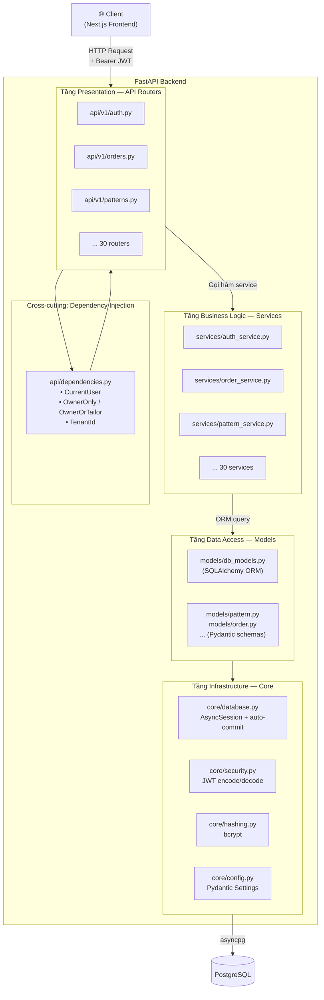
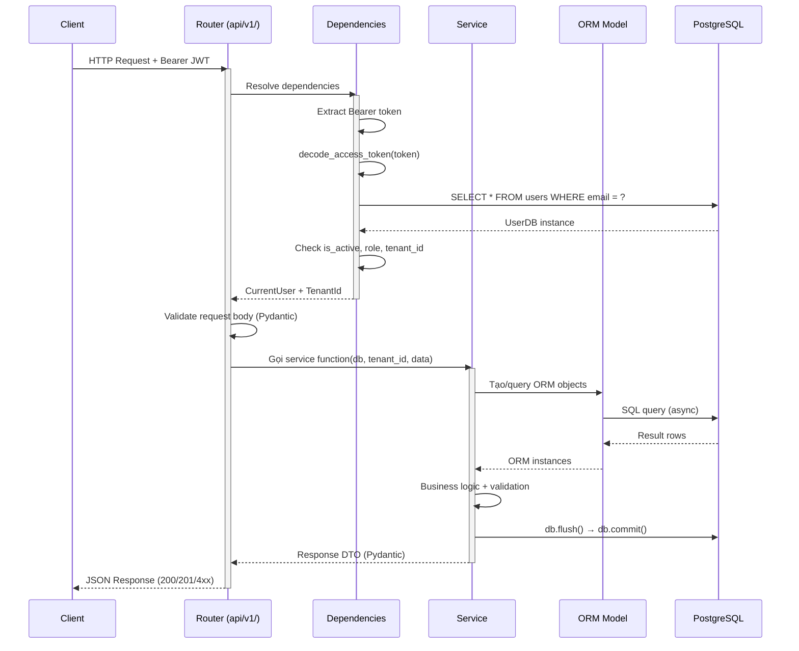
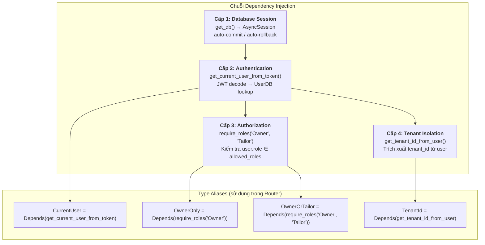
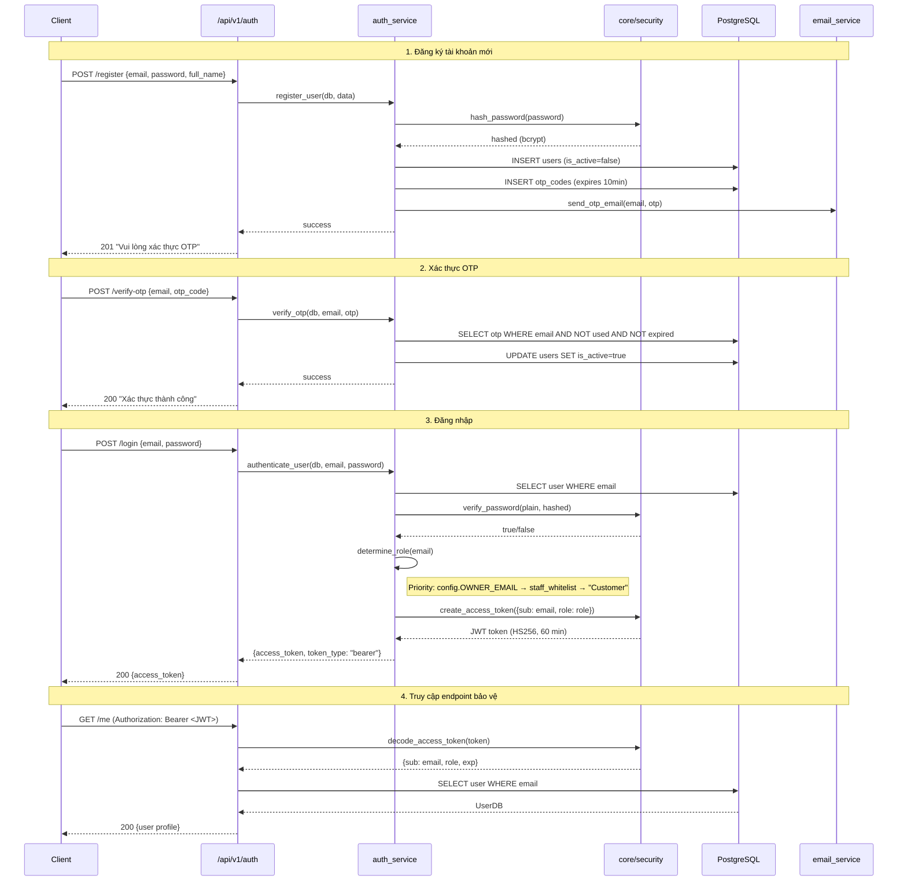
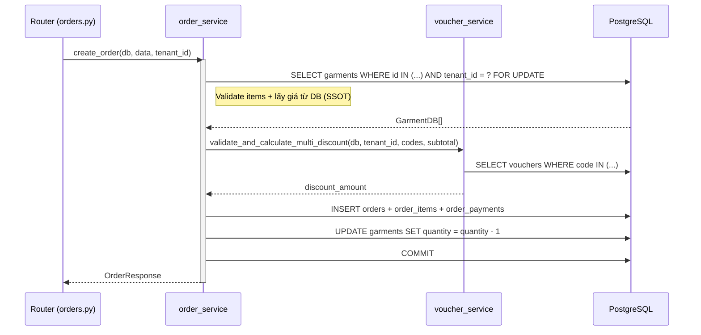

# Chương 05 — Backend (FastAPI)

## 5.1. Tổng quan kiến trúc phân lớp

Backend của **Nhà May Thanh Lộc** được xây dựng theo mô hình **Layered Architecture** (kiến trúc phân lớp) gồm 4 tầng, mỗi tầng có trách nhiệm riêng biệt và chỉ giao tiếp với tầng liền kề.



**Nguyên tắc thiết kế:**

| Nguyên tắc | Giải thích |
|---|---|
| **Separation of Concerns** | Mỗi tầng chỉ xử lý đúng trách nhiệm của mình — Router không chứa logic nghiệp vụ, Service không trả HTTP response |
| **Dependency Injection** | FastAPI `Depends()` tự động resolve chuỗi phụ thuộc: DB session → User → Role → Tenant |
| **Single Source of Truth (SSOT)** | Giá sản phẩm, discount, inventory đều lấy từ DB phía server — không tin client |
| **Async I/O toàn bộ** | Tất cả I/O (database, email, file) đều dùng `async`/`await` qua `asyncpg` và `aiosmtplib` |

### 5.1.1 Chi tiết từng tầng

| Tầng | Thư mục | Vai trò | Ví dụ |
|---|---|---|---|
| **Presentation** | `src/api/v1/` | Nhận HTTP request, validate input (Pydantic), gọi service, trả JSON response | `POST /api/v1/orders` → `create_order_endpoint()` |
| **Business Logic** | `src/services/` | Xử lý logic nghiệp vụ, điều phối transaction, gọi cross-service | `order_service.create_order()` — validate item, apply voucher, tạo payment |
| **Data Access** | `src/models/` | Định nghĩa ORM models (SQLAlchemy) và request/response schemas (Pydantic) | `OrderDB`, `OrderCreate`, `OrderResponse` |
| **Infrastructure** | `src/core/` | Kết nối DB, JWT, bcrypt, config từ env vars | `get_db()`, `create_access_token()`, `hash_password()` |

## 5.2. Luồng xử lý Request → Response

Sơ đồ dưới đây minh hoạ luồng xử lý hoàn chỉnh khi client gửi request đến một endpoint yêu cầu xác thực:



## 5.3. Cấu trúc thư mục `backend/`

```
backend/
├── src/
│   ├── main.py              # Entry point: FastAPI app, CORS, lifespan, mount routers
│   ├── api/
│   │   ├── dependencies.py  # OwnerOnly, OwnerOrTailor, TenantId, CurrentUser
│   │   └── v1/              # 30 routers (1 file/domain)
│   ├── core/
│   │   ├── config.py        # Pydantic settings (env vars)
│   │   ├── database.py      # async engine + get_db dependency
│   │   ├── hashing.py       # bcrypt password
│   │   ├── security.py      # JWT encode/decode (python-jose)
│   │   └── seed.py          # seed_owner_account khi startup
│   ├── models/              # 24 file: Pydantic schemas + SQLAlchemy ORM
│   ├── services/            # 30 service: business logic
│   ├── patterns/            # Pattern Engine (Epic 11) — standalone
│   ├── geometry/            # GeometryRebuilder (Epic 13, hoãn)
│   ├── agents/              # LangGraph Emotional Compiler (Epic 12, hoãn)
│   └── constraints/         # Hard/Soft rules registry (Epic 14, hoãn)
├── migrations/              # 30 file SQL
├── tests/                   # ~50+ test files (pytest)
├── uploads/                 # Static files mounted /uploads
├── venv/                    # Python virtualenv
├── requirements.txt
└── Makefile
```

## 5.4. Entry point — `src/main.py`

`src/main.py` khởi tạo ứng dụng FastAPI và đăng ký toàn bộ 30 routers:

```python
app = FastAPI(
    title="Nhà May Thanh Lộc API",
    description="Backend API for the Nhà May Thanh Lộc - AI-powered tailoring platform",
    version="0.1.0",
    lifespan=lifespan,
)
```

### 5.4.1 Lifespan tasks

Hàm `lifespan` (async context manager) xử lý hai tác vụ khi ứng dụng khởi động và tắt:

- **Startup**: `seed_owner_account()` — tạo tài khoản Owner mặc định nếu chưa có; `start_reminder_scheduler()` — chạy background task nhắc trả đồ thuê (Story 5.4).
- **Shutdown**: cancel scheduler task an toàn.

### 5.4.2 CORS Middleware

```python
allowed_origins = os.getenv("CORS_ORIGINS", "http://localhost:3000").split(",")
app.add_middleware(
    CORSMiddleware,
    allow_origins=allowed_origins,
    allow_credentials=True,
    allow_methods=["*"],
    allow_headers=["*"],
)
```

Cho phép frontend (Next.js, mặc định port 3000) gọi API cross-origin. Biến `CORS_ORIGINS` cấu hình qua environment variable.

### 5.4.3 Static files & Health check

```python
# Mount thư mục uploads phục vụ ảnh sản phẩm
app.mount("/uploads", StaticFiles(directory=str(_UPLOADS_DIR)), name="uploads")

# Endpoint kiểm tra trạng thái server
@app.get("/health")
async def health_check() -> dict[str, str]:
    return {"status": "healthy"}
```

## 5.5. Dependency Injection — Chuỗi phụ thuộc

FastAPI sử dụng hệ thống **Dependency Injection** (DI) thông qua hàm `Depends()`. Backend định nghĩa một chuỗi phụ thuộc 4 cấp, tự động resolve từ dưới lên:



### 5.5.1 Cấp 1 — Database Session

```python
# src/core/database.py
async def get_db() -> AsyncGenerator[AsyncSession, None]:
    async with async_session_factory() as session:
        try:
            yield session          # Router/service sử dụng session
            await session.commit() # Thành công → commit
        except Exception:
            await session.rollback() # Lỗi → rollback toàn bộ
            raise
```

Mọi endpoint nhận `db: AsyncSession = Depends(get_db)`. Session tự động commit khi handler trả về thành công, và rollback nếu có exception — đảm bảo tính **ACID** của transaction.

### 5.5.2 Cấp 2 — Authentication (Xác thực JWT)

```python
# src/api/dependencies.py
async def get_current_user_from_token(
    credentials: HTTPAuthorizationCredentials = Depends(security_scheme),
    db: AsyncSession = Depends(get_db),
) -> UserDB:
    payload = decode_access_token(credentials.credentials)
    if payload is None:
        raise HTTPException(401, "Token không hợp lệ hoặc đã hết hạn")
    email = payload.get("sub")
    user = await get_user_by_email(db, email)
    if user is None:
        raise HTTPException(404, "Không tìm thấy người dùng")
    if not user.is_active:
        raise HTTPException(403, "Tài khoản đã bị vô hiệu hóa")
    return user
```

### 5.5.3 Cấp 3 — Authorization (Phân quyền theo vai trò)

```python
def require_roles(*allowed_roles: str):
    async def role_checker(user: UserDB = Depends(get_current_user_from_token)) -> UserDB:
        if user.role not in allowed_roles:
            raise HTTPException(403, f"Yêu cầu vai trò: {', '.join(allowed_roles)}")
        return user
    return role_checker

# Sử dụng:
OwnerOnly     = Annotated[UserDB, Depends(require_roles("Owner"))]
OwnerOrTailor = Annotated[UserDB, Depends(require_roles("Owner", "Tailor"))]
```

### 5.5.4 Cấp 4 — Tenant Isolation (Cách ly dữ liệu đa khách thuê)

```python
async def get_tenant_id_from_user(
    user: UserDB = Depends(get_current_user_from_token),
) -> uuid.UUID:
    DEFAULT_TENANT_ID = uuid.UUID("00000000-0000-0000-0000-000000000001")
    if user.role == "Owner":
        return user.tenant_id if user.tenant_id else DEFAULT_TENANT_ID
    if user.tenant_id is None:
        raise HTTPException(403, "Tài khoản chưa được gán vào tiệm nào.")
    return user.tenant_id

TenantId = Annotated[uuid.UUID, Depends(get_tenant_id_from_user)]
```

`TenantId` được truyền xuống tầng Service → mọi truy vấn DB đều lọc theo `tenant_id`, đảm bảo dữ liệu giữa các tiệm may hoàn toàn cách ly.

### 5.5.5 Ví dụ sử dụng trong Router

```python
# src/api/v1/orders.py
@router.patch("/{order_id}/status")
async def update_order_status_endpoint(
    order_id: uuid.UUID,
    update: OrderStatusUpdate,        # Pydantic validate request body
    user: OwnerOnly,                  # DI: Cấp 2 + 3 (JWT + role check)
    tenant_id: TenantId,             # DI: Cấp 4 (tenant isolation)
    db: AsyncSession = Depends(get_db), # DI: Cấp 1 (DB session)
) -> dict:
    result = await order_service.update_order_status(db, order_id, tenant_id, update)
    return {"data": result.model_dump(mode="json"), "meta": {}}
```

FastAPI tự động resolve toàn bộ chuỗi DI **trước khi** chạy code trong endpoint. Nếu bất kỳ dependency nào fail (token hết hạn, sai role, chưa gán tenant), request bị reject ngay mà không cần xử lý thủ công.

## 5.6. Luồng Authentication chi tiết



### 5.6.1 JWT Token

Token được ký bằng thuật toán **HS256** với `JWT_SECRET_KEY` từ environment variable:

```python
# src/core/security.py
def create_access_token(data: dict, expires_delta: timedelta | None = None) -> str:
    to_encode = data.copy()
    expire = datetime.now(timezone.utc) + (
        expires_delta or timedelta(minutes=settings.JWT_EXPIRE_MINUTES)
    )
    to_encode["exp"] = expire
    return jwt.encode(to_encode, settings.JWT_SECRET_KEY, algorithm=settings.JWT_ALGORITHM)
```

**Cấu trúc payload:**

| Claim | Ý nghĩa | Ví dụ |
|---|---|---|
| `sub` | Email người dùng (subject) | `"user@example.com"` |
| `role` | Vai trò được xác định từ SSOT | `"Owner"`, `"Tailor"`, `"Customer"` |
| `exp` | Thời điểm hết hạn (UTC timestamp) | `1713283800` |

### 5.6.2 Xác định vai trò (Role Determination — SSOT)

Hệ thống xác định vai trò theo thứ tự ưu tiên:

1. Email trùng `config.OWNER_EMAIL` → **Owner** (quyền toàn hệ thống)
2. Email có trong bảng `staff_whitelist` → vai trò theo whitelist (**Owner** hoặc **Tailor**)
3. Mặc định → **Customer**

### 5.6.3 Mật khẩu — bcrypt

```python
def hash_password(password: str) -> str:
    password_bytes = password.encode('utf-8')
    salt = bcrypt.gensalt()
    hashed = bcrypt.hashpw(password_bytes, salt)
    return hashed.decode('utf-8')
```

Sử dụng **bcrypt** với salt ngẫu nhiên. Giới hạn 72 bytes của bcrypt được xử lý tự động qua UTF-8 encoding.

## 5.7. 30 API Routers (`src/api/v1/`)

| Router file | Prefix | Mục đích |
|---|---|---|
| `auth.py` | `/api/v1/auth` | Login, register, OTP, reset password |
| `customers.py` | `/api/v1/customers` | Owner CRUD khách hàng |
| `customer_profile.py` | `/api/v1/customers/me` | Self-service: hồ sơ, số đo, đơn, thông báo |
| `appointments.py` | `/api/v1/appointments` | Booking endpoints |
| `owner_appointments.py` | `/api/v1/owner/appointments` | Owner manage appointments |
| `designs.py` | `/api/v1/designs` | AI design (Epic 12+) |
| `overrides.py` | `/api/v1/overrides` | Tailor override (Epic 14+) |
| `export.py` | `/api/v1/export` | Export blueprint SVG/DXF |
| `fabrics.py` | `/api/v1/fabrics` | Fabric matrix (Epic 12) |
| `garments.py` | `/api/v1/garments` | Showroom + Inventory CRUD |
| `orders.py` | `/api/v1/orders` | Owner orders, approve, refund |
| `order_customer.py` | `/api/v1/orders/me` | Customer my orders |
| `payments.py` | `/api/v1/payments` | Payment + webhook |
| `rentals.py` | `/api/v1/rentals` | Rental tracking + return inspection |
| `geometry.py` | `/api/v1/geometry` | Geometry transformation API |
| `guardrails.py` | `/api/v1/guardrails` | Hard/Soft constraint checking |
| `inference.py` | `/api/v1/inference` | LangGraph inference (Epic 12+) |
| `kpi.py` | `/api/v1/kpi` | Owner dashboard KPI |
| `notifications.py` | `/api/v1/notifications` | In-app notification |
| `rules.py` | `/api/v1/rules` | Smart Rules CRUD |
| `staff.py` | `/api/v1/staff` | Staff whitelist + management |
| `styles.py` | `/api/v1/styles` | Style Pillars (Epic 12) |
| `tailor_tasks.py` | `/api/v1/tailor/tasks` | Tailor tasks list, status update |
| `leads.py` | `/api/v1/leads` | CRM Leads CRUD |
| `vouchers.py` | `/api/v1/vouchers` | Voucher CRUD + analytics |
| `templates.py` | `/api/v1/templates` | Campaign message templates |
| `campaigns.py` | `/api/v1/campaigns` | Outreach campaigns |
| `uploads.py` | `/api/v1/uploads` | Multipart file upload |
| `patterns.py` | `/api/v1/patterns` | **Epic 11** — Pattern Engine sessions/pieces/export |

## 5.8. Services layer — `src/services/`

30 service file, mỗi file đảm nhiệm 1 domain nghiệp vụ. Tầng Service là nơi **duy nhất** chứa logic nghiệp vụ — Router không được truy vấn DB trực tiếp.

| Service | Vai trò chính |
|---|---|
| `auth_service.py` | login, register, hash bcrypt, gen JWT, determine_role, get_user_by_email |
| `pattern_service.py` | **Epic 11** — create_session, generate_patterns, get_piece_for_export, create_svg_zip, create_gcode_zip |
| `order_service.py` | CRUD đơn, approve flow, status pipeline transition, validate & price items (SSOT) |
| `order_customer_service.py` | Customer view + cancel |
| `payment_service.py` | Multi-transaction payment, webhook handler |
| `rental_service.py` | Rental lifecycle + deposit refund |
| `tailor_task_service.py` | Task assignment + status tracking |
| `email_service.py` | aiosmtplib gửi OTP, confirm, reminder |
| `scheduler_service.py` | `start_reminder_scheduler` chạy nền nhắc trả đồ |
| `notification_service.py` | In-app notifications CRUD |
| `notification_creator.py` | Factory tạo notification theo event |
| `kpi_service.py` | Aggregations cho dashboard (revenue, order count, ...) |
| `voucher_service.py` | Apply voucher, validate điều kiện, analytics |
| `lead_service.py` | CRM leads CRUD, classification, convert |
| `campaign_service.py` | Marketing outreach |
| `template_service.py` | Campaign message templates |
| `customer_service.py` | Customer profile management |
| `measurement_service.py` | Versioned body measurements |
| `garment_service.py` | Inventory CRUD |
| `fabric_service.py` | Fabric matrix |
| `style_service.py` | Style Pillars (Epic 12+) |
| `smart_rules_service.py` | Smart Rules (Epic 12+) |
| `export_service.py` | Blueprint SVG/DXF export (Epic 8/14) |
| `staff_service.py` | Staff whitelist management |
| `otp_service.py` | OTP generation + validation |
| `invoice_service.py` | Invoice PDF generation |
| `appointment_service.py` | Booking management |
| `base_pattern_service.py` | Base pattern logic |

### 5.8.1 Ví dụ: Tương tác giữa các tầng (Tạo đơn hàng)



**Điểm đáng chú ý:**

- **SSOT cho giá**: Service lấy `sale_price` / `rental_price` từ DB, không dùng giá client gửi lên
- **Optimistic locking**: `SELECT ... FOR UPDATE` khoá bản ghi garment, tránh race condition khi nhiều đơn đặt cùng lúc
- **Cross-service call**: `order_service` gọi `voucher_service` để validate và tính discount — logic voucher tách riêng, tái sử dụng được

## 5.9. Models layer — `src/models/`

Mỗi domain có 1 file chứa **Pydantic schemas** (request/response) + **SQLAlchemy ORM models** (DB mapping):

```
appointment.py    db_models.py   inference.py    order.py        rule.py
campaign.py       export.py      kpi.py          override.py     staff.py
customer.py       fabric.py      lead.py         pattern.py      style.py
customer_profile.py garment.py   notification.py rental.py       tailor_task.py
                  geometry.py    order_customer.py user.py        voucher.py
                  guardrail.py
```

`db_models.py` khai báo `Base = declarative_base()` và toàn bộ các bảng ORM dùng chung.

### 5.9.1 Ví dụ `models/pattern.py` — Pydantic schemas cho Pattern Engine

```python
class PatternSessionCreate(BaseModel):
    customer_id: UUID
    do_dai_ao: Decimal
    ha_eo: Decimal
    vong_co: Decimal
    vong_nach: Decimal
    vong_nguc: Decimal
    vong_eo: Decimal
    vong_mong: Decimal
    do_dai_tay: Decimal
    vong_bap_tay: Decimal
    vong_co_tay: Decimal
    garment_type: str
    notes: str | None = None
```

Pydantic V2 validation tự động kiểm tra min/max ranges theo yêu cầu FR99 — giá trị không hợp lệ trả về HTTP 422 kèm message tiếng Việt.

## 5.10. Pattern Engine module — `src/patterns/`

| File | Vai trò |
|---|---|
| `engine.py` | Orchestrator: `generate_pattern_pieces(measurements)` → 3 PieceResult |
| `formulas.py` | `generate_bodice(measurements, offset)` + `generate_sleeve(measurements)` |
| `svg_export.py` | `render_bodice_svg(params)`, `render_sleeve_svg(params)` — SVG markup 1:1 scale |
| `gcode_export.py` | `svg_to_gcode(svg_data, speed, power, piece_type)` — chuyển SVG → G-code laser |

Chi tiết công thức xem [Chương 07 — Pattern Engine](./07-pattern-engine.md).

## 5.11. Constraints / Geometry / Agents (Epic 12-14)

| Module | Trạng thái | Vai trò |
|---|---|---|
| `geometry/engine.py` | Khung sẵn | GeometryRebuilder áp Ease Delta lên Golden Base Pattern |
| `agents/emotional_compiler.py` | Khung sẵn | LangGraph workflow Emotional Compiler (cảm xúc → Ease Delta) |
| `constraints/` | Khung sẵn | Hard rules (cấm xuất) + Soft rules (cảnh báo ±5%) |

## 5.12. Database access — `src/core/database.py`

```python
# Chuyển URL sync → async driver
_async_url = settings.DATABASE_URL.replace("postgresql://", "postgresql+asyncpg://")
engine = create_async_engine(_async_url, echo=False)
async_session_factory = async_sessionmaker(engine, class_=AsyncSession, expire_on_commit=False)
```

Sử dụng làm dependency: `db: AsyncSession = Depends(get_db)`. Session auto-commit khi handler return thành công; auto-rollback nếu exception.

## 5.13. Tests (`backend/tests/`)

| Test file | Story / Domain |
|---|---|
| `test_10_1_db_migration_service_type.py` | 10.1 — DB migration service_type |
| `test_10_2_measurement_gate.py` | 10.2 — Measurement Gate |
| `test_10_3_checkout_service_type.py` | 10.3 — Checkout 3 luồng |
| `test_10_4_owner_approve.py` | 10.4 — Owner approve flow |
| `test_10_5_sub_steps.py` | 10.5 — Preparation sub-steps |
| `test_10_6_remaining_payment.py` | 10.6 — Remaining payment |
| `test_10_7_rental_return.py` | 10.7 — Rental return + deposit |
| `test_11_1_pattern_models.py` | 11.1 — Pattern models |
| `test_11_2_pattern_api.py` + `test_11_2_pattern_engine.py` | 11.2 — Pattern API + Engine |
| `test_11_3_export_api.py` + `test_11_3_gcode_export.py` | 11.3 — Export API + G-code |
| `test_auth_api.py`, `test_auth_service.py`, `test_auth_recovery.py` | Auth + OTP |
| `test_constraint_registry.py`, `test_hard_constraints.py` | Constraints |
| `test_emotional_compiler.py` | LangGraph |
| `test_export_api.py`, `test_export_service.py` | Export Blueprint |

Test runner: `pytest` (xem [Chương 10](./10-testing-va-trien-khai.md)).

## 5.14. Khởi chạy backend (dev)

```bash
cd backend
python -m venv venv
source venv/bin/activate
pip install -r requirements.txt

# Chạy migrations
for f in migrations/*.sql; do psql -U postgres -d tailor_db -f "$f"; done

# Start server
uvicorn src.main:app --reload --port 8000
```

Health check: `curl http://localhost:8000/health` → `{"status":"healthy"}`.
