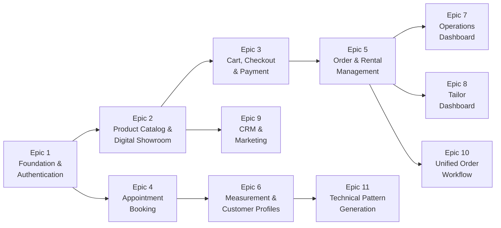

# Chương 1. Giới thiệu đề tài

## 1.1. Lý do chọn đề tài

### 1.1.1. Bối cảnh ngành may áo dài Việt Nam

Áo dài là biểu tượng văn hoá truyền thống của Việt Nam và đồng thời là một sản phẩm thời trang có giá trị thương mại lớn. Trong vài năm trở lại đây, nhu cầu về áo dài đã mở rộng từ các dịp lễ truyền thống sang nhiều hoàn cảnh sử dụng đa dạng hơn: cưới hỏi, công sở, sự kiện doanh nghiệp, du lịch, thời trang đường phố. Thị trường đồng thời chia thành ba phân khúc chính: **may sẵn** (ready-to-wear), **cho thuê** (rental) và **đặt may riêng** (bespoke).

Bên cạnh sự tăng trưởng về quy mô, ngành may áo dài đang đối mặt với áp lực số hoá rõ rệt. Khách hàng kỳ vọng trải nghiệm đặt hàng trực tuyến tương đương các sàn thương mại điện tử lớn, nhưng các tiệm may truyền thống chủ yếu vận hành thủ công với sổ giấy, Excel và Zalo. Quy trình nghiệp vụ phân mảnh khiến chủ tiệm khó quản lý đồng thời ba phân khúc, khó theo dõi tồn kho cho thuê, khó phân công thợ, và đặc biệt khó số hoá tri thức nghệ nhân để truyền lại cho thế hệ sau.

### 1.1.2. Khó khăn trong việc kết nối cảm xúc và kĩ thuật

Vấn đề cốt lõi của ngành may đo cá nhân hoá nằm ở khoảng cách giữa hai "thế giới" gần như không cùng ngôn ngữ:

1. **Thế giới Cảm quan của khách hàng** — nơi sản phẩm được hình dung qua những tính từ trừu tượng như *"thanh tao"*, *"mạnh mẽ"*, *"kín đáo"*, *"hiện đại nhưng vẫn truyền thống"*. Khách hàng không có công cụ để chuyển những cảm nhận ấy thành con số.
2. **Thế giới Vật lý của thợ may** — nơi mọi quyết định được biểu diễn bằng số đo (cm, mm), độ rộng đường tà, độ rủ vải, góc nghiêng của đường nách. Thợ may không có cách "đọc" được tâm trí khách hàng để hiểu đúng gu thẩm mỹ cá nhân.

Khoảng cách này tạo ra ba hệ quả tiêu cực rõ rệt:

- **Sản phẩm "đẹp nhưng không phải là tôi":** khách hàng nhận sản phẩm vừa vặn về số đo nhưng không khớp với hình dung cảm xúc ban đầu, dẫn đến phải chỉnh sửa nhiều lần hoặc bỏ luôn không sử dụng.
- **"Bẫy số trung bình" của may sẵn:** khách hàng có hình thể không thuộc bảng size chuẩn S–M–L buộc phải thoả hiệp về kích cỡ, làm mất đi nét riêng cá nhân.
- **Tri thức nghệ nhân không có "Version Control":** mỗi nghệ nhân có một bộ "Smart Rules" tích luỹ từ kinh nghiệm cá nhân, nhưng tri thức này tồn tại dưới dạng *tacit knowledge* (tri thức ẩn). Khi nghệ nhân nghỉ hưu, toàn bộ tri thức bị mai một, và khách hàng quay lại lần sau gặp một thợ may mới phải bắt đầu lại quá trình "dò sóng" từ đầu.

### 1.1.3. Khoảng trống công nghệ hiện tại

Khảo sát các giải pháp đang tồn tại cho thấy ba nhóm chính, mỗi nhóm đều có hạn chế nghiêm trọng đối với ngành may áo dài Việt Nam:

| Nhóm giải pháp | Đại diện | Hạn chế đối với áo dài Việt |
|---|---|---|
| Sàn thương mại điện tử thời trang | Shopee Fashion, Lazada, Tiki | Chỉ phục vụ may sẵn, không hỗ trợ đo cá nhân hoá hay cho thuê có cọc thế chân |
| Nền tảng đặt lịch dịch vụ | Booking.vn, các app salon | Đặt được lịch nhưng không kết nối hồ sơ số đo, không quản lý sản xuất |
| Phần mềm CAD/CAM ngành may | Optitex, Gerber AccuMark | Mạnh về sinh rập kỹ thuật, nhưng đắt, phức tạp, không có lớp e-commerce, không quản lý tiệm |

Chưa có một nền tảng nào tích hợp đồng thời bốn yếu tố cần thiết: (1) thương mại điện tử áo dài, (2) đặt lịch và quản lý đo cá nhân, (3) sinh rập kỹ thuật tự động từ số đo, (4) công cụ vận hành tiệm cho chủ và thợ. Khoảng trống này là cơ hội để xây dựng một sản phẩm "phần mềm chuyên ngành" (vertical SaaS) phục vụ riêng cho tiệm may áo dài Việt.

## 1.2. Mục tiêu đề tài

### 1.2.1. Mục tiêu tổng quát

Xây dựng nền tảng SaaS đa khách thuê (multi-tenant) mang tên **Nhà May Thanh Lộc** (codename `tailor_project`), giúp tiệm may áo dài Việt Nam số hoá toàn bộ chuỗi giá trị từ tư vấn, đo, may, bán và cho thuê trong một hệ thống duy nhất. Nền tảng đặt mục tiêu rút ngắn khoảng cách giữa cảm xúc khách hàng và thông số kỹ thuật của thợ may thông qua hai cơ chế bổ trợ: **AI Bespoke Engine** (chuyển cảm xúc thành tham số hình học) và **Technical Pattern Engine** (chuyển số đo thành rập kỹ thuật bằng công thức tất định).

### 1.2.2. Mục tiêu cụ thể

Đề tài đặt ra các mục tiêu cụ thể, được phân thành hai nhóm:

**Nhóm 1 — Mục tiêu chức năng (Functional)**

- Triển khai 11 phân hệ nghiệp vụ ưu tiên cho MVP, bao gồm: nền tảng và xác thực, sàn trưng bày sản phẩm, giỏ hàng và thanh toán, đặt lịch tư vấn, quản lý đơn hàng và cho thuê, hồ sơ khách hàng và số đo, dashboard vận hành, dashboard thợ may, CRM và marketing, luồng đơn hợp nhất theo loại dịch vụ, sinh rập kỹ thuật từ số đo cơ thể.
- Hỗ trợ ba vai trò người dùng độc lập: **Customer** (khách hàng), **Owner** (chủ tiệm), **Tailor** (thợ may), với hai chế độ giao diện tách biệt (Boutique Mode cho khách, Command Mode cho nội bộ).
- Hỗ trợ ba luồng đơn hàng song song: **Buy** (mua sẵn), **Rent** (thuê có cọc thế chân), **Bespoke** (đặt may theo số đo).
- Cho phép xuất rập kỹ thuật ở hai định dạng sản xuất: SVG tỉ lệ 1:1 cho in vẽ giấy và G-code cho máy cắt laser.

**Nhóm 2 — Mục tiêu phi chức năng (Non-functional KPIs)**

| Chỉ số | Mục tiêu |
|---|---|
| Phản hồi UI khi kéo Slider hình học | Dưới 200 ms |
| Tải trang thương mại điện tử (p95) | Dưới 2 giây |
| Phản hồi API thông thường (p95) | Dưới 300 ms |
| Phiên suy luận AI Bespoke (LangGraph cycle) | Dưới 15 giây |
| Tỷ lệ vi phạm ràng buộc hình học khi xuất bản vẽ | 0% (tuyệt đối) |
| Sai số hình học so với rập tham chiếu | Tối đa 1 mm |
| Sai số rập SVG so với bản in vật lý | Tối đa ±0,5 mm |
| Số lượng người dùng e-commerce đồng thời | Tối thiểu 100 |
| Uptime trong giờ vận hành tiệm | 99,9% |
| Tỷ lệ thanh toán thành công | Trên 99,5% |

Các chỉ số trên được trích trực tiếp từ tài liệu *Non-functional Requirements* và *Architecture Decision Document* của dự án, đóng vai trò làm thước đo nghiệm thu khi báo cáo.

## 1.3. Đối tượng và phạm vi nghiên cứu

### 1.3.1. Đối tượng nghiên cứu

Đối tượng nghiên cứu của đề tài bao gồm cả **nghiệp vụ ngành** lẫn **giải pháp công nghệ**:

- **Nghiệp vụ:** quy trình vận hành đặc thù của tiệm may áo dài Việt Nam, gồm tư vấn, đo, sinh rập, may, bán, cho thuê, thu hồi, hoàn cọc, chăm sóc khách hàng dài hạn.
- **Người dùng:** ba nhóm với nhu cầu trái ngược về mặt UX — Customer ưu tiên trải nghiệm thẩm mỹ, Owner ưu tiên thông tin mật độ cao, Tailor ưu tiên thông số kỹ thuật chính xác.
- **Công nghệ:** kiến trúc full-stack hiện đại với Next.js 16 (App Router), FastAPI bất đồng bộ, PostgreSQL với extension `pgvector`, kết hợp công thức tất định và LangGraph cho hai mô-đun pattern engine.
- **Tri thức ngành:** thuật ngữ chuyên ngành may tiếng Việt (`vong_nach`, `ha_eo`, `vong_nguc`, ...) cùng các "Smart Rules" mà nghệ nhân tích luỹ qua kinh nghiệm thực tế.

### 1.3.2. Phạm vi MVP

Nhóm thực hiện chốt phạm vi MVP gồm **11 epic** chính, bao phủ phần lớn các yêu cầu chức năng cốt lõi:

Trong đó, các epic 1–10 đã hoàn thành, epic 11 đang được triển khai theo các story 11.1 đến 11.6.

### 1.3.3. Phạm vi loại trừ

Một số nhóm tính năng được khoanh vùng **hoãn lại sau MVP** do vượt ngưỡng độ phức tạp hoặc cần dữ liệu huấn luyện chưa sẵn sàng:

- **Epic 12 — AI Style & Semantic Interpretation:** chọn Style Pillar, Sliders điều chỉnh cường độ phong cách, dịch cảm xúc thành Ease Delta.
- **Epic 13 — AI Geometric Transformation Engine:** áp Ease Delta lên Golden Base Pattern, sinh Master Geometry Specification.
- **Epic 14 — AI Guardrails & Tailor Collaboration:** Hard/Soft Constraints, Sanity Check Dashboard, cơ chế Override của thợ may.

Lý do hoãn: AI Bespoke Engine yêu cầu một bộ **Smart Rules** đủ lớn (mục tiêu trên 50 quy tắc theo PRD) được trích từ phỏng vấn nghệ nhân, cùng dataset huấn luyện cho LangGraph, trong khi nguồn lực giai đoạn MVP ưu tiên phủ kín lõi e-commerce và Pattern Engine tất định trước.

## 1.4. Phương pháp thực hiện

### 1.4.1. Công nghệ áp dụng

Hệ thống được xây dựng dựa trên ngăn xếp công nghệ hiện đại, mỗi lựa chọn đều có lý do kỹ thuật rõ ràng:

| Tầng | Công nghệ | Lý do lựa chọn |
|---|---|---|
| Frontend | Next.js 16, React 19, TypeScript 5, TailwindCSS v4 | App Router hỗ trợ tách biệt Server Component và Client Component, phù hợp kiến trúc Dual-Mode UI |
| State Management | Zustand 5, TanStack Query 5 | Zustand cho UI cục bộ tốc độ cao, TanStack Query cho server state với invalidation chuẩn |
| Authentication | NextAuth v5 (Auth.js v5) | Hỗ trợ JWT trong HttpOnly Cookie chuẩn an toàn, tích hợp tự nhiên với Next.js |
| UI Primitives | Radix UI, Framer Motion | Primitive accessible cho WCAG 2.1, animation mượt cho Boutique Mode |
| Backend | FastAPI ≥ 0.133, Python 3.13 | Hỗ trợ async cao, validation Pydantic V2 nhanh nhờ Rust core |
| ORM | SQLAlchemy 2.0 async + asyncpg | ORM async hoàn chỉnh, kết nối PostgreSQL hiệu năng cao |
| Database | PostgreSQL 17 + pgvector 0.8.x | Vừa hỗ trợ ACID cho đơn hàng và tồn kho, vừa hỗ trợ vector search cho semantic matching |
| AI Orchestration | LangGraph ≥ 1.0 | Mô hình hoá workflow đa bước cho Emotional Compiler |
| Email | aiosmtplib | Gửi OTP và thông báo bất đồng bộ, không chặn request |
| CAD Export | ezdxf | Mở đường cho xuất DXF tương lai cho máy CNC |

### 1.4.2. Mô hình phát triển

Nhóm thực hiện áp dụng mô hình phát triển **lặp tuần tự theo sprint**, dựa trên các nguyên tắc Agile nhưng được điều chỉnh cho quy mô đồ án sinh viên:

- **Phân rã yêu cầu** thành 11 epic, mỗi epic gồm 3 đến 8 user story độc lập, có thể triển khai và kiểm thử riêng.
- **Kiểm soát thay đổi nghiệp vụ giữa sprint** thông qua các *Sprint Change Proposal* (SCP), giúp ghi lại lý do điều chỉnh và tác động trước khi nhánh code mới được trộn về `main`.
- **Kiểm thử xuyên tầng:** mỗi story đi kèm test pytest cho backend (đặt tên theo quy ước `test_<epic>_<story>_<scope>.py`) và test Jest cho frontend khi liên quan đến component có logic phức tạp.
- **Quản trị tài liệu song hành code:** mỗi story có một file đặc tả trong `docs/` (vd: `4-4-xuat-ban-ve-san-xuat.md`), đảm bảo người mới onboard có thể đọc tài liệu trước khi đọc code.
- **Quản lý cấu hình môi trường:** phân tách rõ rệt biến môi trường giữa frontend (`NEXTAUTH_SECRET`, `BACKEND_URL`) và backend (`DATABASE_URL`, `JWT_SECRET_KEY`, `SMTP_USER`, `SMTP_PASSWORD`, `CORS_ORIGINS`), không commit secret vào git.

### 1.4.3. Phương pháp kiểm thử và đảm bảo chất lượng

Để đạt được các chỉ số phi chức năng đã cam kết ở mục 1.2.2, đề tài áp dụng đồng thời nhiều kỹ thuật kiểm thử:

- **Unit test và integration test** cho backend bằng `pytest` và `pytest-asyncio`, sử dụng `aiosqlite` làm in-memory database để tách biệt với PostgreSQL production.
- **Component test** cho frontend bằng Jest và `@testing-library/react`, tập trung vào các form quan trọng (đăng ký, checkout, MeasurementForm).
- **Validation hai lớp:** lớp ngoài bằng TypeScript/Zod ở frontend chặn lỗi định dạng, lớp trong bằng Pydantic V2 ở backend chặn lỗi nghiệp vụ và trả về thông báo tiếng Việt chuyên ngành theo mã HTTP 422 cho các vi phạm ràng buộc hình học.
- **Kiểm tra ràng buộc Authoritative Server Pattern:** mọi giá trị giá tiền, voucher, tồn kho đều được tính lại tại backend khi checkout, không tin cậy giá trị từ Zustand store ở frontend.

## 1.5. Ý nghĩa khoa học và thực tiễn

### 1.5.1. Ý nghĩa khoa học

- **Mô hình SSOT cho tri thức ngành:** khác với cách tiếp cận lưu trữ rời rạc (sổ giấy, Excel) đã nêu ở mục 1.1, đề tài đề xuất kiến trúc cụ thể để giải quyết vấn đề: "Smart Rules" và "Master Geometry JSON" được mã hoá dưới dạng *Single Source of Truth* (SSOT), cho phép truy vấn, so sánh phiên bản và tái sử dụng xuyên suốt các đơn hàng.
- **Kiến trúc "Core cứng, Shell mềm":** đề tài trình bày một mô hình kiến trúc tách bạch giữa logic toán học chính xác (Pattern Engine tất định, sai số ≤ 1 mm) và logic suy luận xác suất (AI Bespoke Engine dựa trên LangGraph), đảm bảo mọi sản phẩm đầu ra luôn khả thi về mặt vật lý ngay cả khi tầng AI đưa ra gợi ý chưa tối ưu. Mô hình này có thể ứng dụng rộng hơn cho các lĩnh vực khác cần kết hợp AI sáng tạo với ràng buộc vật lý nghiêm ngặt.
- **Multi-tenant SaaS chuyên ngành:** mô hình `tenant_id` row-level isolation kết hợp RBAC ba vai trò là trường hợp nghiên cứu thực tế về kiến trúc SaaS quy mô vừa, có thể tham khảo cho các ngành dọc tương tự (nail, salon, photography studio).

### 1.5.2. Ý nghĩa thực tiễn

- **Cho chủ tiệm:** rút ngắn đáng kể thời gian "dò sóng" tư vấn (mục tiêu giảm 70% so với quy trình truyền thống) nhờ Blueprint sẵn có; tập trung mọi nghiệp vụ vào một dashboard duy nhất; theo dõi thời gian thực tình trạng đơn, kho, lịch hẹn, leads.
- **Cho thợ may:** truy cập rập kỹ thuật chính xác tới ±0,5 mm cho mỗi đơn hàng, in trực tiếp SVG tỉ lệ 1:1 hoặc xuất G-code cho máy laser, không cần dò số đo lại từ đầu mỗi lần.
- **Cho khách hàng:** trải nghiệm đặt may bespoke trực tuyến với cơ chế *Measurement Gate* tự động kiểm tra số đo trước thanh toán; lịch sử số đo có version control để tái đặt hàng nhanh; cơ chế cho thuê có CCCD hoặc cọc tiền thế chân minh bạch.
- **Cho ngành:** đặt nền móng cho việc bảo tồn di sản nghề may áo dài thông qua số hoá quy tắc nghệ nhân, đồng thời mở rộng kênh phân phối từ tiệm vật lý sang sàn trực tuyến mà không phá vỡ tính cá nhân hoá vốn là giá trị cốt lõi.

## 1.6. Bố cục báo cáo

Báo cáo được tổ chức thành **bảy chương** liên kết theo trình tự "từ tổng quan đến chi tiết, từ thiết kế đến triển khai":

| Chương | Tiêu đề | Nội dung chính |
|---|---|---|
| 1 | Giới thiệu đề tài | Bối cảnh, vấn đề, mục tiêu, phạm vi, phương pháp, ý nghĩa, bố cục báo cáo |
| 2 | Phân tích yêu cầu | Hệ thống yêu cầu chức năng (FR1 đến FR99) và phi chức năng, ánh xạ FR sang epic, đặc tả yêu cầu UX |
| 3 | Phân tích và Thiết kế hệ thống | Kiến trúc tổng thể, sơ đồ thành phần, mô hình dữ liệu (ERD 22 bảng), thiết kế API, thiết kế UI Dual-Mode |
| 4 | Công nghệ sử dụng | Chi tiết ngăn xếp công nghệ, lý do lựa chọn, phiên bản, dependencies, tooling |
| 5 | Triển khai chi tiết | Backend FastAPI, frontend Next.js, Pattern Engine, các luồng nghiệp vụ chính (Buy/Rent/Bespoke), cơ chế thanh toán, scheduler |
| 6 | Bảo mật và Kiểm thử | Mô hình bảo mật bốn lớp, RBAC, multi-tenant isolation, chiến lược test, kết quả test |
| 7 | Kết luận và Hướng phát triển | Tổng kết kết quả đạt được so với mục tiêu, hạn chế, lộ trình phát triển (Phase 2 đến Phase 6) |

Phụ lục đi kèm gồm: (A) Sơ đồ ERD đầy đủ ở các định dạng Mermaid, DBML, Graphviz; (B) Danh sách 30 endpoint API quan trọng; (C) Hướng dẫn cài đặt môi trường phát triển; (D) Bảng đối chiếu thuật ngữ chuyên ngành may Việt — Anh.
