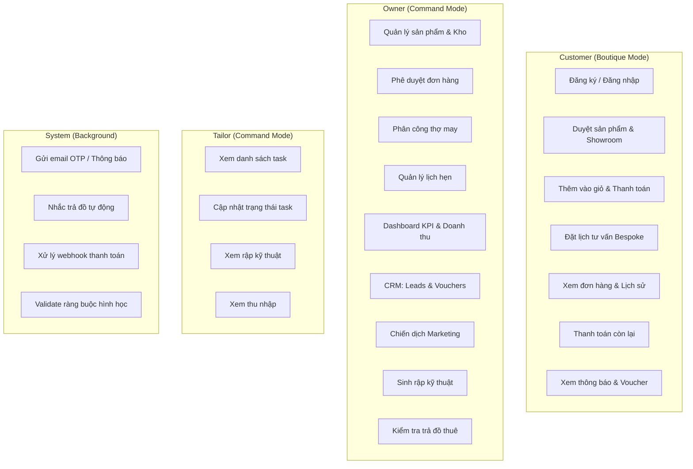
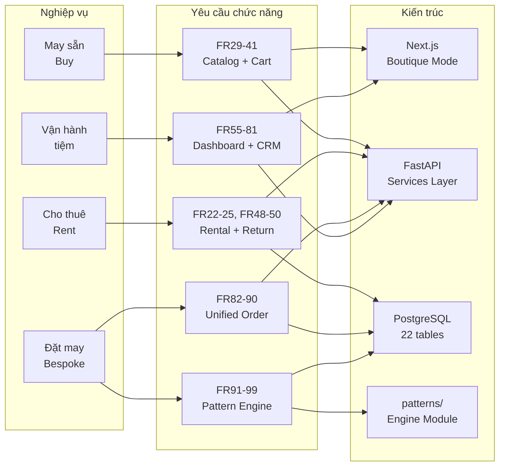

# Chương 2. Phân tích yêu cầu

Chương này trình bày hệ thống yêu cầu đã được nhóm thực hiện thu thập, phân loại và phê duyệt trước khi triển khai. Các yêu cầu được chia thành ba nhóm: yêu cầu chức năng (Functional Requirements — FR), yêu cầu phi chức năng (Non-functional Requirements — NFR), và yêu cầu thiết kế trải nghiệm người dùng (UX Design Requirements — UX-DR).

## 2.1. Sơ đồ Use-Case tổng quan

Hệ thống phục vụ ba nhóm actor chính với các use-case được phân chia theo vai trò:

**Mô tả actor:**

| Actor | Vai trò | Chế độ giao diện |
|---|---|---|
| **Customer** | Khách hàng — duyệt sản phẩm, đặt mua/thuê/bespoke, quản lý hồ sơ cá nhân | Boutique Mode (thẩm mỹ, spacious) |
| **Owner** | Chủ tiệm — quản trị toàn bộ: sản phẩm, đơn, kho, nhân viên, CRM, pattern, dashboard | Command Mode (mật độ cao, dữ liệu) |
| **Tailor** | Thợ may — nhận task, xem rập, cập nhật tiến độ, theo dõi thu nhập | Command Mode (giới hạn quyền) |
| **System** | Hệ thống tự động — email, nhắc trả đồ, webhook thanh toán, validate constraints | Nền (background) |

## 2.2. Yêu cầu chức năng (FR)

Hệ thống có tổng cộng **96 yêu cầu chức năng** (đánh số FR1–FR99, bỏ trống FR19–FR21), được tổ chức thành **17 nhóm** (section) theo nghiệp vụ. Phần dưới đây trình bày tóm tắt từng nhóm cùng các FR tiêu biểu; danh sách đầy đủ được đặt tại Phụ lục A.

### 2.2.1. Nhóm 1 — Style & Semantic Interpretation (FR1–FR4)

**Tóm tắt:** Cho phép người dùng chọn "Style Pillar" (trụ cột phong cách) và điều chỉnh cường độ qua Slider, hệ thống dịch thành Ease Delta và gợi ý chất liệu vải phù hợp.

**Trạng thái MVP:** Hoãn (Epic 12 — post-MVP).

| FR | Mô tả tóm tắt |
|---|---|
| FR1 | Chọn Style Pillar từ danh sách định sẵn |
| FR3 | Dịch lựa chọn phong cách thành bộ tham số Ease Delta |

### 2.2.2. Nhóm 2 — Geometric Transformation Engine (FR5–FR8)

**Tóm tắt:** Áp dụng Ease Delta lên rập chuẩn (Golden Base Pattern), tính toạ độ mới theo số đo khách hàng, sinh Master Geometry Specification và xuất bản vẽ SVG.

**Trạng thái MVP:** Hoãn (Epic 13 — post-MVP).

| FR | Mô tả tóm tắt |
|---|---|
| FR5 | Áp Ease Delta lên Golden Base Pattern |
| FR7 | Sinh Master Geometry Specification chứa tham số hình học hậu biến đổi |

### 2.2.3. Nhóm 3 — Deterministic Guardrails & Validation (FR9–FR12)

**Tóm tắt:** Kiểm tra ràng buộc vật lý tự động, chặn xuất bản vẽ khi vi phạm Golden Rules, cảnh báo khi gần ngưỡng giới hạn, cho phép thợ may override.

**Trạng thái MVP:** Hoãn (Epic 14 — post-MVP).

| FR | Mô tả tóm tắt |
|---|---|
| FR9 | Tự động kiểm tra ràng buộc vật lý (vd: vòng nách so với bắp tay) |
| FR10 | Chặn xuất bản vẽ nếu vi phạm Golden Rules |

### 2.2.4. Nhóm 4 — Tailor Collaboration & Production (FR13–FR16)

**Tóm tắt:** Overlay so sánh rập chuẩn và rập tuỳ chỉnh, bảng đối soát kỹ thuật, danh sách tham số điều chỉnh, bảo vệ tri thức Golden Rules.

**Trạng thái MVP:** Hoãn (Epic 14 — post-MVP).

| FR | Mô tả tóm tắt |
|---|---|
| FR14 | Bảng Sanity Check để thợ may đối chiếu số đo với gợi ý AI |
| FR15 | Danh sách tham số điều chỉnh ± cm cho từng vị trí cắt |

### 2.2.5. Nhóm 5 — Measurement & Profile Management (FR17–FR18)

**Tóm tắt:** Thợ may nhập và lưu trữ bộ số đo chi tiết, hệ thống liên kết số đo với phiên bản rập tương ứng.

**Trạng thái MVP:** Đã triển khai (Epic 6).

| FR | Mô tả tóm tắt |
|---|---|
| FR17 | Nhập và lưu bộ số đo theo danh mục tham số chuẩn cho mỗi khách |
| FR18 | Liên kết số đo với phiên bản rập tuỳ chỉnh trong lịch sử |

### 2.2.6. Nhóm 6 — Rental Catalog & Status (FR22–FR25)

**Tóm tắt:** Hiển thị danh mục cho thuê với hình ảnh, thông số kích thước thực tế, trạng thái kho thời gian thực, ngày trả dự kiến, và cập nhật trạng thái nhanh cho Owner.

**Trạng thái MVP:** Đã triển khai (Epic 2).

| FR | Mô tả tóm tắt |
|---|---|
| FR22 | Hiển thị danh mục cho thuê với hình, mô tả, kích thước thực (cm) |
| FR23 | Hiển thị trạng thái thời gian thực: Available / Rented / Maintenance |
| FR25 | Owner cập nhật trạng thái kho tối đa 3 thao tác chạm |

### 2.2.7. Nhóm 7 — Authentication & Security (FR26–FR28)

**Tóm tắt:** Khôi phục mật khẩu qua OTP (tái sử dụng hạ tầng đăng ký), template email riêng cho recovery, đổi mật khẩu sau OTP verify.

**Trạng thái MVP:** Đã triển khai (Epic 1).

| FR | Mô tả tóm tắt |
|---|---|
| FR26 | Cho phép yêu cầu khôi phục mật khẩu qua OTP |
| FR28 | Chỉ cho phép đổi mật khẩu sau khi xác thực OTP thành công |

### 2.2.8. Nhóm 8 — Product & Inventory Management (FR29–FR37)

**Tóm tắt:** Danh sách sản phẩm phân trang server-side (20 item/trang), bộ lọc đa tiêu chí (Season/Color/Material/Size) trả kết quả dưới 500 ms, chi tiết sản phẩm HD zoom, lựa chọn Mua/Thuê, CRUD sản phẩm cho Owner, quản lý tồn kho, tag mùa, timeline trả đồ, nhắc nhở tự động.

**Trạng thái MVP:** Đã triển khai (Epic 2).

| FR | Mô tả tóm tắt |
|---|---|
| FR29 | Danh sách sản phẩm phân trang server-side (20 items/page) |
| FR30 | Bộ lọc đa tiêu chí, trả kết quả dưới 500 ms |
| FR32 | Chọn "Mua" hoặc "Thuê" — thuê hiện calendar chọn ngày |
| FR37 | Nhắc nhở tự động 3 ngày và 1 ngày trước hạn trả đồ |

### 2.2.9. Nhóm 9 — E-commerce: Cart & Checkout (FR38–FR41)

**Tóm tắt:** Giỏ hàng với phân loại mua/thuê, cập nhật số lượng, tổng tiền chạy, checkout với địa chỉ giao + phương thức thanh toán, tạo đơn + gửi email xác nhận.

**Trạng thái MVP:** Đã triển khai (Epic 3).

| FR | Mô tả tóm tắt |
|---|---|
| FR38 | Giỏ hàng hiển thị sản phẩm với số lượng, giá, phân loại mua/thuê |
| FR39 | Cập nhật, xoá item, tổng tiền chạy; state lưu xuyên session |
| FR41 | Tạo đơn khi checkout, gửi email xác nhận |

### 2.2.10. Nhóm 10 — Appointment Booking (FR42–FR44)

**Tóm tắt:** Lịch trực quan chọn ngày/slot, form thông tin cá nhân và yêu cầu đặc biệt, xác nhận và thông báo đến cả khách và chủ tiệm.

**Trạng thái MVP:** Đã triển khai (Epic 4).

| FR | Mô tả tóm tắt |
|---|---|
| FR42 | Chọn ngày và slot (Morning / Afternoon) qua giao diện lịch |
| FR44 | Xác nhận lịch hẹn, thông báo email/SMS cho cả hai bên |

### 2.2.11. Nhóm 11 — Order & Payment Management (FR45–FR54)

**Tóm tắt:** Owner xem và lọc đơn theo trạng thái, xem chi tiết đơn (cả Owner và Customer), cập nhật trạng thái luồng, theo dõi thuê, ghi nhận tình trạng trả đồ, thông báo quá hạn, tích hợp payment gateway, theo dõi trạng thái thanh toán, lịch sử đơn cho Customer, tải hoá đơn PDF.

**Trạng thái MVP:** Đã triển khai (Epic 5).

| FR | Mô tả tóm tắt |
|---|---|
| FR45 | Owner xem đơn với bộ lọc trạng thái |
| FR47 | Cập nhật trạng thái đơn theo luồng Pending → Confirmed → ... → Delivered |
| FR49 | Ghi nhận tình trạng trả đồ thuê: Good / Damaged / Lost |
| FR51 | Tích hợp payment gateway: COD, bank transfer, e-wallet |
| FR54 | Customer tải hoá đơn PDF cho đơn hoàn thành |

### 2.2.12. Nhóm 12 — Operations Dashboard (FR55–FR61)

**Tóm tắt:** Dashboard doanh thu (ngày/tuần/tháng) với trend indicator, biểu đồ trực quan, thống kê đơn mua/thuê, cảnh báo deadline sản xuất, danh sách lịch hẹn thời gian thực, phân công task cho thợ.

**Trạng thái MVP:** Đã triển khai (Epic 7).

| FR | Mô tả tóm tắt |
|---|---|
| FR55 | Tổng doanh thu với trend indicator |
| FR56 | Biểu đồ doanh thu (line/bar) chọn khoảng ngày |
| FR58 | Cảnh báo đơn có deadline sản xuất trong 7 ngày |
| FR61 | Phân công task cho thợ may kèm deadline và ghi chú |

### 2.2.13. Nhóm 13 — Tailor Dashboard (FR62–FR65)

**Tóm tắt:** Thợ may xem danh sách task, xem garment đã hoàn thành cùng đơn giá, thống kê thu nhập tháng, cập nhật trạng thái task.

**Trạng thái MVP:** Đã triển khai (Epic 8).

| FR | Mô tả tóm tắt |
|---|---|
| FR62 | Danh sách task với deadline, chi tiết đơn, ưu tiên |
| FR64 | Thống kê thu nhập tháng theo loại garment, so sánh tháng trước |
| FR65 | Cập nhật trạng thái: Assigned → In Progress → Completed |

### 2.2.14. Nhóm 14 — Customer Management (FR66–FR68)

**Tóm tắt:** Owner xem hồ sơ khách gồm số đo + lịch sử mua/thuê, tìm kiếm khách, lưu giữ lịch sử thay đổi số đo theo phiên bản.

**Trạng thái MVP:** Đã triển khai (Epic 6).

| FR | Mô tả tóm tắt |
|---|---|
| FR66 | Xem hồ sơ khách: số đo, lịch sử mua/thuê |
| FR68 | Lịch sử thay đổi số đo theo phiên bản (versioned) |

### 2.2.15. Nhóm 15 — CRM & Marketing (FR69–FR81)

**Tóm tắt:** Quản lý leads (danh sách, tạo, phân loại Hot/Warm/Cold, chuyển đổi thành Customer), quản lý vouchers (CRUD, loại percent/fixed, điều kiện, analytics, phân phối), chiến dịch outreach (email/Zalo/Facebook, templates, analytics).

**Trạng thái MVP:** Đã triển khai (Epic 9).

| FR | Mô tả tóm tắt |
|---|---|
| FR71 | Phân loại lead: Hot / Warm / Cold |
| FR72 | Chuyển đổi lead → tài khoản Customer |
| FR74 | Hỗ trợ voucher phần trăm và cố định |
| FR79 | Hỗ trợ gửi qua Zalo và Facebook Messaging API |
| FR81 | Theo dõi open rate, CTR, voucher redemption theo campaign |

### 2.2.16. Nhóm 16 — Unified Order Workflow (FR82–FR90)

**Tóm tắt:** Luồng đơn hàng hợp nhất cho ba loại dịch vụ: Buy, Rent, Bespoke. Measurement Gate cho bespoke, thanh toán theo service type, yêu cầu CCCD/cọc cho thuê, Owner phê duyệt, auto-routing tạo TailorTask hoặc chuyển kho, sub-steps chuẩn bị theo loại, thanh toán còn lại, hoàn cọc/trả CCCD.

**Trạng thái MVP:** Đã triển khai (Epic 10).

| FR | Mô tả tóm tắt |
|---|---|
| FR82 | Measurement Gate: kiểm tra số đo trước khi cho phép bespoke checkout |
| FR83 | Ba chế độ thanh toán: Buy (100%), Rent (cọc + CCCD/thế chân), Bespoke (cọc) |
| FR85 | Owner phải phê duyệt đơn trước khi vào sản xuất/chuẩn bị |
| FR86 | Auto-routing: bespoke → tạo TailorTask, rent/buy → queue kho |
| FR90 | Hoàn cọc/trả CCCD sau kiểm tra tình trạng sản phẩm trả |

### 2.2.17. Nhóm 17 — Technical Pattern Generation (FR91–FR99)

**Tóm tắt:** Owner tạo phiên sinh rập bằng cách chọn khách, hệ thống auto-fill 10 số đo, sinh 3 mảnh rập (thân trước, thân sau, tay) bằng công thức tất định, xuất SVG 1:1 và G-code cho laser, preview split-pane thời gian thực, gắn rập vào đơn cho thợ, thợ xem rập zoom/pan, validate min/max trước khi sinh.

**Trạng thái MVP:** Đang triển khai (Epic 11, Story 11.1–11.6).

| FR | Mô tả tóm tắt |
|---|---|
| FR91 | Tạo phiên sinh rập, auto-fill 10 số đo từ hồ sơ khách |
| FR92 | Sinh 3 mảnh rập bằng công thức tất định, sai số < 1 mm |
| FR94 | Xuất SVG tỉ lệ 1:1, bản in khớp vật lý ±0,5 mm |
| FR95 | Xuất G-code cho máy laser: closed paths, speed/power cấu hình |
| FR96 | Preview SVG split-pane, cập nhật dưới 500 ms khi thay đổi số đo |
| FR99 | Validate 10 số đo theo min/max, thông báo lỗi tiếng Việt cụ thể |

### 2.2.18. Tổng hợp ánh xạ FR → Epic

Bảng dưới đây tóm tắt cách ánh xạ 99 FR vào 14 epic (11 MVP + 3 hoãn post-MVP):

| Epic | Tên | FR bao phủ | Trạng thái |
|---|---|---|---|
| 1 | Project Foundation & Authentication | FR26, FR27, FR28 | ✅ Hoàn thành |
| 2 | Product Catalog & Digital Showroom | FR22–FR25, FR29–FR37 | ✅ Hoàn thành |
| 3 | E-commerce Cart, Checkout & Payment | FR38–FR41, FR51, FR52 | ✅ Hoàn thành |
| 4 | Appointment Booking | FR42–FR44 | ✅ Hoàn thành |
| 5 | Order & Rental Management | FR45–FR50, FR53, FR54 | ✅ Hoàn thành |
| 6 | Measurement & Customer Profiles | FR17, FR18, FR66–FR68 | ✅ Hoàn thành |
| 7 | Operations Dashboard | FR55–FR61 | ✅ Hoàn thành |
| 8 | Tailor Dashboard | FR62–FR65 | ✅ Hoàn thành |
| 9 | CRM & Marketing | FR69–FR81 | ✅ Hoàn thành |
| 10 | Unified Order Workflow | FR82–FR90 | ✅ Hoàn thành |
| 11 | Technical Pattern Generation | FR91–FR99 | 🔄 Đang triển khai |
| 12 | AI Style & Semantic Interpretation | FR1–FR4 | ⏸️ Hoãn |
| 13 | AI Geometric Transformation Engine | FR5–FR8 | ⏸️ Hoãn |
| 14 | AI Guardrails & Tailor Collaboration | FR9–FR16 | ⏸️ Hoãn |

**Ghi chú:** PRD đánh số nhảy từ FR18 sang FR22 (FR19–FR21 không được sử dụng), do đó tổng số FR thực tế là **96 mục** mặc dù mã số cao nhất là FR99.

## 2.3. Yêu cầu phi chức năng (NFR)

Hệ thống có **20 yêu cầu phi chức năng**, phân thành bốn nhóm. Tất cả NFR đều áp dụng cho toàn bộ hệ thống (cross-cutting) và đóng vai trò làm tiêu chí nghiệm thu.

### 2.3.1. Performance & Scalability (NFR1–NFR5)

| NFR | Mô tả | Chỉ số mục tiêu | Phương pháp đo |
|---|---|---|---|
| NFR1 | Thời gian phản hồi chu kỳ suy luận LangGraph | Trung bình < 15 giây | APM monitoring, 100 request liên tiếp trên staging |
| NFR2 | Số lượng request suy luận đồng thời | Tối thiểu 5 concurrent | Load testing trên staging |
| NFR3 | Thời gian tải trang sản phẩm | < 2 giây (p95) | Real User Monitoring (RUM) |
| NFR4 | Thời gian phản hồi API thường (non-inference) | < 300 ms (p95) | APM monitoring |
| NFR5 | Người dùng e-commerce đồng thời | Tối thiểu 100, không suy giảm hiệu năng | Load testing mô phỏng session |

### 2.3.2. Accuracy & Reliability (NFR6–NFR10)

| NFR | Mô tả | Chỉ số mục tiêu | Phương pháp đo |
|---|---|---|---|
| NFR6 | Sai số hình học tuyệt đối | ΔG ≤ 1 mm so với tính toán lý thuyết | So sánh toạ độ trên bản vẽ SVG/DXF |
| NFR7 | Tính sẵn sàng (availability) trong giờ vận hành | 99,9% | Cloud uptime monitoring |
| NFR8 | Toàn vẹn dữ liệu Master Geometry | Checksum (hash) trước lưu trữ và truyền tải | Automated integrity test |
| NFR9 | Tỷ lệ thanh toán thành công | > 99,5% cho giao dịch hợp lệ | Payment gateway transaction logs |
| NFR10 | Nhất quán trạng thái đơn/tồn kho khi truy cập đồng thời | Không mâu thuẫn dữ liệu | Concurrent transaction testing |

### 2.3.3. Security & Privacy (NFR11–NFR15)

| NFR | Mô tả | Chỉ số mục tiêu | Phương pháp đo |
|---|---|---|---|
| NFR11 | Xác thực đa yếu tố cho phiên làm việc nội bộ | Bắt buộc cho Owner/Tailor session | Access audit logs |
| NFR12 | RBAC nghiêm ngặt bảo vệ Golden Rules và dữ liệu theo vai trò | Không truy cập ngoài quyền | Periodic access control testing |
| NFR13 | Mã hoá dữ liệu nhạy cảm khi lưu trữ | AES-256 cho số đo và tri thức nghệ nhân | Storage encryption audit |
| NFR14 | Tuân thủ PCI DSS cho thanh toán | Không lưu trữ dữ liệu thẻ thô | PCI compliance audit |
| NFR15 | JWT lưu trong cookie bảo mật | HttpOnly, Secure, SameSite — không localStorage | Security review |

### 2.3.4. Maintainability & Usability (NFR16–NFR20)

| NFR | Mô tả | Chỉ số mục tiêu | Phương pháp đo |
|---|---|---|---|
| NFR16 | Ghi log toàn bộ quyết định AI và override của thợ may | 100% completeness | Log completeness audit |
| NFR17 | Phản hồi UI khi kéo Slider trên Adaptive Canvas | < 200 ms | Browser DevTools profiling |
| NFR18 | Thuật ngữ tiếng Việt chuyên ngành may | 100% trên mọi label và output | Đối chiếu Terminology Glossary |
| NFR19 | Hoạt động đầy đủ trên mobile | Viewport ≥ 375 px, 3 kích thước thiết bị | Responsive design testing |
| NFR20 | Tuân thủ WCAG 2.1 Level A | Pass 100% | Automated accessibility testing (axe-core) |

## 2.4. Yêu cầu thiết kế trải nghiệm người dùng (UX-DR)

Hệ thống có **21 yêu cầu thiết kế UX**, được tài liệu hoá tại `ux-design-specification.md`. Bảng dưới đây tóm tắt từng yêu cầu theo nhóm:

### 2.4.1. Design Tokens & Typography

| UX-DR | Tên | Mô tả tóm tắt |
|---|---|---|
| UX-DR1 | Heritage Palette | 10 color tokens: Primary Indigo `#1A2B4C`, Surface Ivory `#F9F7F2`, Accent Gold `#D4AF37`, Background White, Text Charcoal, Warm Gray, Jade Green, Amber, Ruby Red, Slate Blue |
| UX-DR2 | Dual-Tone Typography | 3 font families: Cormorant Garamond (Display), Inter (Body), JetBrains Mono (Data/Số/KPI) |
| UX-DR3 | Dual-Mode UI | Boutique Mode (Ivory bg, serif, gap 16–24 px) vs Command Mode (White bg, sans-serif, gap 8–12 px). Phát hiện mode theo route |
| UX-DR20 | Adaptive Density | Hệ lưới 8 px cơ bản. Border-radius: 8 px default, 12 px card, 24 px button. 3 cấp shadow |

### 2.4.2. Custom Components

| UX-DR | Component | Mô tả tóm tắt |
|---|---|---|
| UX-DR4 | ProductCard | Card sản phẩm: ảnh HD, tên, giá, badge Mua/Thuê. States: Default, Hover, Out of Stock, Loading. Responsive 2/3/4 cột |
| UX-DR5 | BookingCalendar | Lịch đặt hẹn: slot Available (xanh) / Booked (xám) / Selected (vàng) / Today (indigo). Week view mobile, Month view desktop |
| UX-DR6 | KPICard | Thẻ KPI dashboard: trend arrow, sparkline chart. 3 variants: Revenue, Orders, Appointments |
| UX-DR7 | StatusBadge | Badge trạng thái đa màu: Pending (amber), Confirmed (blue), In Progress (indigo), Completed (green), Cancelled/Overdue (red). Quick-cycle tap |
| UX-DR8 | TaskRow | Dòng task thợ may: tên task, khách, garment, deadline, badge, income preview. Swipe left for actions |
| UX-DR9 | OrderTimeline | Pipeline trạng thái đơn. 2 variants: Compact (table row) và Expanded (detail page) |
| UX-DR10 | LeadCard | Thẻ CRM lead: tên, SĐT, nguồn, classification Hot/Warm/Cold, ghi chú. Actions: Convert, Add Note, Schedule |
| UX-DR11 | MeasurementForm | Form 10 trường số đo + Customer Combobox auto-fill. Lỗi bằng thuật ngữ may tiếng Việt |
| UX-DR12 | PatternPreview | SVG viewer zoom/pan, toggle 3 mảnh rập. 2 variants: Full (Design Session) và Embedded (Task Detail). Pinch-to-zoom mobile |
| UX-DR13 | PatternExportBar | Thanh xuất: nút [SVG] [G-code] + popover speed/power. Batch export ZIP. 3 states: Disabled, Ready, Exporting |

### 2.4.3. Navigation & Layout

| UX-DR | Tên | Mô tả tóm tắt |
|---|---|---|
| UX-DR14 | Customer Navigation | Bottom Tab Bar mobile (Home, Shop, Book, Profile). Breadcrumb + Back cho detail |
| UX-DR15 | Owner/Tailor Navigation | Sidebar collapsible, section grouping, menu theo role |
| UX-DR16 | Responsive Strategy | Mobile-first (≥ 375 px) cho Customer, Desktop-first cho Dashboard. Breakpoint: 320–767 / 768–1023 / 1024+ |

### 2.4.4. Accessibility, Animation & Error Handling

| UX-DR | Tên | Mô tả tóm tắt |
|---|---|---|
| UX-DR17 | Accessibility | WCAG 2.1 Level A. Touch target ≥ 44 × 44 px. Focus ring 2 px Heritage Gold. ARIA via Radix. Contrast Indigo/Ivory 11,2:1 (AAA) |
| UX-DR18 | Micro-animations | Framer Motion: page transitions fade/slide, button press, card hover, layout reorder, scroll hero |
| UX-DR19 | Error Handling UX | Thông báo lỗi bằng ngôn ngữ tự nhiên (không lỗi kỹ thuật), CTA rõ (Thử lại / Liên hệ), giữ state form khi lỗi, skeleton thay spinner |
| UX-DR21 | i18n Hook | `useTranslate` wrapper, hỗ trợ Việt và Anh. JSON locale lazy-loading |

## 2.5. Ma trận truy xuất yêu cầu (Requirements Traceability Matrix)

Sơ đồ dưới đây minh hoạ ở mức tổng quan cách năm nhóm nghiệp vụ cốt lõi liên kết với các nhóm FR và thành phần kiến trúc tương ứng. Ánh xạ đầy đủ từng FR → epic xem tại mục 2.2.18:

**Ý nghĩa của ma trận:**

- Mỗi nghiệp vụ cốt lõi (Buy, Rent, Bespoke, Vận hành) đều có ít nhất một nhóm FR phủ trực tiếp.
- Mọi nhóm FR đều được ánh xạ sang ít nhất một thành phần kiến trúc cụ thể (frontend route group, backend module, hoặc database table group).
- Pattern Engine (FR91–FR99) là module duy nhất ánh xạ sang thư mục `patterns/` độc lập — tuân theo nguyên tắc "Core cứng, Shell mềm" đã nêu ở Chương 1.

## 2.6. Tổng kết chương

Dự án **Nhà May Thanh Lộc** có tổng cộng **96 yêu cầu chức năng thực tế** (đánh số FR1–FR99, bỏ trống FR19–FR21), **20 yêu cầu phi chức năng** (4 nhóm), và **21 yêu cầu thiết kế UX**. Trong phạm vi MVP, **80 FR** (nhóm 5 đến nhóm 17) được triển khai thuộc 11 epic; **16 FR** (nhóm 1 đến 4) thuộc 3 epic AI Bespoke được hoãn lại. Toàn bộ 20 NFR và 21 UX-DR áp dụng cho mọi phần đã triển khai.

Các chương tiếp theo trình bày cách biến hệ thống yêu cầu này thành kiến trúc (Chương 3), lựa chọn công nghệ (Chương 4) và triển khai chi tiết (Chương 5).
