# Chương 3. Phân tích và Thiết kế hệ thống

Chương này trình bày kiến trúc tổng thể, mô hình dữ liệu, thiết kế API và thiết kế giao diện người dùng. Mọi quyết định kiến trúc tuân theo tài liệu *Architecture Decision Document* đã được phê duyệt trước khi triển khai.

## 3.1. Kiến trúc tổng thể

### 3.1.1. Mô hình kiến trúc

Hệ thống tuân theo mô hình **Full-stack Layered Architecture** với hai deployable unit (frontend + backend) giao tiếp qua REST API, cùng một lớp persistence (PostgreSQL + pgvector).

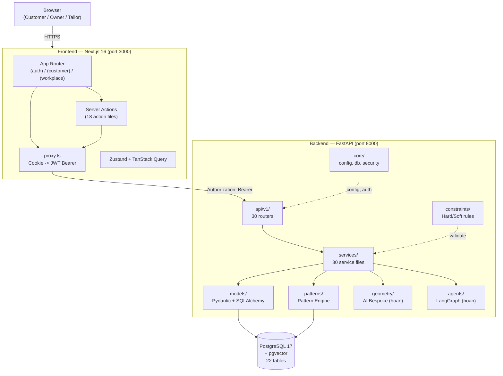

### 3.1.2. Mô hình kiến trúc (ASCII — phiên bản in ấn)

Phiên bản ASCII dưới đây phục vụ cho các trường hợp in giấy hoặc renderer không hỗ trợ Mermaid:

```text
┌─────────────────────────────────────────────────────────────────┐
│                    BROWSER (3 vai trò)                          │
│      Cookie HttpOnly + Secure + SameSite (Auth.js v5)          │
└──────────────────────────┬──────────────────────────────────────┘
                           │ HTTPS
┌──────────────────────────▼──────────────────────────────────────┐
│           NEXT.JS 16 APP ROUTER (port 3000)                     │
│                                                                  │
│  app/                                                            │
│   ├─ (auth)/       → login, register, OTP, reset                │
│   ├─ (customer)/   → showroom, booking, checkout (Boutique)     │
│   ├─ (workplace)/  → owner/, tailor/, design-session/ (Command) │
│   ├─ actions/      → 18 Server Actions (goi backend qua proxy) │
│   └─ proxy.ts      → doc cookie, dinh JWT, forward request     │
│                                                                  │
│  State: Zustand (cart, design) + TanStack Query (server sync)   │
│  UI: TailwindCSS v4 + Radix UI + Framer Motion                  │
└──────────────────────────┬──────────────────────────────────────┘
                           │ HTTP (server-to-server, JWT)
┌──────────────────────────▼──────────────────────────────────────┐
│           FASTAPI BACKEND (port 8000)                            │
│                                                                  │
│  api/v1/ (30 routers) → services/ (30 files) → models/ (ORM)   │
│                                                                  │
│  Sidecars doc lap:                                               │
│    patterns/    — Pattern Engine (Epic 11, deterministic)        │
│    geometry/    — GeometryRebuilder (Epic 13, hoan)              │
│    agents/      — LangGraph Emotional Compiler (Epic 12, hoan)  │
│    constraints/ — Hard/Soft rules registry (Epic 14, hoan)      │
│    core/        — config, database, security, seed               │
│                                                                  │
│  Background: scheduler_service (nhac tra do), email_service      │
└──────────────────────────┬──────────────────────────────────────┘
                           │ asyncpg
┌──────────────────────────▼──────────────────────────────────────┐
│           POSTGRESQL 17 + pgvector 0.8.x                         │
│           22 tables, 30 migrations, tenant_id isolation          │
└─────────────────────────────────────────────────────────────────┘
```

### 3.1.3. Nguyên lý kiến trúc cốt lõi

**Nguyên lý 1 — Authoritative Server Pattern (SSOT)**

Backend là nguồn chân lý duy nhất cho mọi validation nghiệp vụ, giá trị hoá đơn và tồn kho. Frontend chỉ chịu trách nhiệm validate kiểu (TypeScript/Zod) và rendering UI. Khi checkout, backend tính lại toàn bộ giá, voucher, tồn kho — không tin cậy giá trị từ Zustand store.

**Nguyên lý 2 — Dual-Mode UI Architecture**

Giao diện tách hoàn toàn hai chế độ thông qua Route Groups của Next.js:

| Thuộc tính | Boutique Mode `(customer)/` | Command Mode `(workplace)/` |
|---|---|---|
| Đối tượng | Customer | Owner, Tailor |
| Background | Silk Ivory `#F9F7F2` | White `#FFFFFF` |
| Heading font | Cormorant Garamond (serif) | Inter (sans-serif) |
| Spacing | 16–24 px (spacious) | 8–12 px (dense) |
| Navigation | Bottom Tab Bar (mobile) | Sidebar collapsible |
| Ưu tiên | Thẩm mỹ, animation | Mật độ dữ liệu, hiệu suất |

**Nguyên lý 3 — Proxy Pattern (Auth-aware)**

```text
Browser → Next.js Server (proxy.ts đọc cookie, đính JWT) → FastAPI Backend
```

Browser không bao giờ gọi trực tiếp FastAPI. Proxy đảm bảo JWT không bị lộ qua JavaScript (HttpOnly cookie).

**Nguyên lý 4 — "Core cứng, Shell mềm"**

Module `patterns/` (Pattern Engine, Epic 11) hoàn toàn standalone — không import từ `geometry/`, `agents/`, hay `constraints/`. Dùng công thức tất định (pure math), chạy dưới 50 ms cho 3 mảnh rập. Tách biệt hoàn toàn với AI Bespoke Engine để đảm bảo mọi output luôn khả thi vật lý.

### 3.1.4. Sơ đồ thành phần (Component Diagram)

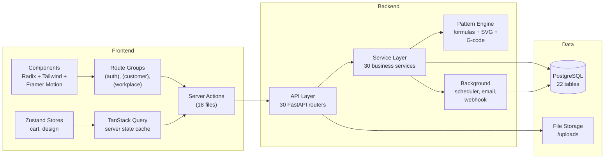

## 3.2. Mô hình dữ liệu

### 3.2.1. Tổng quan

Cơ sở dữ liệu gồm **22 bảng** được chia thành 7 nhóm domain, kết nối bởi hơn **39 foreign key**. Tất cả bảng nghiệp vụ đều chứa `tenant_id` để hỗ trợ multi-tenant isolation ở tầng ứng dụng.

Dưới đây trình bày ERD theo từng nhóm domain để dễ đọc. Sơ đồ ERD đầy đủ xem tại Phụ lục A (`_bmad-output/erd.mmd`).

### 3.2.2. Nhóm Auth & Tenant

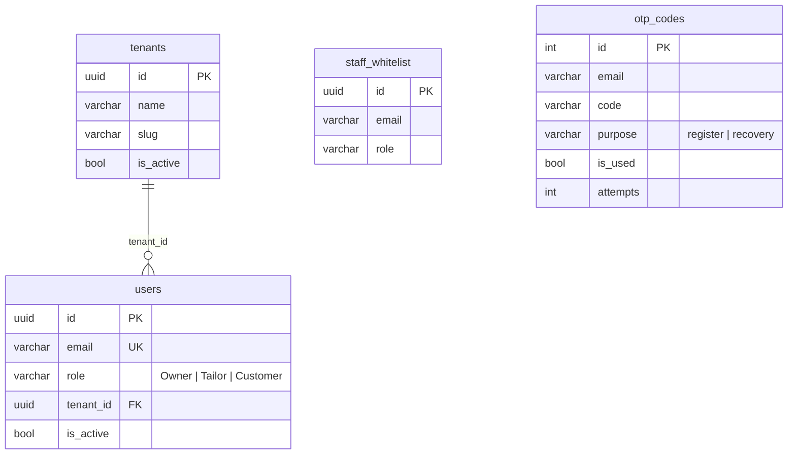

**Mô tả:**

| Bảng | Vai trò |
|---|---|
| `tenants` | Mỗi record = 1 tiệm may, cách ly hoàn toàn dữ liệu |
| `users` | Tài khoản — 3 role: Owner, Tailor, Customer. FK `tenant_id` |
| `staff_whitelist` | Whitelist email nhân viên được phép đăng ký role Owner/Tailor |
| `otp_codes` | Mã OTP cho đăng ký và khôi phục mật khẩu, có rate limiting |

### 3.2.3. Nhóm Customer & Measurement

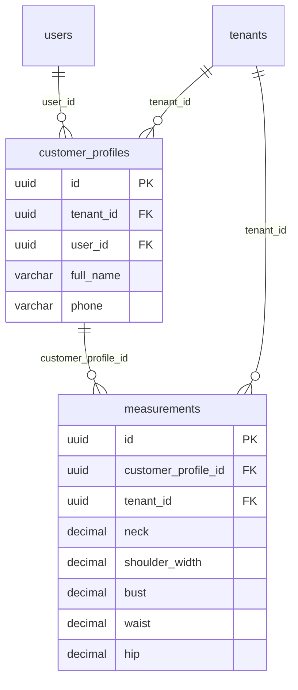

**Mô tả:**

| Bảng | Vai trò |
|---|---|
| `customer_profiles` | Hồ sơ khách hàng (per-tenant) — gắn `user_id` |
| `measurements` | Bộ số đo cơ thể — versioned (1 khách có nhiều bộ số đo theo thời gian) |

### 3.2.4. Nhóm Order, Payment & Rental

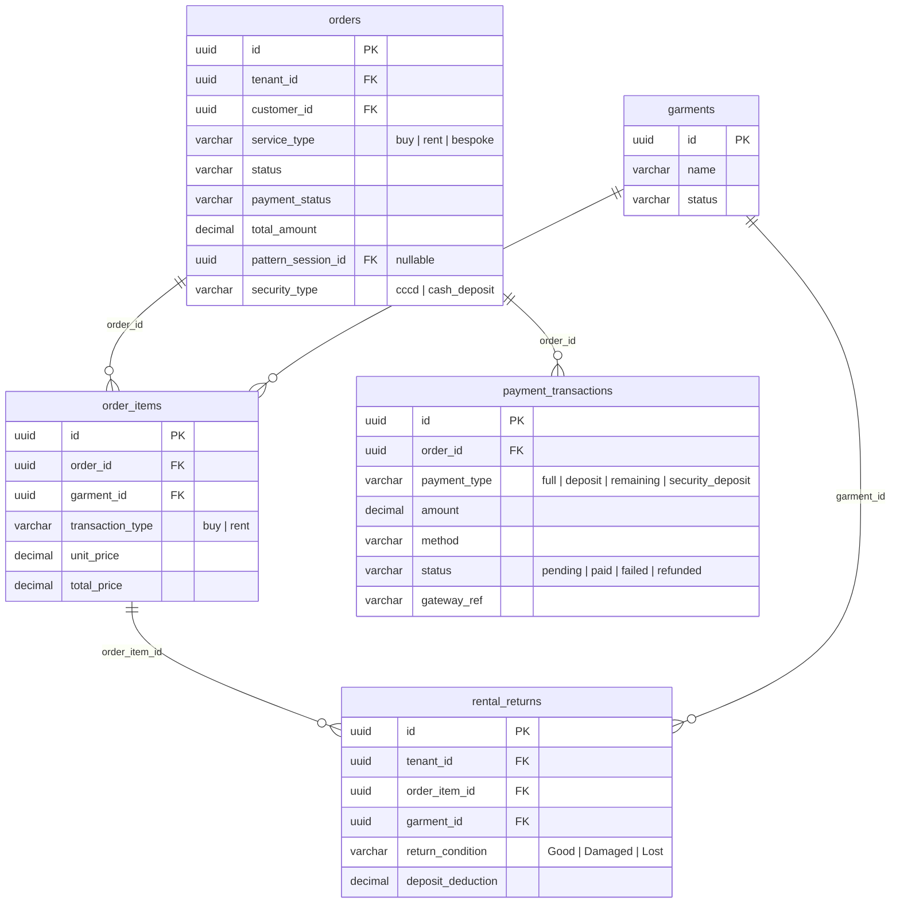

**Mô tả:**

| Bảng | Vai trò |
|---|---|
| `orders` | Đơn hàng — `service_type` phân biệt 3 luồng; `pattern_session_id` gắn rập (Epic 11) |
| `order_items` | Chi tiết từng sản phẩm trong đơn — `transaction_type` phân loại mua/thuê |
| `payment_transactions` | Mô hình thanh toán đa bước: full / deposit / remaining / security_deposit |
| `rental_returns` | Ghi nhận trả đồ thuê: tình trạng + tiền trừ cọc |

### 3.2.5. Nhóm Product, Production & Design

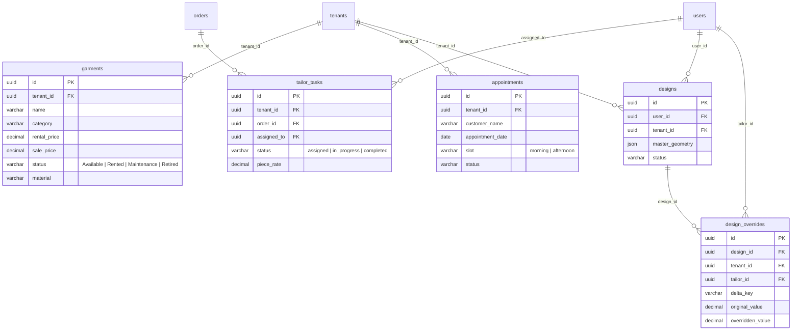

**Mô tả:**

| Bảng | Vai trò |
|---|---|
| `garments` | Kho áo dài: bán + cho thuê, theo dõi trạng thái và chất liệu |
| `tailor_tasks` | Phân công thợ may — `piece_rate` lưu lương theo sản phẩm |
| `appointments` | Lịch hẹn tư vấn Bespoke — slot morning/afternoon |
| `designs` | Thiết kế áo dài — Master Geometry JSON (Epic 12–14, hoãn) |
| `design_overrides` | Override thủ công của thợ may — delta_key, original vs overridden value |

### 3.2.6. Nhóm CRM & Marketing

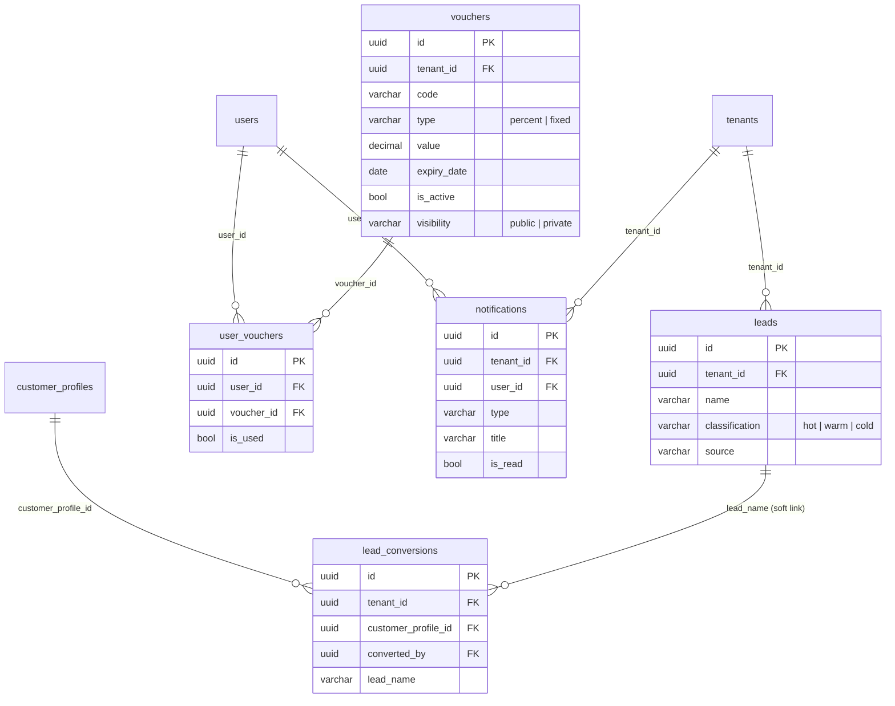

**Mô tả:**

| Bảng | Vai trò |
|---|---|
| `leads` | Khách tiềm năng — phân loại Hot/Warm/Cold |
| `lead_conversions` | Lịch sử chuyển đổi lead → customer |
| `vouchers` | Mã giảm giá: percent/fixed, public/private visibility |
| `user_vouchers` | Gán voucher cho user, tracking `is_used` |
| `notifications` | Thông báo in-app — type, title, is_read |

### 3.2.7. Nhóm Pattern Engine (Epic 11)

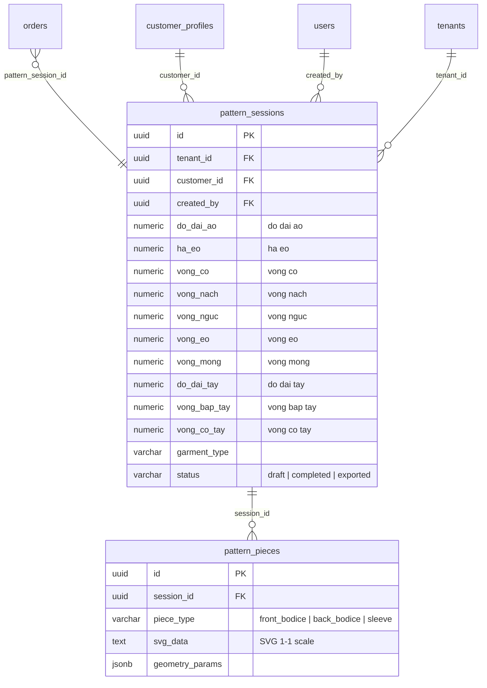

**Mô tả:**

| Bảng | Vai trò |
|---|---|
| `pattern_sessions` | Phiên sinh rập — snapshot 10 số đo (immutable), garment_type extensible |
| `pattern_pieces` | 3 mảnh rập kết quả — SVG markup + geometry params JSONB |

**Quyết định thiết kế quan trọng:**

- **10 cột riêng** cho số đo (không dùng JSONB) → hỗ trợ SQL query trực tiếp, type safety, Pydantic validation per field.
- **svg_data TEXT** lưu trực tiếp trong DB — pattern SVG nhỏ (dưới 50 KB), tránh phức tạp quản lý file external.
- **garment_type VARCHAR** chuẩn bị cho Open Garment System (không chỉ áo dài) mà không cần thay đổi schema.

### 3.2.8. Chiến lược Multi-Tenancy

Hệ thống áp dụng **shared schema, tenant_id column** — tất cả bảng nghiệp vụ chứa `tenant_id UUID` FK về `tenants(id)`.

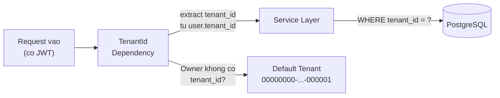

- Mọi truy vấn service BẮT BUỘC filter theo `tenant_id`.
- Owner role có thể dùng default tenant nếu chưa gán tenant cụ thể.
- Khi resource thuộc tenant khác → trả `404` (không phải `403`) để tránh leak thông tin.

## 3.3. Thiết kế API

### 3.3.1. Tổng quan endpoint

Backend cung cấp **30 router** tại prefix `/api/v1/`, tổ chức theo domain nghiệp vụ:

| Nhóm | Router tiêu biểu | Phương thức chính | Đối tượng auth |
|---|---|---|---|
| **Auth** | `/auth` | POST login, register, OTP send/verify, reset | Public / CurrentUser |
| **Customer Self-service** | `/customers/me` | GET profile, measurements, orders, notifications, vouchers | Customer |
| **Products & Showroom** | `/garments` | GET list (paginated + filter), GET detail, POST/PUT/DELETE CRUD | Public (GET) / OwnerOnly (CRUD) |
| **Cart & Checkout** | `/orders` | POST create, GET list, GET detail | CurrentUser |
| **Booking** | `/appointments` | POST create, GET list | CurrentUser / OwnerOnly |
| **Order Management** | `/orders/{id}/approve`, `/orders/{id}/pay-remaining`, `/orders/{id}/refund-security` | POST | OwnerOnly / Customer |
| **Tailor Tasks** | `/tailor/tasks` | GET list, PATCH status | OwnerOrTailor |
| **Dashboard KPI** | `/kpi` | GET stats, revenue, order-breakdown | OwnerOnly |
| **CRM** | `/leads`, `/vouchers`, `/campaigns` | CRUD | OwnerOnly |
| **Pattern Engine** | `/patterns/sessions`, `/patterns/pieces/{id}/export` | POST create/generate, GET detail/export | OwnerOnly / OwnerOrTailor |
| **Uploads** | `/uploads` | POST multipart | CurrentUser |

### 3.3.2. Quy ước response

Mọi endpoint tuân theo wrapper thống nhất:

**Thành công:**

```json
{
  "data": { "id": "uuid", "status": "completed", "..." : "..." },
  "meta": { "pagination": { "page": 1, "size": 20, "total": 100 } }
}
```

**Lỗi:**

```json
{
  "error": {
    "code": "ERR_INVALID_FORMAT",
    "message": "Dinh dang xuat khong hop le. Chon 'svg' hoac 'gcode'"
  }
}
```

HTTP status tuân theo quy ước: `200`/`201` thành công, `400` sai format, `401` token hết hạn, `403` sai role, `404` không tìm thấy (hoặc khác tenant), **`422`** vi phạm ràng buộc hình học (message tiếng Việt 100%), `500` lỗi không lường trước.

### 3.3.3. Ví dụ chi tiết — Pattern Engine API

**Tạo phiên sinh rập:**

```
POST /api/v1/patterns/sessions
Authorization: Bearer <owner_jwt>
Content-Type: application/json

{
  "customer_id": "uuid-of-customer",
  "do_dai_ao": 120.0,
  "ha_eo": 38.5,
  "vong_co": 36.0,
  "vong_nach": 40.0,
  "vong_nguc": 88.0,
  "vong_eo": 68.0,
  "vong_mong": 92.0,
  "do_dai_tay": 55.0,
  "vong_bap_tay": 28.0,
  "vong_co_tay": 16.0,
  "garment_type": "ao_dai",
  "notes": "Khach yeu cau ta rong hon 2cm"
}
```

**Response 201:**

```json
{
  "data": {
    "id": "session-uuid",
    "customer_id": "uuid-of-customer",
    "status": "draft",
    "garment_type": "ao_dai",
    "do_dai_ao": 120.0,
    "vong_nguc": 88.0,
    "..."  : "..."
  },
  "meta": {}
}
```

**Sinh 3 mảnh rập:**

```
POST /api/v1/patterns/sessions/{session-uuid}/generate
Authorization: Bearer <owner_jwt>
```

**Response 200:**

```json
{
  "data": {
    "id": "session-uuid",
    "status": "completed",
    "pieces": [
      { "id": "piece-1", "piece_type": "front_bodice", "svg_data": "<svg ...>", "geometry_params": { "bust_width": 22.0, "waist_width": 16.0, "..." : "..." } },
      { "id": "piece-2", "piece_type": "back_bodice", "svg_data": "<svg ...>", "geometry_params": { "..." : "..." } },
      { "id": "piece-3", "piece_type": "sleeve", "svg_data": "<svg ...>", "geometry_params": { "cap_height": 19.0, "..." : "..." } }
    ]
  },
  "meta": {}
}
```

**Xuất G-code (single piece):**

```
GET /api/v1/patterns/pieces/{piece-1}/export?format=gcode&speed=1000&power=80
Authorization: Bearer <owner_jwt>
```

**Response:** `Content-Type: text/plain`, file download `front_bodice.gcode`.

### 3.3.4. Ví dụ chi tiết — Unified Order Workflow API

**Owner phê duyệt đơn:**

```
POST /api/v1/orders/{order-id}/approve
Authorization: Bearer <owner_jwt>
```

**Response 200:**

```json
{
  "data": {
    "id": "order-id",
    "status": "confirmed",
    "service_type": "bespoke",
    "routing": "tailor_task_created"
  },
  "meta": {}
}
```

Backend tự động: (1) chuyển status `pending` → `confirmed`, (2) tạo `tailor_tasks` nếu bespoke, (3) gửi notification cho thợ may, (4) email xác nhận cho customer.

## 3.4. Thiết kế giao diện người dùng

### 3.4.1. Luồng tương tác — Đặt may Bespoke (Customer)

Sơ đồ sequence dưới đây mô tả luồng chính của hành trình Bespoke từ góc nhìn Customer:

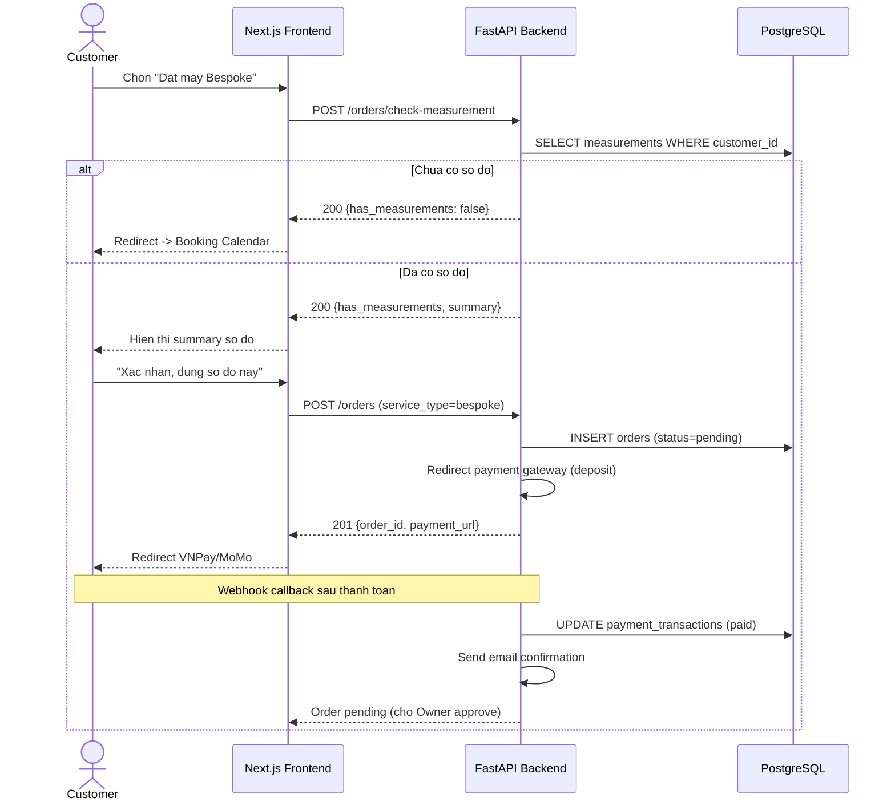

### 3.4.2. Luồng tương tác — Sinh rập kỹ thuật (Owner)

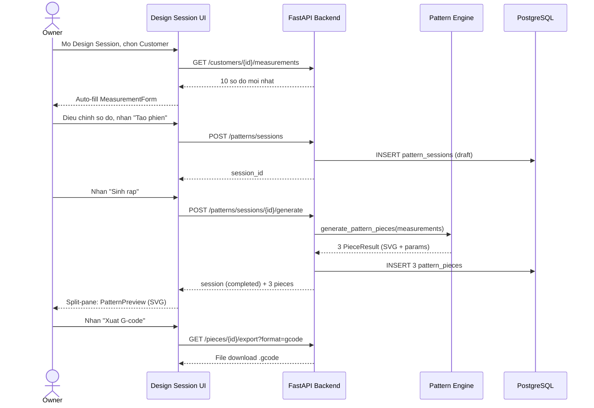

### 3.4.3. Cấu trúc route frontend

Bảng dưới đây ánh xạ các route chính vào chức năng và vai trò:

| Route group | Route tiêu biểu | Chức năng | Vai trò |
|---|---|---|---|
| `(auth)/` | `/login`, `/register`, `/verify-otp`, `/forgot-password`, `/reset-password` | Xác thực | Tất cả |
| `(customer)/` | `/showroom`, `/showroom/[id]` | Duyệt sản phẩm, chi tiết HD zoom | Customer + Guest |
| | `/booking` | Đặt lịch tư vấn | Customer |
| | `/measurement-gate` | Kiểm tra số đo trước bespoke checkout | Customer |
| | `/checkout` | Thanh toán (service-type-aware) | Customer |
| | `/profile` | Hồ sơ, đơn hàng, voucher, thông báo | Customer |
| `(workplace)/` | `/owner` | Dashboard KPI + doanh thu | Owner |
| | `/owner/orders`, `/owner/products`, `/owner/inventory` | Quản lý đơn, sản phẩm, kho | Owner |
| | `/owner/customers`, `/owner/staff` | Quản lý khách hàng, nhân viên | Owner |
| | `/owner/crm`, `/owner/vouchers`, `/owner/campaigns` | CRM, voucher, chiến dịch | Owner |
| | `/owner/rentals`, `/owner/production` | Quản lý thuê, sản xuất | Owner |
| | `/design-session` | Sinh rập kỹ thuật (split-pane) | Owner |
| | `/tailor/tasks`, `/tailor/tasks/[taskId]` | Danh sách task, chi tiết + PatternPreview | Tailor |
| | `/tailor/feedback`, `/tailor/review` | Phản hồi, review | Tailor |

### 3.4.4. So sánh hai chế độ giao diện

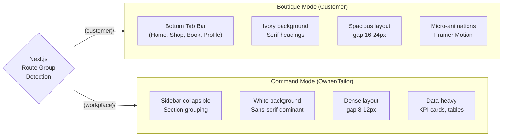

### 3.4.5. State management strategy

Hệ thống tách rõ hai loại state:

| Loại | Công cụ | Phạm vi | Ví dụ |
|---|---|---|---|
| **Local UI State** | Zustand 5 (+ Immer middleware) | Client-side, optimistic | Cart items, design pillar selection, slider values, modal visibility |
| **Server State** | TanStack Query 5 | Sync với backend, cache + invalidation | Order list, customer profiles, pattern sessions, KPI data |

**Quy tắc quan trọng:** Zustand KHÔNG cache giá sản phẩm hoặc tồn kho. Khi navigate đến Checkout, TanStack Query luôn invalidate và re-fetch từ backend (Authoritative Server Pattern).

## 3.5. Thiết kế bảo mật

### 3.5.1. Mô hình bảo mật bốn lớp

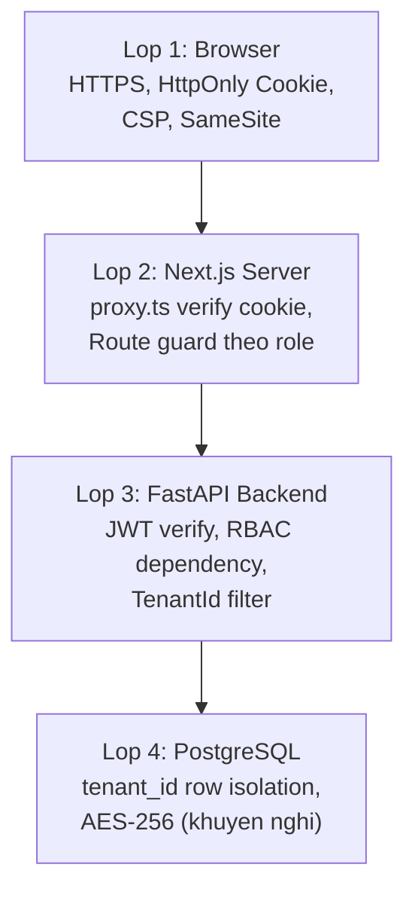

### 3.5.2. RBAC Dependencies

Backend áp dụng RBAC thông qua FastAPI dependency injection:

| Dependency | Vai trò cho phép | Sử dụng tại |
|---|---|---|
| `CurrentUser` | Bất kỳ user đã đăng nhập | Profile, notifications |
| `OwnerOnly` | Chỉ Owner | Product CRUD, order approve, KPI, pattern generate |
| `OwnerOrTailor` | Owner hoặc Tailor | Task list, pattern view/export |
| `OptionalCurrentUser` | Đăng nhập hoặc guest | Showroom GET (hiển thị khác nhau) |
| `TenantId` | Auto-extract từ user JWT | Mọi query có filter tenant |

## 3.6. Tổng kết chương

Kiến trúc hệ thống **Nhà May Thanh Lộc** được thiết kế theo bốn nguyên lý cốt lõi: Authoritative Server (SSOT), Dual-Mode UI, Proxy Pattern, và "Core cứng, Shell mềm". Cơ sở dữ liệu gồm 22 bảng chia 7 nhóm domain, hỗ trợ multi-tenant qua `tenant_id`. API cung cấp 30 router với response wrapper thống nhất. Giao diện tách biệt hoàn toàn Boutique Mode và Command Mode qua Route Groups.

Chương tiếp theo (Chương 4) trình bày chi tiết công nghệ và lý do lựa chọn cho từng tầng kiến trúc.
