# Chương 5. Triển khai chi tiết

Chương này trình bày quá trình triển khai cụ thể hệ thống **Nhà May Thanh Lộc** theo bốn khối chức năng chính: Backend (FastAPI), Frontend (Next.js), Pattern Engine (Epic 11) và các luồng nghiệp vụ cốt lõi. Nội dung tập trung vào việc hiện thực các nguyên lý kiến trúc đã trình bày ở Chương 3 trên nền tảng công nghệ đã chọn ở Chương 4, kèm theo sơ đồ trình tự và đoạn mã minh hoạ cho các điểm then chốt.

## 5.1. Phân công triển khai theo module

Khối triển khai được chia thành bốn phần, phản ánh đúng cấu trúc thư mục dự án và thứ tự phụ thuộc giữa các thành phần:

| Phần | Phạm vi | Thư mục nguồn | Vai trò trong báo cáo |
|---|---|---|---|
| **5.2** | Backend — FastAPI | `backend/src/` | Tầng API, dịch vụ nghiệp vụ, truy cập dữ liệu, xác thực |
| **5.3** | Frontend — Next.js 16 | `frontend/src/` | App Router, Server Actions, state management, Proxy Pattern |
| **5.4** | Pattern Engine (Epic 11) | `backend/src/patterns/` + `frontend/src/components/client/design/` | Sinh rập kỹ thuật từ 10 số đo, xuất SVG & G-code |
| **5.5** | Luồng nghiệp vụ | Cross-cutting (xuyên suốt FE ↔ BE) | 3 luồng đơn hàng Buy/Rent/Bespoke và các lifecycle liên quan |

## 5.2. Triển khai Backend — FastAPI

### 5.2.1. Kiến trúc phân lớp

Backend tổ chức theo mô hình **Layered Architecture** với bốn tầng, tuân thủ nguyên tắc *Separation of Concerns* — mỗi tầng chỉ giao tiếp với tầng liền kề bên dưới và không chứa trách nhiệm của tầng khác.

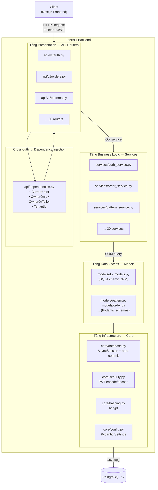

**Vai trò từng tầng:**

| Tầng | Thư mục | Trách nhiệm | Ví dụ |
|---|---|---|---|
| **Presentation** | `src/api/v1/` | Nhận HTTP request, validate input bằng Pydantic, gọi service, trả JSON response | `POST /api/v1/orders` → `create_order_endpoint()` |
| **Business Logic** | `src/services/` | Xử lý logic nghiệp vụ, điều phối transaction, gọi cross-service | `order_service.create_order()` — validate item, áp voucher, tạo payment |
| **Data Access** | `src/models/` | Định nghĩa ORM models (SQLAlchemy) + request/response schemas (Pydantic) | `OrderDB`, `OrderCreate`, `OrderResponse` |
| **Infrastructure** | `src/core/` | Kết nối DB, JWT, bcrypt, config từ biến môi trường | `get_db()`, `create_access_token()`, `hash_password()` |

### 5.2.2. Entry point và vòng đời ứng dụng

File `backend/src/main.py` khởi tạo ứng dụng FastAPI và đăng ký 30 router của API v1:

```python
@asynccontextmanager
async def lifespan(app: FastAPI) -> AsyncGenerator[None, None]:
    await seed_owner_account()                               # Tạo tài khoản Owner mặc định
    scheduler_task = await start_reminder_scheduler()        # Story 5.4 — nhắc trả đồ
    yield
    if scheduler_task and not scheduler_task.done():
        scheduler_task.cancel()                              # Cancel an toàn khi shutdown


app = FastAPI(
    title="Nhà May Thanh Lộc API",
    description="Backend API for the Nhà May Thanh Lộc - AI-powered tailoring platform",
    version="0.1.0",
    lifespan=lifespan,
)

app.add_middleware(
    CORSMiddleware,
    allow_origins=os.getenv("CORS_ORIGINS", "http://localhost:3000").split(","),
    allow_credentials=True,
    allow_methods=["*"],
    allow_headers=["*"],
)
```

Cơ chế `lifespan` (async context manager) đảm bảo:

- **Khi khởi động:** seed tài khoản Owner mặc định và khởi chạy background scheduler (nhắc khách trả đồ thuê trước 3 ngày và 1 ngày).
- **Khi shutdown:** huỷ scheduler task an toàn, tránh rò rỉ resource.

### 5.2.3. Chuỗi Dependency Injection

FastAPI sử dụng hệ thống **Dependency Injection** (DI) qua hàm `Depends()`. Backend định nghĩa một chuỗi DI bốn cấp, trong đó các cấp sau phụ thuộc vào cấp trước:

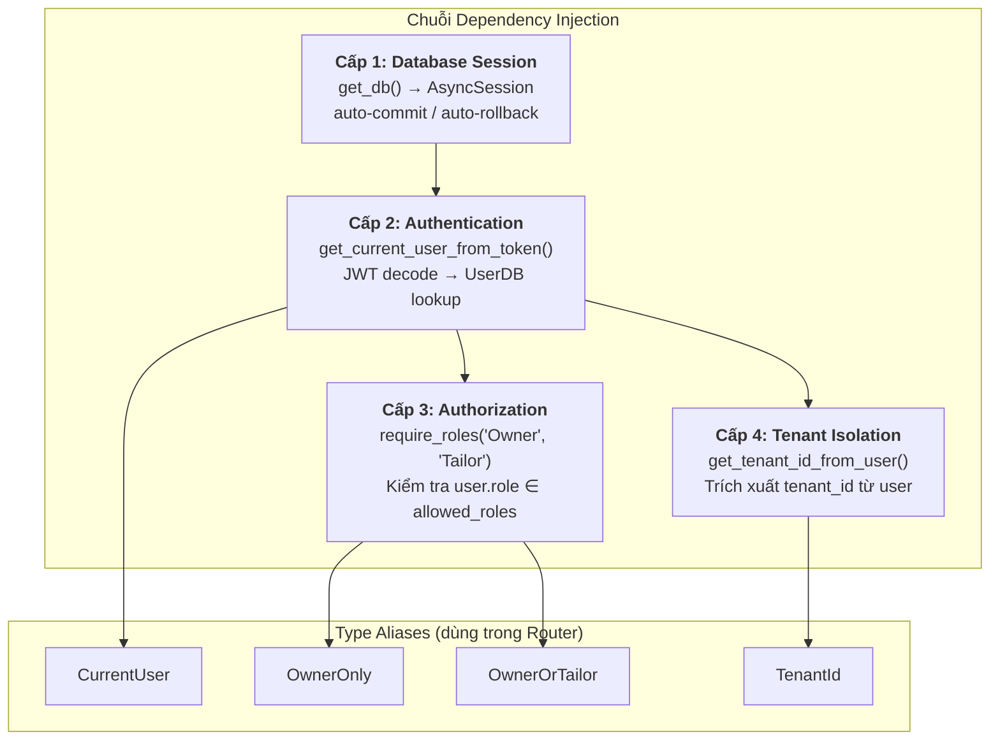

**Cấp 1 — Database Session** (`backend/src/core/database.py`):

```python
async def get_db() -> AsyncGenerator[AsyncSession, None]:
    async with async_session_factory() as session:
        try:
            yield session             # Router/service sử dụng session
            await session.commit()    # Thành công → commit
        except Exception:
            await session.rollback()  # Lỗi → rollback toàn bộ
            raise
```

Cơ chế yield + try/except đảm bảo tính ACID: mọi thay đổi trong một request hoặc được commit trọn vẹn, hoặc rollback hoàn toàn. Không bao giờ có trạng thái nửa vời.

**Cấp 2 — Authentication** (`backend/src/api/dependencies.py`):

```python
async def get_current_user_from_token(
    credentials: HTTPAuthorizationCredentials = Depends(security_scheme),
    db: AsyncSession = Depends(get_db),
) -> UserDB:
    payload = decode_access_token(credentials.credentials)
    if payload is None:
        raise HTTPException(401, "Token không hợp lệ hoặc đã hết hạn")
    email = payload.get("sub")
    user = await get_user_by_email(db, email)
    if user is None:
        raise HTTPException(404, "Không tìm thấy người dùng")
    if not user.is_active:
        raise HTTPException(403, "Tài khoản đã bị vô hiệu hóa")
    return user
```

**Cấp 3 — Authorization:**

```python
def require_roles(*allowed_roles: str):
    async def role_checker(user: UserDB = Depends(get_current_user_from_token)) -> UserDB:
        if user.role not in allowed_roles:
            raise HTTPException(
                403,
                f"Bạn không có quyền truy cập chức năng này. Yêu cầu vai trò: {', '.join(allowed_roles)}",
            )
        return user
    return role_checker


OwnerOnly     = Annotated[UserDB, Depends(require_roles("Owner"))]
OwnerOrTailor = Annotated[UserDB, Depends(require_roles("Owner", "Tailor"))]
```

**Cấp 4 — Tenant Isolation:**

```python
async def get_tenant_id_from_user(
    user: UserDB = Depends(get_current_user_from_token),
) -> uuid.UUID:
    DEFAULT_TENANT_ID = uuid.UUID("00000000-0000-0000-0000-000000000001")
    if user.role == "Owner":
        return user.tenant_id if user.tenant_id else DEFAULT_TENANT_ID
    if user.tenant_id is None:
        raise HTTPException(403, "Tài khoản chưa được gán vào tiệm nào.")
    return user.tenant_id


TenantId = Annotated[uuid.UUID, Depends(get_tenant_id_from_user)]
```

Mọi endpoint sau đó chỉ cần khai báo các type alias để kích hoạt toàn bộ chuỗi DI:

```python
@router.patch("/{order_id}/status")
async def update_order_status_endpoint(
    order_id: uuid.UUID,
    update: OrderStatusUpdate,           # Pydantic validate request body
    user: OwnerOnly,                     # DI cấp 2 + 3
    tenant_id: TenantId,                 # DI cấp 4
    db: AsyncSession = Depends(get_db),  # DI cấp 1
) -> dict:
    result = await order_service.update_order_status(db, order_id, tenant_id, update)
    return {"data": result.model_dump(mode="json"), "meta": {}}
```

Nếu bất kỳ cấp nào thất bại — token hết hạn, sai vai trò, chưa gán tenant — request sẽ bị reject với mã HTTP phù hợp **trước khi** code endpoint được thực thi.

### 5.2.4. Luồng xử lý Request → Response

Sơ đồ tuần tự sau minh hoạ đường đi của một request yêu cầu xác thực:

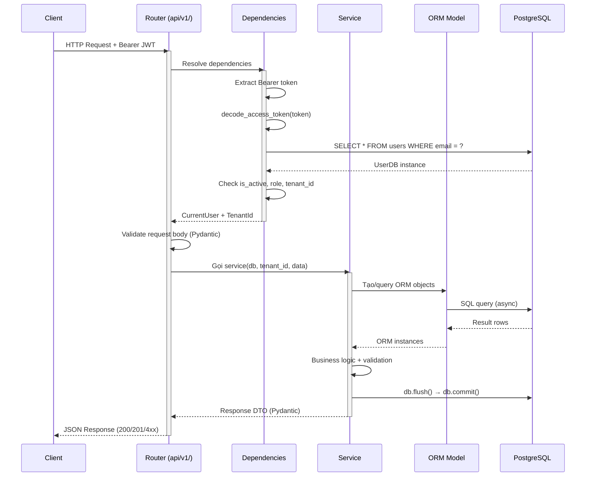

### 5.2.5. Luồng xác thực (Authentication)

Hệ thống xác thực kết hợp JWT (cho truy cập API) với OTP qua email (cho đăng ký và khôi phục mật khẩu):

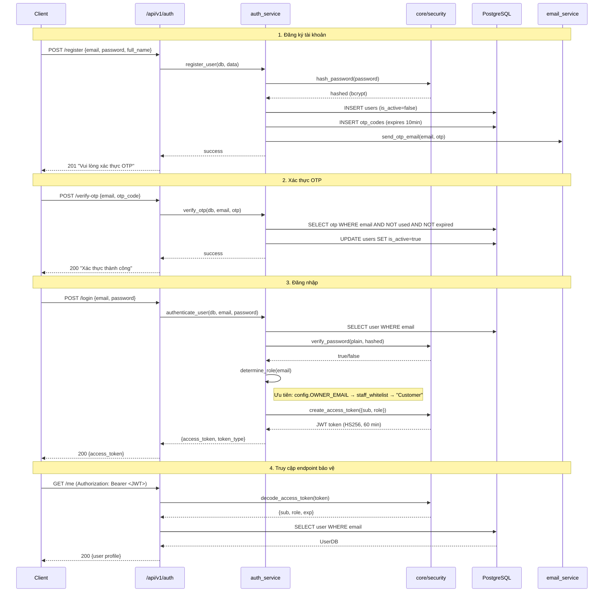

**Cấu trúc JWT token:**

| Claim | Ý nghĩa | Ví dụ |
|---|---|---|
| `sub` | Email người dùng (subject) | `"user@example.com"` |
| `role` | Vai trò — xác định theo SSOT | `"Owner"`, `"Tailor"`, `"Customer"` |
| `exp` | Thời điểm hết hạn (Unix timestamp UTC) | `1713283800` |

**Xác định vai trò (SSOT — Story 1.2 AC3):** thứ tự ưu tiên như sau và dừng ở match đầu tiên:

1. Email trùng `config.OWNER_EMAIL` → **Owner** (quyền toàn hệ thống)
2. Email có trong bảng `staff_whitelist` → vai trò theo whitelist
3. Mặc định → **Customer**

**Bảo mật mật khẩu:** sử dụng **bcrypt** với salt ngẫu nhiên và giới hạn 72 bytes được xử lý qua UTF-8 encoding. Work factor mặc định bcrypt 12 cân bằng giữa bảo mật và độ trễ login.

### 5.2.6. Cách ly dữ liệu đa khách thuê

Multi-tenancy được thực thi ở tầng ứng dụng bằng mô hình **tenant_id trên mọi bảng nghiệp vụ**:

- Mỗi bảng (orders, customer_profiles, garments, ...) có cột `tenant_id NOT NULL REFERENCES tenants(id)`.
- `get_tenant_id_from_user()` trích xuất `tenant_id` từ JWT và ném `HTTP 403` nếu user không thuộc tiệm nào.
- Mọi service function **bắt buộc** nhận `tenant_id` làm tham số và áp vào WHERE clause:

```python
# Mẫu truy vấn bắt buộc trong mọi service
result = await db.execute(
    select(OrderDB).where(
        OrderDB.id == order_id,
        OrderDB.tenant_id == tenant_id,   # Điều kiện cách ly
    )
)
```

Nhờ vậy, ngay cả khi một user cố gắng đoán UUID của tenant khác, WHERE clause sẽ lọc hết và trả về `None` → endpoint trả `HTTP 404`.

### 5.2.7. Tầng Service — Logic nghiệp vụ

Thư mục `backend/src/services/` chứa 30 service file — mỗi file đảm nhiệm một domain nghiệp vụ. Tầng Service là nơi **duy nhất** được phép chứa logic nghiệp vụ; Router không được truy vấn DB trực tiếp.

Ví dụ mô tả cách `order_service.create_order()` phối hợp nhiều service:

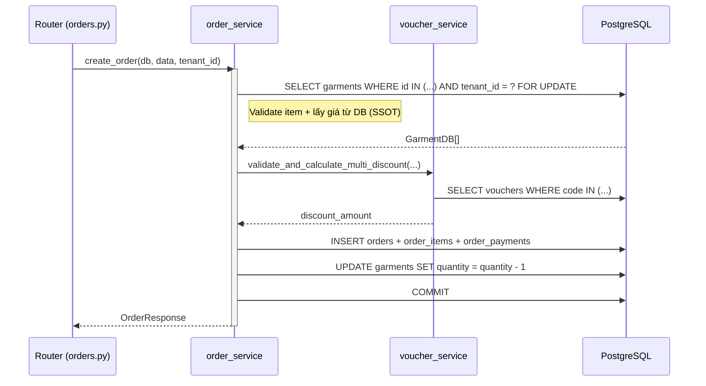

Điểm quan trọng:

- **SSOT cho giá:** backend luôn lấy `sale_price` / `rental_price` từ DB, hoàn toàn bỏ qua giá client gửi lên.
- **Optimistic locking:** `SELECT ... FOR UPDATE` khoá bản ghi garment, ngăn chặn race condition khi hai đơn cùng đặt sản phẩm cuối cùng.
- **Cross-service call:** `order_service` gọi `voucher_service` để validate voucher, tách biệt trách nhiệm và tái sử dụng được.

### 5.2.8. Bảng tổng hợp routers và services

**30 API Routers** được mount tại `/api/v1/`:

| Router | Mục đích chính | Epic |
|---|---|---|
| `auth.py`, `staff.py` | Đăng nhập/ký, OTP, quản lý whitelist | 1 |
| `garments.py`, `fabrics.py`, `uploads.py` | Sản phẩm, vải, upload ảnh | 2 |
| `orders.py`, `order_customer.py`, `payments.py` | Đơn hàng, thanh toán | 3, 10 |
| `appointments.py`, `owner_appointments.py` | Đặt lịch đo | 4 |
| `rentals.py` | Quản lý thuê | 5, 10 |
| `customers.py`, `customer_profile.py` | Hồ sơ khách, số đo | 6 |
| `kpi.py`, `notifications.py` | Dashboard, thông báo | 7 |
| `tailor_tasks.py` | Task cho thợ may | 8 |
| `leads.py`, `vouchers.py`, `campaigns.py`, `templates.py` | CRM & Marketing | 9 |
| `patterns.py` | Pattern Engine (sinh rập, export SVG/G-code) | 11 |
| `designs.py`, `overrides.py`, `fabrics.py`, `styles.py`, `inference.py`, `geometry.py`, `guardrails.py`, `rules.py`, `export.py` | AI Bespoke (khung sẵn, hoãn) | 12–14 |

## 5.3. Triển khai Frontend — Next.js 16

### 5.3.1. Cấu trúc App Router và Route Groups

Frontend xây dựng trên **Next.js 16 App Router** — mô hình routing dựa trên thư mục. Hệ thống áp dụng kỹ thuật **Route Groups** (thư mục đặt trong ngoặc tròn) để tách hoàn toàn hai chế độ UI (Nguyên lý 2 ở Chương 3):

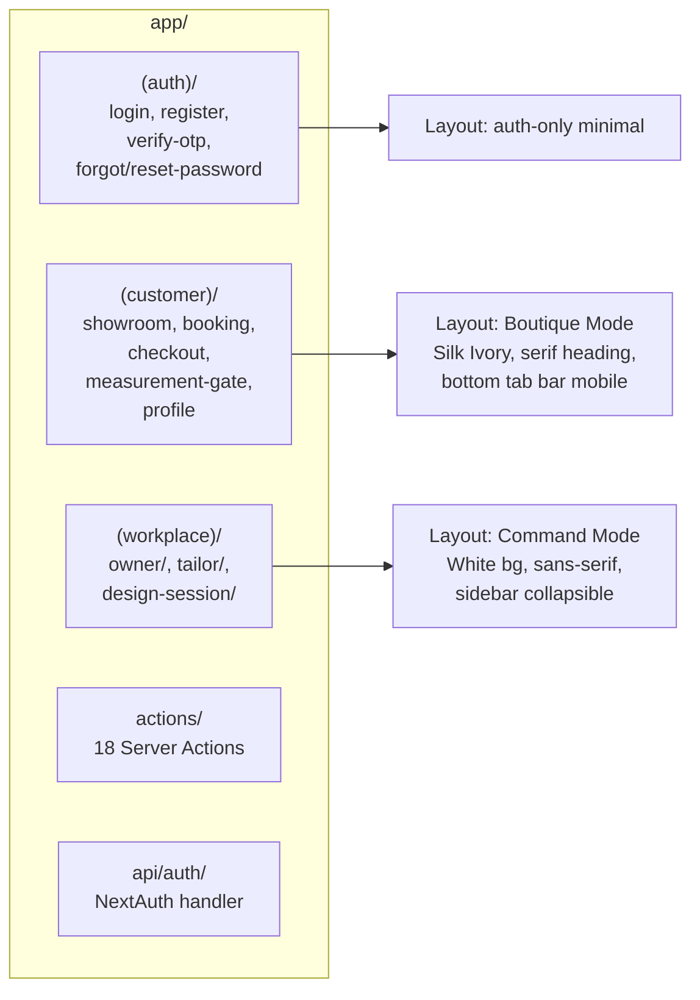

| Route Group | Đối tượng | Theme mode | Layout chính |
|---|---|---|---|
| `(auth)/` | Tất cả (chưa đăng nhập) | Standalone | Minimal, centered form |
| `(customer)/` | Customer + guest (showroom) | **Boutique Mode** | Bottom Tab Bar (mobile), Breadcrumb (desktop) |
| `(workplace)/` | Owner + Tailor | **Command Mode** | Sidebar collapsible, menu theo role |

Route Groups được chọn thay cho multi-subdomain hay multi-app vì chúng cho phép **chia sẻ code** (components, hooks, types) trong cùng một codebase, đồng thời cho phép **layout khác biệt hoàn toàn** giữa hai chế độ.

### 5.3.2. Server Components và Client Components

Next.js 16 mặc định coi mọi component trong `app/` là **Server Component** — chỉ chạy ở server, không phát sinh JavaScript client. Component cần tương tác được đánh dấu `"use client"` ở dòng đầu tiên.

**Quy tắc áp dụng trong dự án:**

| Loại component | Vai trò | Ví dụ |
|---|---|---|
| **Server Component** (default) | Data fetching ban đầu, SEO, layout | `showroom/page.tsx` load danh sách garments từ backend |
| **Client Component** (`"use client"`) | Tương tác: form, slider, drag, canvas | `MeasurementForm.tsx`, `IntensitySliders.tsx`, `DesignSessionClient.tsx` |

Chiến lược này giảm đáng kể kích thước JavaScript bundle gửi xuống browser: các phần tĩnh (header, product grid) được render thẳng thành HTML từ server, chỉ những thành phần thực sự tương tác mới chuyển thành client component.

### 5.3.3. Proxy Pattern — Cầu nối Browser và Backend

Một nguyên lý bảo mật cốt lõi (NFR15): **browser không bao giờ gọi trực tiếp FastAPI**. Toàn bộ request đi qua một proxy chạy trên Next.js server, có nhiệm vụ đọc session cookie HttpOnly và đính JWT Bearer vào header.

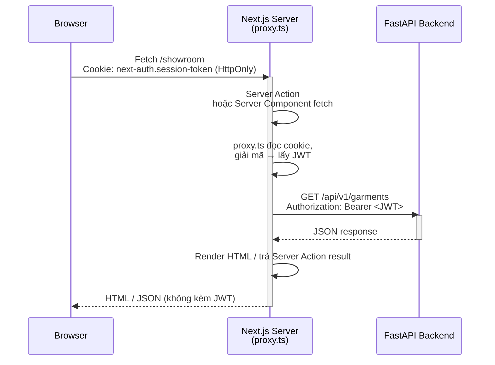

Ưu điểm:

- JWT **không bao giờ lộ** ra JavaScript client — tránh được XSS leak token.
- Cookie được set với `HttpOnly + Secure + SameSite=Lax` nên JavaScript không thể đọc.
- Mỗi Server Action / Server Component chỉ cần `import { proxy } from '@/proxy'` và gọi `proxy().get(...)` — không phải lặp lại logic đính header.

**File cấu hình liên quan:**

| File | Vai trò |
|---|---|
| `frontend/src/auth.ts` | Cấu hình NextAuth v5: Credentials provider, JWT strategy, cookie options |
| `frontend/src/app/api/auth/[...nextauth]/route.ts` | Route handler NextAuth |
| `frontend/src/proxy.ts` | Proxy helper — đọc cookie, đính JWT, forward fetch |

### 5.3.4. Server Actions — Mutation không cần API route

Next.js 16 hỗ trợ **Server Actions** — hàm async chạy trên server, có thể gọi trực tiếp từ form hoặc button client. Dự án dùng 18 file server action (thư mục `app/actions/`) thay cho các API route kiểu cũ:

```typescript
// frontend/src/app/actions/pattern-actions.ts
'use server';

import { proxy } from '@/proxy';
import { revalidatePath } from 'next/cache';

export async function createPatternSessionAction(input: PatternSessionInput) {
  const session = await proxy().post('/api/v1/patterns/sessions', input);
  revalidatePath('/workplace/design-session');
  return session.data;
}
```

Lợi ích:

- Gọi trực tiếp từ form: `<form action={createPatternSessionAction}>`.
- Không cần wrapper fetch thủ công ở client.
- Tự động revalidate cache qua `revalidatePath()` / `revalidateTag()` sau mutation.

### 5.3.5. State management — Tách biệt Local và Server state

Dự án áp dụng triệt để nguyên tắc **tách biệt Local UI state và Server state**:

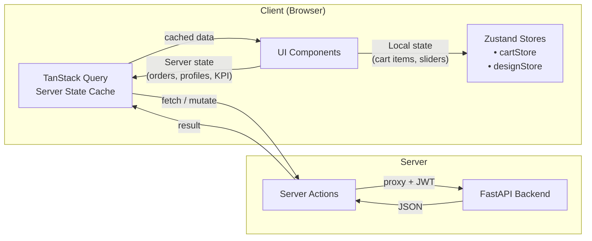

**Zustand — Local UI State:**

| Store | Mục đích | Dữ liệu giữ |
|---|---|---|
| `cartStore.ts` | Giỏ hàng của khách | items, quantity, transaction_type |
| `designStore.ts` | Phiên thiết kế AI Bespoke (Epic 12+) | selected_pillar, intensity_values, morph_delta |

Quy tắc bất biến: **Zustand không bao giờ cache giá, tồn kho hoặc voucher** — những dữ liệu có tính tiền. Khi checkout, backend luôn tính lại toàn bộ (Authoritative Server Pattern).

**TanStack Query — Server State:**

- Cache kết quả fetch theo key convention: `['domain', 'subdomain', params]`.
- Tự động invalidate sau mutation: ví dụ tạo đơn thành công sẽ invalidate `['orders']` + `['notifications']`.
- Hỗ trợ optimistic update kết hợp rollback khi mutation thất bại.

### 5.3.6. Styling — TailwindCSS v4 + Heritage Palette

Hệ thống áp dụng Heritage Palette gồm 10 color token (UX-DR1), được khai báo dưới dạng CSS variables để chuyển đổi dễ dàng giữa Boutique/Command mode:

| Token | Hex | Mục đích |
|---|---|---|
| Primary Indigo | `#1A2B4C` | Brand chính |
| Surface Silk Ivory | `#F9F7F2` | Background Boutique |
| Accent Heritage Gold | `#D4AF37` | Highlight, focus ring |
| Background White | `#FFFFFF` | Background Command |
| Text Primary Charcoal | `#1A1A2E` | Body text |
| Success Jade | `#059669` | Confirm, completed |
| Warning Amber | `#D97706` | Pending, alert |
| Error Ruby | `#DC2626` | Error, overdue |

Typography: **Cormorant Garamond** (serif) cho heading Boutique, **Inter** (sans-serif) cho body và Command mode, **JetBrains Mono** cho số liệu (giá VND, KPI).

### 5.3.7. Cấu trúc components

Thư mục `components/client/` được chia theo domain để dễ bảo trì và tìm kiếm:

| Thư mục | Vai trò | Ví dụ component |
|---|---|---|
| `dashboard/` | Owner Dashboard (Epic 7) | `KPICard`, `RevenueChart`, `OrderStatsCard` |
| `design/` | Pattern Engine + AI Bespoke | `MeasurementForm`, `SvgPattern`, `IntensitySliders` |
| `showroom/` | Catalog Buy/Rent | Product cards, filters |
| `cart/`, `checkout/` | Giỏ hàng và thanh toán | Cart sidebar, checkout steps |
| `booking/` | Đặt lịch đo | Calendar, slot picker |
| `orders/`, `production/`, `rentals/` | Quản lý đơn + sản xuất | Order Board, sub-steps, Rental form |
| `tailor/` | Task cho thợ may | TaskRow, PatternPreview embed |
| `crm/`, `vouchers/`, `campaigns/` | CRM & Marketing | LeadCard, Voucher editor |

## 5.4. Triển khai Pattern Engine (Epic 11)

### 5.4.1. Đặc điểm khác biệt của module Pattern

Pattern Engine là module **deterministic** (tất định), hoàn toàn tách biệt khỏi khối AI Bespoke (Epic 12–14):

| Đặc điểm | AI Bespoke Engine | Technical Pattern Engine |
|---|---|---|
| Mục đích | Cảm xúc → concept pattern | 10 số đo → rập production-ready |
| Phương pháp | LLM + Semantic + Ease Delta | Công thức toán học thuần |
| AI/LLM | Có | Không |
| Output | Master Geometry JSON | SVG 1:1 + G-code |
| Người dùng | Customer + Tailor | Owner (Internal Design Session) |
| Code | `src/geometry/` + `src/agents/` | `src/patterns/` (standalone) |

Nguyên tắc kiến trúc **"Core cứng, Shell mềm"** được áp dụng triệt để: module `patterns/` KHÔNG import từ `geometry/`, `agents/`, hay `constraints/`. Việc này đảm bảo output của Pattern Engine luôn khả thi vật lý và không bị tác động bởi bất ổn của AI.

### 5.4.2. Mô hình dữ liệu

Hai bảng chính được thêm qua migrations của Story 11.1:

```sql
CREATE TABLE pattern_sessions (
    id           UUID PRIMARY KEY,
    tenant_id    UUID NOT NULL REFERENCES tenants(id),
    customer_id  UUID NOT NULL REFERENCES customer_profiles(id),
    created_by   UUID NOT NULL REFERENCES users(id),
    -- 10 cột số đo immutable tại thời điểm generate
    do_dai_ao    NUMERIC(5,1) NOT NULL,
    ha_eo        NUMERIC(5,1) NOT NULL,
    vong_co      NUMERIC(5,1) NOT NULL,
    vong_nach    NUMERIC(5,1) NOT NULL,
    vong_nguc    NUMERIC(5,1) NOT NULL,
    vong_eo      NUMERIC(5,1) NOT NULL,
    vong_mong    NUMERIC(5,1) NOT NULL,
    do_dai_tay   NUMERIC(5,1) NOT NULL,
    vong_bap_tay NUMERIC(5,1) NOT NULL,
    vong_co_tay  NUMERIC(5,1) NOT NULL,
    garment_type VARCHAR NOT NULL,
    notes        TEXT,
    status       VARCHAR NOT NULL,  -- 'draft' | 'completed' | 'exported'
    created_at   TIMESTAMPTZ NOT NULL DEFAULT NOW()
);

CREATE TABLE pattern_pieces (
    id              UUID PRIMARY KEY,
    session_id      UUID NOT NULL REFERENCES pattern_sessions(id) ON DELETE CASCADE,
    piece_type      VARCHAR NOT NULL,  -- 'front_bodice' | 'back_bodice' | 'sleeve'
    svg_data        TEXT NOT NULL,     -- SVG markup 1:1
    geometry_params JSONB NOT NULL,    -- params đã tính
    created_at      TIMESTAMPTZ NOT NULL DEFAULT NOW()
);
```

Lý do thiết kế:

- **10 cột riêng (không JSONB):** cho phép query SQL trực tiếp, type-safe với Pydantic, dễ validate min/max từng trường.
- **SVG TEXT trong DB:** pattern SVG < 50KB/mảnh — không cần object storage riêng, đơn giản hoá vận hành.
- **`garment_type` mở rộng:** chuẩn bị cho Open Garment System (Phase 3) mà không cần đổi schema.

### 5.4.3. Engine — Công thức tất định

`backend/src/patterns/formulas.py` định nghĩa các công thức sinh rập. Ưu điểm của cách tiếp cận công thức là **reproducible**: cùng input luôn cho cùng output, dễ test, dễ debug.

**Công thức thân áo (Bodice):**

```
bust_width     = vong_nguc / 4
waist_width    = (vong_eo / 4) + offset       # offset = 0 (back), -1 (front)
hip_width      = vong_mong / 4
armhole_drop   = vong_nach / 12
neck_depth     = vong_co / 16
hem_width      = 37.0 cm (constant — design decision)
seam_allowance = 1.0 cm (auto-added)
```

Hàm `generate_bodice(measurements, offset)` dùng chung cho cả mảnh trước và mảnh sau — kiến trúc DRY với tham số `offset` phân biệt front (-1cm) và back (0cm).

**Công thức tay áo (Sleeve):**

```
cap_height  = vong_nach / 2 - 1
bicep_width = vong_bap_tay / 2 + 2.5
wrist_width = vong_co_tay / 2 + 1
length      = do_dai_tay
```

**Orchestrator `engine.py`:**

```python
def generate_pattern_pieces(measurements: dict[str, Any]) -> list[PieceResult]:
    front_params = generate_bodice(measurements, offset=-1.0)
    front_svg    = render_bodice_svg(front_params, piece_type="front_bodice")

    back_params  = generate_bodice(measurements, offset=0.0)
    back_svg     = render_bodice_svg(back_params, piece_type="back_bodice")

    sleeve_params = generate_sleeve(measurements)
    sleeve_svg    = render_sleeve_svg(sleeve_params)

    return [
        PieceResult("front_bodice", front_svg, front_params),
        PieceResult("back_bodice",  back_svg,  back_params),
        PieceResult("sleeve",       sleeve_svg, sleeve_params),
    ]
```

Performance: benchmark trên CPU thường cho thấy toàn bộ pipeline dưới **50ms** cho ba mảnh — đáp ứng yêu cầu FR96 (preview real-time < 500ms).

### 5.4.4. Export — SVG và G-code

**SVG export** (`svg_export.py`):

- `render_bodice_svg()`: vẽ closed path cổ → vai → nách (1/4 ellipse arc qua SVG `A` command) → sườn → eo → hông → tà.
- `render_sleeve_svg()`: vẽ đường mang tay (1/2 ellipse arc) → cạnh sleeve → cổ tay → trở về điểm bắt đầu.
- `viewBox` đặt theo cm (1cm = 1 unit SVG) để khi in ra đúng kích cỡ 1:1 ±0.5mm (FR94).
- Tự động thêm seam allowance offset 1cm.

**G-code export** (`gcode_export.py`):

- Parse SVG path → chuyển sang lệnh G-code cho máy cắt laser.
- Header: `G21` (đơn vị mm), `G90` (toạ độ tuyệt đối), laser off.
- Move nhanh: `G0 X.. Y..`.
- Cắt: `G1 X.. Y.. F{speed} S{power*255/100}` — laser on.
- Closed path: tự động quay về điểm start.
- Footer: laser off, return home.
- Defaults: speed 1000 mm/phút, power 80%.

### 5.4.5. API endpoints

| Method | Endpoint | Auth | Mô tả |
|---|---|---|---|
| `POST` | `/api/v1/patterns/sessions` | `OwnerOnly` | Tạo pattern session draft với 10 số đo |
| `POST` | `/api/v1/patterns/sessions/{id}/generate` | `OwnerOnly` | Chạy engine → sinh 3 pattern_pieces. Validate FR99 trước |
| `GET` | `/api/v1/patterns/sessions/{id}` | `OwnerOrTailor` | Lấy session + 3 pieces (Design Session preview + Tailor view) |
| `GET` | `/api/v1/patterns/pieces/{id}/export` | `OwnerOrTailor` | Export 1 mảnh: `?format=svg` hoặc `?format=gcode&speed=X&power=Y` |
| `GET` | `/api/v1/patterns/sessions/{id}/export` | `OwnerOrTailor` | Batch export 3 mảnh dạng ZIP |
| `POST` | `/api/v1/orders/{id}/attach-pattern` | `OwnerOnly` | Gắn pattern_session_id vào order (FR97) |

Validation export params (`patterns.py:117`):

```python
def _validate_export_params(format, speed, power):
    if format is None:
        raise HTTPException(422, {"code": "ERR_INVALID_FORMAT",
                                  "message": "Định dạng xuất không hợp lệ. Chọn 'svg' hoặc 'gcode'"})
    if speed is not None and speed <= 0:
        raise HTTPException(422, {"code": "ERR_INVALID_SPEED",
                                  "message": "Tốc độ cắt phải là số dương (mm/phút)"})
    if power is not None and (power < 0 or power > 100):
        raise HTTPException(422, {"code": "ERR_INVALID_POWER",
                                  "message": "Công suất laser phải từ 0 đến 100 (%)"})
    return format_enum, speed or 1000, power or 80
```

### 5.4.6. Giao diện Design Session

**Route mới:**

| Route | Component | Mục đích |
|---|---|---|
| `(workplace)/design-session/page.tsx` | `DesignSessionClient.tsx` | Split-pane: MeasurementForm trái + PatternPreview phải |
| `(workplace)/tailor/tasks/[taskId]/` | (embedded) | Tailor xem PatternPreview compact trong task detail |

**Components Epic 11:**

| Component | File | Vai trò |
|---|---|---|
| `MeasurementForm` | `components/client/design/MeasurementForm.tsx` | Form 10 trường + Customer Combobox auto-fill từ profile |
| `PatternPreview` | `components/client/design/SvgPattern.tsx` | SVG viewer có zoom/pan, toggle 3 mảnh |
| `PatternExportBar` | (đang triển khai Story 11.6) | [Xuất SVG] [Xuất G-code] + popover tham số laser |

**Hook `usePatternSession.ts`** gói gọn lifecycle phiên thiết kế:

```typescript
export function usePatternSession(sessionId?: string) {
  const createSession      = (input) => { /* POST /sessions */ };
  const generatePieces     = (id)    => { /* POST /sessions/{id}/generate */ };
  const getSession         = (id)    => { /* GET /sessions/{id} */ };
  const exportPiece        = (pieceId, format, speed?, power?) => { /* ... */ };
  const exportSessionBatch = (id, format, speed?, power?) => { /* ZIP */ };
  // ...
}
```

### 5.4.7. Pipeline triển khai khuyến nghị

Luồng end-to-end từ lúc Owner mở Design Session đến lúc Tailor nhận được rập:

```mermaid
flowchart TB
    A[Customer đã có Profile<br/>+ Measurement (Epic 6)] --> B[Owner mở Design Session]
    B --> C[Chọn customer<br/>→ MeasurementForm auto-fill 10 số đo]
    C --> D{Validate FR99}
    D -->|Invalid| C
    D -->|Valid| E[POST /sessions/generate<br/>Engine chạy < 50ms]
    E --> F[3 pattern_pieces lưu DB<br/>+ SVG real-time preview]
    F --> G{Owner chọn action}
    G -->|Export SVG| H[Download SVG<br/>in 1:1 ±0.5mm]
    G -->|Export G-code| I[Download G-code<br/>chạy máy laser]
    G -->|Attach to Order| J[POST /orders/{id}/attach-pattern<br/>gắn pattern_session_id]
    J --> K[Tailor xem PatternPreview<br/>trong task detail — FR98]
```

## 5.5. Triển khai các luồng nghiệp vụ chính

### 5.5.1. Ba luồng đơn hàng hợp nhất (Epic 10)

Hệ thống phân biệt ba luồng trạng thái dựa trên cột `service_type` của bảng `orders`:

```
service_type ∈ { 'buy', 'rent', 'bespoke' }
```

Nhờ việc hợp nhất vào một bảng duy nhất thay vì tạo ba bảng riêng, hệ thống dễ dàng tính KPI chéo, chia sẻ logic thanh toán và chuẩn hoá UX đơn hàng ở frontend.

**Buy (Mua sẵn):**

```text
pending → confirmed → preparing (QC → Packaging)
       → ready_to_ship | ready_for_pickup
       → shipped → delivered → completed
```

Đặc điểm: 1 transaction `payment_type='full'` (100% upfront). Khi Owner approve, đơn tự động chuyển sang `preparing` cho kho QC.

**Rent (Thuê):**

```text
pending → confirmed → preparing (Cleaning → Altering → Ready)
       → ready_to_ship | ready_for_pickup
       → shipped → delivered → renting → returned → completed
```

Đặc điểm:

- 2–3 transactions: `deposit` + (tuỳ chọn `security_deposit`) + `remaining`.
- **Bắt buộc** có `security_type` (`cccd` hoặc `cash_deposit`) + `security_value`.
- **Bắt buộc** có `pickup_date` và `return_date`.
- Trạng thái `renting` kích hoạt scheduler nhắc trả đồ trước 3 ngày và 1 ngày.
- Khi khách trả, Owner kiểm tra `return_condition` ∈ {Good, Damaged, Lost} để hoàn deposit.

**Bespoke (Đặt may):**

```text
pending_measurement → pending → confirmed
       → in_production (Cutting → Sewing → Fitting → Finishing)
       → ready_to_ship | ready_for_pickup
       → shipped → delivered → completed
```

Đặc điểm:

- 2 transactions: `deposit` + `remaining`.
- Trạng thái riêng `pending_measurement` chỉ dành cho Bespoke: đơn chờ khách xác nhận số đo (Measurement Gate — FR82).
- Owner approve → hệ thống tự động tạo `tailor_tasks` và gắn pattern session (Epic 11).

### 5.5.2. Mô hình thanh toán đa giao dịch

Bảng `payment_transactions` cho phép một đơn hàng có nhiều transaction độc lập:

| Trường | Kiểu | Mô tả |
|---|---|---|
| `id` | UUID | PK |
| `order_id` | UUID | FK → `orders` |
| `payment_type` | VARCHAR | `full` \| `deposit` \| `remaining` \| `security_deposit` |
| `amount` | NUMERIC(12,2) | Số tiền |
| `method` | VARCHAR | COD / bank_transfer / e_wallet / cccd |
| `status` | VARCHAR | pending / paid / failed / refunded |
| `gateway_ref` | VARCHAR | Mã giao dịch từ gateway |

| Service | Số transaction | Chi tiết |
|---|---|---|
| Buy | 1 | `full` 100% |
| Rent | 2–3 | `deposit` + (optional) `security_deposit` + `remaining` |
| Bespoke | 2 | `deposit` + `remaining` |

### 5.5.3. Bespoke Measurement Gate (FR82)

Trước khi khách hàng có thể checkout đơn Bespoke, hệ thống bắt buộc xác nhận số đo. Sơ đồ tuần tự:

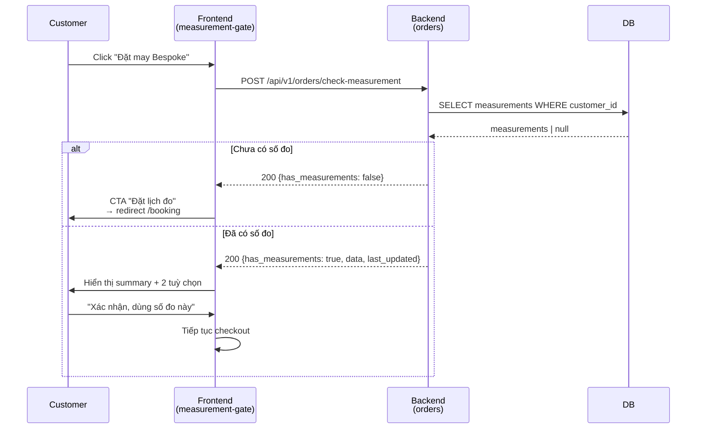

Endpoint `/check-measurement` là **read-only** — không tạo side effect, trả 200 với data hoặc cho `has_measurements=false` khi profile trống.

### 5.5.4. Owner Approve Flow (FR85, FR86)

Khi Owner phê duyệt đơn trên Order Board, backend thực hiện tách luồng theo `service_type`:

```mermaid
flowchart TB
    A[Owner click "Phê duyệt"<br/>trên Order Board] --> B[POST /orders/:id/approve]
    B --> C[Transition: pending → confirmed]
    C --> D{service_type?}
    D -->|bespoke| E[Tạo TailorTask<br/>gán thợ có capacity thấp nhất]
    E --> F[Attach pattern_session<br/>nếu có - Epic 11]
    F --> G[Notification cho thợ]
    D -->|rent / buy| H[Chuyển sang 'preparing']
    H --> I[Notification cho kho]
    H -->|rent| J[Start countdown<br/>tới pickup_date]

    G --> Z[Email confirmation<br/>+ update inventory<br/>+ push notification]
    I --> Z
    J --> Z
```

Background tasks sau approve:

- Gửi email xác nhận cho customer (`email_service.send_confirmation`).
- Cập nhật inventory `garments`: set `renter_id` cho rent, decrement stock cho buy.
- Tạo notification in-app + đẩy qua WebSocket (nếu Epic 9 đã bật).

### 5.5.5. Rental Return Lifecycle (Story 10.7, FR90)

Khi khách trả đồ thuê, Owner tiến hành kiểm tra và backend xử lý hoàn trả security deposit:

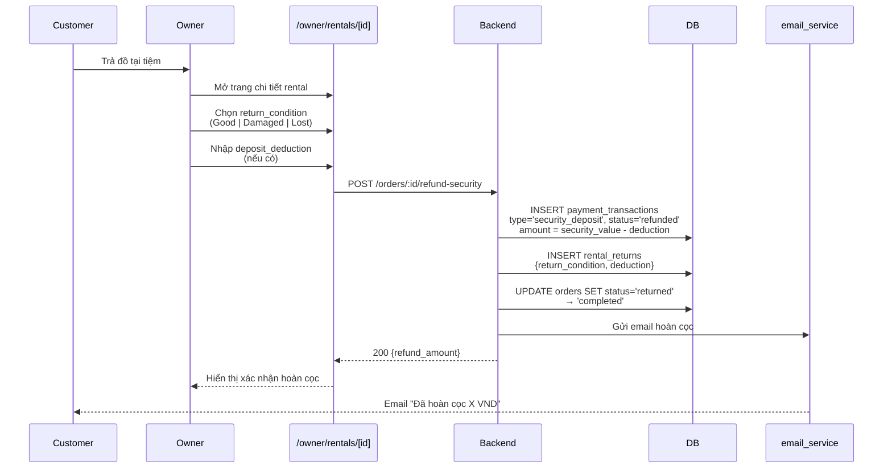

### 5.5.6. Scheduler Service — Background Jobs

`backend/src/services/scheduler_service.py` chạy một async loop trong `lifespan` của app:

```python
async def start_reminder_scheduler():
    async def loop():
        while True:
            await check_rental_returns_due_in_days(3)   # Nhắc trước 3 ngày
            await check_rental_returns_due_in_days(1)   # Nhắc trước 1 ngày
            await check_rental_overdue()                # Cảnh báo quá hạn
            await asyncio.sleep(3600)                   # Mỗi 1 giờ
    return asyncio.create_task(loop())
```

Scheduler tự động bị cancel khi app shutdown (qua `scheduler_task.cancel()` trong `lifespan` finally block), tránh rò rỉ background task khi restart container.

### 5.5.7. Hệ thống thông báo

`notifications` table kết hợp với `notification_creator` service tự động tạo notification khi có các event sau:

| Event | Đối tượng | Nội dung thông báo |
|---|---|---|
| Order created | Customer | "Đơn hàng #X đã được tạo" |
| Order approved | Customer | "Đơn hàng #X đã được xác nhận" |
| Tailor task assigned | Tailor | "Bạn có task mới: ..." |
| Production sub-step hoàn thành | Customer | "Đơn của bạn đang ở bước Cắt vải / Ráp / ..." |
| Ready for pickup | Customer | "Sản phẩm sẵn sàng — vui lòng tới nhận" |
| Rental due in 3 days / 1 day | Customer | "Còn X ngày đến hạn trả áo dài" |
| Rental overdue | Customer + Owner | "Đơn thuê đã quá hạn" |
| Voucher distributed | Customer (segment) | "Bạn nhận được voucher giảm X%" |
| Lead converted | Owner | "Lead Y đã chuyển thành Customer" |

Frontend hiển thị badge unread count ở cả hai chế độ:

- `(customer)/profile/notifications/` — Customer view.
- `(workplace)/owner/notifications/` — Owner view, có thể filter theo loại event.

### 5.5.8. Voucher Application Flow

Voucher được validate **hoàn toàn ở backend** (SSOT) khi checkout:

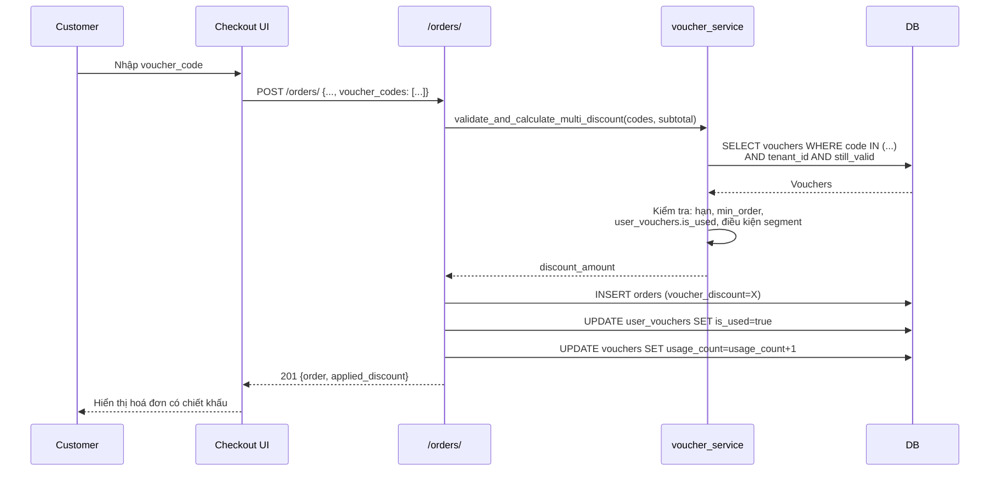

## 5.6. Tổng kết chương

Chương 5 đã trình bày chi tiết quá trình triển khai bốn khối chức năng chính của hệ thống **Nhà May Thanh Lộc**:

- **Backend (mục 5.2):** áp dụng Layered Architecture với 4 tầng rõ ràng, hệ thống Dependency Injection 4 cấp (DB → Auth → Role → Tenant) cho phép kiểm soát quyền truy cập và cách ly dữ liệu đa khách thuê ngay ở tầng router. Xác thực kết hợp JWT (60 phút) và OTP qua email, mật khẩu hash bcrypt.
- **Frontend (mục 5.3):** tận dụng Next.js 16 App Router với Route Groups để hiện thực Dual-Mode UI, Proxy Pattern đảm bảo JWT không rò rỉ ra JavaScript client, Server Actions thay thế API route truyền thống, và tách biệt rạch ròi Local UI state (Zustand) với Server state (TanStack Query).
- **Pattern Engine (mục 5.4):** module deterministic standalone, sinh 3 mảnh rập từ 10 số đo qua công thức toán học thuần dưới 50ms, xuất file SVG 1:1 và G-code cho máy cắt laser. Đặc điểm *"Core cứng, Shell mềm"* — hoàn toàn độc lập với các module AI.
- **Luồng nghiệp vụ (mục 5.5):** hợp nhất ba luồng Buy/Rent/Bespoke vào một bảng `orders` duy nhất, mô hình thanh toán đa giao dịch, Measurement Gate cho Bespoke, Approve Flow phân nhánh theo service_type, và Scheduler nhắc trả đồ thuê chạy nền mỗi giờ.

Kết quả triển khai cho thấy các nguyên lý kiến trúc đã đề ra ở Chương 3 (Authoritative Server Pattern, Dual-Mode UI, Proxy Pattern, "Core cứng, Shell mềm") đều được hiện thực hoá nhất quán xuyên suốt codebase. Chương tiếp theo (Chương 6) sẽ trình bày các biện pháp bảo mật và chiến lược kiểm thử đảm bảo chất lượng hệ thống.
