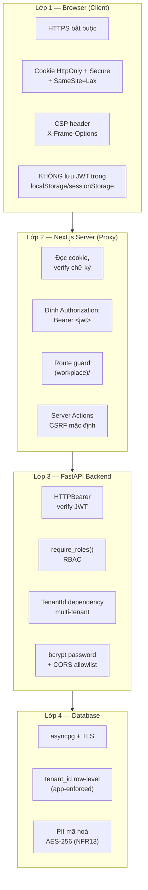
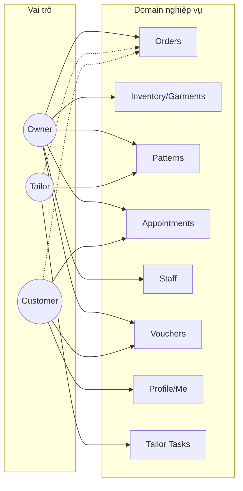
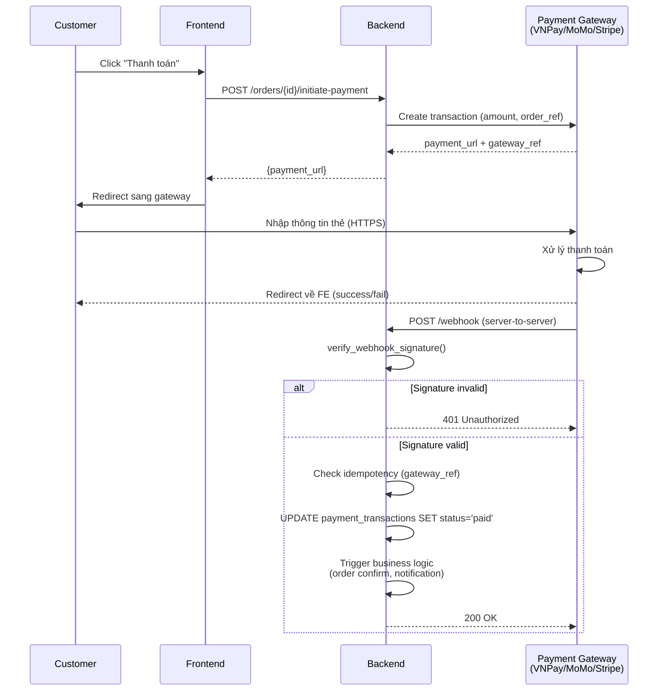
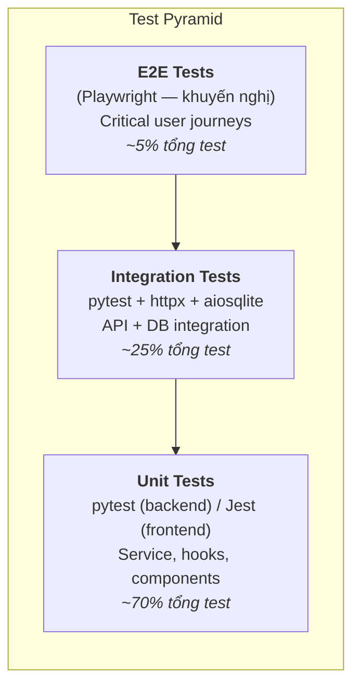
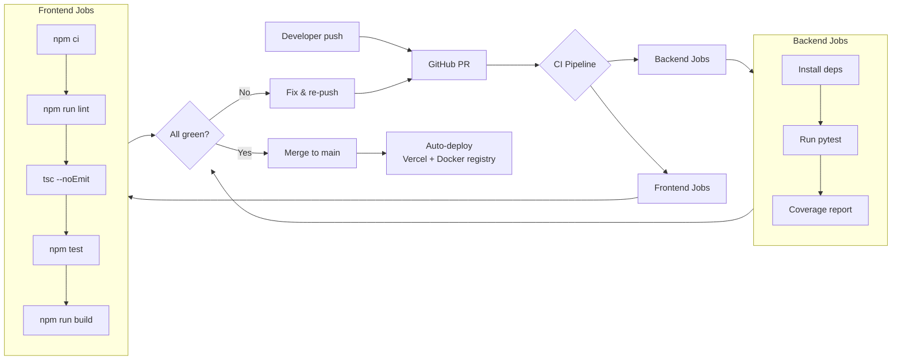

# Chương 6. Bảo mật và Kiểm thử

Chương này trình bày các biện pháp bảo mật được áp dụng xuyên suốt hệ thống **Nhà May Thanh Lộc** và chiến lược kiểm thử đảm bảo chất lượng phần mềm trước khi triển khai. Nội dung tập trung vào hai trục chính: (1) mô hình bảo mật theo chiều sâu (Defense-in-Depth) với bốn lớp từ browser đến database, và (2) hệ thống kiểm thử đa cấp (unit, integration, end-to-end) kết hợp kiểm thử tự động và thủ công.

## 6.1. Tổng quan chương

Bảo mật và kiểm thử không phải là hai chủ đề tách rời — chúng là hai mặt của cùng một vấn đề: đảm bảo hệ thống hoạt động đúng và an toàn trong mọi tình huống. Dự án áp dụng cách tiếp cận sau:

| Trục | Phạm vi | Mục tiêu |
|---|---|---|
| **Bảo mật** (6.2 – 6.6) | Authentication, Authorization, Multi-tenant, Payment, Data protection | Ngăn chặn truy cập trái phép, rò rỉ dữ liệu, tấn công phổ biến (OWASP Top 10) |
| **Kiểm thử** (6.7 – 6.11) | Unit, Integration, E2E, Performance, Accessibility | Đảm bảo chức năng đúng đặc tả, hiệu năng đạt NFR, không regression |

## 6.2. Mô hình bảo mật Defense-in-Depth

Hệ thống áp dụng nguyên tắc **Defense-in-Depth** (bảo mật theo chiều sâu): mỗi lớp đều tự chịu trách nhiệm xác thực và kiểm soát, không dựa vào lớp phía trên. Ngay cả khi một lớp bị xâm phạm, các lớp còn lại vẫn ngăn chặn được thiệt hại lan rộng.



Triết lý: **không có single point of trust**. Mỗi request đi qua đều được xác thực lại ở từng tầng, không tầng nào tin tưởng tuyệt đối tầng trước.

## 6.3. Xác thực (Authentication)

### 6.3.1. Phương thức xác thực

Hệ thống hỗ trợ ba phương thức xác thực, với email + password là chính:

| Phương thức | Sử dụng cho | Thời hạn |
|---|---|---|
| **Email + Password** | Đăng nhập chính thức, tất cả vai trò | Session 8 giờ (NextAuth) / JWT 60 phút (backend) |
| **OTP qua email** | Đăng ký, khôi phục mật khẩu, xác thực email mới | 10 phút, 3 lần gửi / 5 phút / email |
| **Multi-factor OTP** *(NFR11 — khuyến nghị)* | Session Owner/Tailor nhạy cảm | OTP mới mỗi phiên login |

### 6.3.2. JWT và OTP

Backend sử dụng ba thư viện chính cho authentication:

| Thư viện | Vai trò | Cấu hình |
|---|---|---|
| `python-jose[cryptography]` | JWT encode/decode | HS256 (có thể nâng cấp RS256 cho key rotation) |
| `bcrypt` | Hash mật khẩu | Work factor 12 (cân bằng bảo mật và độ trễ) |
| `aiosmtplib` | Gửi OTP async | SMTP TLS, pool connection |

**Cấu trúc JWT payload:**

```json
{
  "sub":       "user@example.com",
  "role":      "Owner",
  "tenant_id": "123e4567-e89b-12d3-a456-426614174000",
  "exp":       1713283800
}
```

**Ví dụ tạo JWT:**

```python
# backend/src/core/security.py
def create_access_token(data: dict, expires_delta: timedelta) -> str:
    to_encode = data.copy()
    to_encode["exp"] = datetime.now(timezone.utc) + expires_delta
    return jwt.encode(to_encode, settings.JWT_SECRET_KEY, algorithm="HS256")


def decode_access_token(token: str) -> dict | None:
    try:
        return jwt.decode(token, settings.JWT_SECRET_KEY, algorithms=["HS256"])
    except JWTError:
        return None
```

### 6.3.3. OTP rate limiting

Bảng `otp_codes` (migration 004) có các cột kiểm soát:

- `attempts` — số lần verify sai liên tiếp.
- `last_sent_at` — thời điểm gửi OTP gần nhất.
- `is_used` — OTP đã sử dụng hay chưa.
- `expires_at` — thời điểm hết hạn (10 phút sau khi tạo).

Service `otp_service.py` áp dụng các quy tắc:

| Quy tắc | Giới hạn | Phản ứng khi vi phạm |
|---|---|---|
| Tần suất gửi OTP | 3 lần / 5 phút / email | HTTP 429 "Vui lòng thử lại sau X giây" |
| Số lần verify sai | 5 lần liên tiếp | Khoá email 15 phút, gửi cảnh báo về email |
| Hạn dùng OTP | 10 phút sau khi gửi | HTTP 410 "OTP đã hết hạn, vui lòng yêu cầu mã mới" |

### 6.3.4. NextAuth v5 ở frontend

Frontend dùng **NextAuth v5** (Auth.js v5) quản lý session trong cookie HttpOnly, tránh rò rỉ JWT qua JavaScript:

```typescript
// frontend/src/auth.ts
export const { handlers, signIn, signOut, auth } = NextAuth({
  providers: [
    Credentials({
      authorize: async (credentials) => {
        const res = await fetch(`${BACKEND_URL}/api/v1/auth/login`, { /* ... */ });
        if (!res.ok) return null;
        const { user, access_token } = (await res.json()).data;
        return { ...user, accessToken: access_token };
      },
    }),
  ],
  session: { strategy: 'jwt', maxAge: 60 * 60 * 8 }, // 8 giờ
  cookies: {
    sessionToken: {
      name: '__Secure-next-auth.session-token',
      options: { httpOnly: true, secure: true, sameSite: 'lax' },
    },
  },
});
```

**Ba thuộc tính cookie then chốt:**

| Thuộc tính | Giá trị | Mục đích bảo mật |
|---|---|---|
| `httpOnly` | `true` | JavaScript không đọc được cookie → ngăn XSS đánh cắp session |
| `secure` | `true` | Chỉ gửi qua HTTPS → chống man-in-the-middle trên mạng công cộng |
| `sameSite` | `lax` | Chặn gửi cookie khi request đến từ site khác → chống CSRF cơ bản |

## 6.4. Phân quyền (Authorization — RBAC)

### 6.4.1. Ba vai trò

Hệ thống sử dụng mô hình Role-Based Access Control (RBAC) với ba vai trò phân cấp rõ ràng:

| Vai trò | Đối tượng | Quyền chính |
|---|---|---|
| **Owner** | Chủ tiệm may | Toàn quyền: orders, inventory, staff, reports, vouchers, leads, campaigns, patterns |
| **Tailor** | Thợ may | Chỉ task được gán, Pattern Preview, cập nhật status, xem income cá nhân |
| **Customer** | Khách hàng | Showroom, cart, checkout, profile, orders/me, notifications, vouchers/me |

### 6.4.2. Kiểm soát quyền ở backend

Backend sử dụng **Dependency Injection factory** tên `require_roles` để kiểm soát quyền ngay tại tầng router, không để logic lọt xuống service:

```python
# backend/src/api/dependencies.py
def require_roles(*allowed_roles: str):
    async def role_checker(user: UserDB = Depends(get_current_user_from_token)) -> UserDB:
        if user.role not in allowed_roles:
            raise HTTPException(403, f"Yêu cầu vai trò: {', '.join(allowed_roles)}")
        return user
    return role_checker


OwnerOnly     = Annotated[UserDB, Depends(require_roles("Owner"))]
OwnerOrTailor = Annotated[UserDB, Depends(require_roles("Owner", "Tailor"))]
```

**Ví dụ áp dụng trên Pattern Engine:**

| Endpoint | Dependency | Lý do |
|---|---|---|
| `POST /api/v1/patterns/sessions` | `OwnerOnly` | Chỉ Owner mới được tạo phiên thiết kế |
| `POST /api/v1/patterns/sessions/{id}/generate` | `OwnerOnly` | Sinh rập là thao tác của Owner |
| `GET /api/v1/patterns/sessions/{id}` | `OwnerOrTailor` | Tailor cần xem rập để may |
| `GET /api/v1/patterns/pieces/{id}/export` | `OwnerOrTailor` | Cả hai cần export cho sản xuất |

### 6.4.3. Route guard ở frontend

Frontend áp dụng layer kiểm soát thứ hai bằng cách kiểm session trong layout của route group `(workplace)/`:

```typescript
// app/(workplace)/layout.tsx
import { auth } from '@/auth';
import { redirect } from 'next/navigation';

export default async function WorkplaceLayout({ children }) {
  const session = await auth();
  if (!session) {
    redirect('/login');
  }
  if (!['Owner', 'Tailor'].includes(session.user.role)) {
    redirect('/');
  }
  return <>{children}</>;
}
```

Frontend guard chỉ là UX sugar — bảo mật thực sự vẫn dựa vào backend RBAC. Nếu một user tinh nghịch bỏ qua guard này (ví dụ sửa JavaScript), backend vẫn chặn bằng `require_roles()`.

### 6.4.4. Quy tắc phân quyền chi tiết

Sơ đồ ma trận phân quyền cho các domain chính:



Ký hiệu `-.->` biểu thị **quyền hạn hẹp** — ví dụ Customer chỉ xem được orders của chính mình (`/orders/me`), Tailor chỉ xem được orders có task được gán cho mình.

## 6.5. Cách ly dữ liệu đa khách thuê (Multi-Tenant Isolation)

### 6.5.1. Chiến lược — Shared schema + tenant_id

Hệ thống áp dụng chiến lược **shared schema với cột tenant_id** trên mọi bảng nhạy cảm (orders, customers, garments, designs, vouchers, leads, ...). Đây là cách tiếp cận phổ biến nhất cho SaaS multi-tenant vì:

- **Chi phí vận hành thấp:** một cụm DB phục vụ mọi tenant, không cần quản lý từng DB riêng.
- **Dễ nâng cấp schema:** chạy migration một lần áp dụng cho toàn bộ tenant.
- **Cách ly ở tầng ứng dụng:** đơn giản hơn row-level security của Postgres trong context FastAPI async.

### 6.5.2. Trích xuất tenant_id từ JWT

```python
# backend/src/api/dependencies.py
async def get_tenant_id_from_user(
    user: UserDB = Depends(get_current_user_from_token),
) -> uuid.UUID:
    DEFAULT_TENANT_ID = uuid.UUID("00000000-0000-0000-0000-000000000001")

    if user.role == "Owner":
        return user.tenant_id if user.tenant_id else DEFAULT_TENANT_ID

    if user.tenant_id is None:
        raise HTTPException(403, "Tài khoản chưa được gán vào tiệm nào.")

    return user.tenant_id


TenantId = Annotated[uuid.UUID, Depends(get_tenant_id_from_user)]
```

### 6.5.3. Bắt buộc ở tầng Service

Mọi truy vấn DB trong service **bắt buộc** phải có điều kiện `WHERE tenant_id = :tenant_id`. Đây là quy ước code review nghiêm ngặt:

```python
async def get_session(
    db: AsyncSession,
    session_id: UUID,
    tenant_id: UUID,
):
    stmt = select(PatternSessionDB).where(
        PatternSessionDB.id == session_id,
        PatternSessionDB.tenant_id == tenant_id,   # ← Điều kiện cách ly bắt buộc
    )
    result = await db.execute(stmt)
    session = result.scalar_one_or_none()
    if session is None:
        raise HTTPException(404, "Không tìm thấy pattern session")
    return session
```

### 6.5.4. Convention trả 404 thay vì 403

Khi user cố gắng truy cập resource thuộc tenant khác, service trả **404 Not Found** thay vì **403 Forbidden**. Lý do: trả 403 sẽ leak thông tin rằng resource đó tồn tại trong hệ thống, chỉ là user không có quyền. Trả 404 giấu hoàn toàn sự tồn tại.

| Tình huống | HTTP status | Message |
|---|---|---|
| Resource không tồn tại trong bất kỳ tenant nào | 404 | "Không tìm thấy" |
| Resource thuộc tenant khác | 404 | "Không tìm thấy" *(giống trên — tránh leak)* |
| User không đủ vai trò (role check fail) | 403 | "Yêu cầu vai trò: Owner" |
| Token hết hạn / không hợp lệ | 401 | "Token không hợp lệ hoặc đã hết hạn" |

## 6.6. Bảo mật thanh toán (NFR14)

### 6.6.1. Tuân thủ PCI DSS

Hệ thống **KHÔNG lưu dữ liệu thẻ thanh toán** (card number, CVV, expiry date) — đây là nguyên tắc bảo mật quan trọng nhất liên quan PCI DSS. Thay vào đó:

- User nhập thông tin thẻ tại trang HTTPS của gateway (VNPay, MoMo, Stripe).
- Backend chỉ lưu `gateway_ref` — token tham chiếu của gateway, không đủ để thực hiện giao dịch.
- Việc tuân thủ PCI DSS được "delegate" sang gateway provider — họ chịu trách nhiệm lưu trữ, bảo vệ, audit.

### 6.6.2. Webhook security

Gateway callback (webhook) là vector tấn công tiềm năng: kẻ xấu có thể giả lập webhook để đánh dấu đơn đã thanh toán. Backend áp dụng hai biện pháp:

**1. Signature verification (HMAC):**

```python
async def verify_webhook_signature(body: bytes, signature: str) -> bool:
    expected = hmac.new(
        settings.GATEWAY_WEBHOOK_SECRET.encode(),
        body,
        hashlib.sha256,
    ).hexdigest()
    return hmac.compare_digest(expected, signature)
```

**2. Idempotency:** webhook có thể bị retry bởi gateway → backend kiểm tra `gateway_ref` đã xử lý chưa trước khi cập nhật DB:

```python
existing = await db.execute(
    select(PaymentTransactionDB).where(
        PaymentTransactionDB.gateway_ref == ref,
        PaymentTransactionDB.status == "paid",
    )
)
if existing.scalar_one_or_none():
    return {"status": "already_processed"}  # Idempotent — không cập nhật lần hai
```

### 6.6.3. Luồng thanh toán an toàn



## 6.7. Bảo vệ dữ liệu khác

### 6.7.1. Data-at-rest encryption (NFR13 — khuyến nghị)

Các cột nhạy cảm cần được mã hoá khi lưu trữ:

| Bảng.Cột | Lý do nhạy cảm |
|---|---|
| `measurements.*` | Số đo cơ thể — thuộc diện PII theo luật BVDLCN Việt Nam |
| `customer_profiles.cccd` | CCCD để đặt cọc thuê đồ |
| `customer_profiles.phone` | Thông tin liên lạc cá nhân |
| `design_overrides.*` | Tri thức nghệ nhân (bí quyết kinh doanh) |

Hai phương án áp dụng được khuyến nghị:

1. **Transparent Data Encryption (TDE)** ở mức Postgres — mã hoá toàn bộ datafile, không cần đổi code.
2. **Column-level encryption** với `pgcrypto` — mã hoá chọn lọc từng cột, cho phép index trên vector encrypted.

Khoá mã hoá được quản lý qua **AWS KMS** hoặc **Hashicorp Vault** với rotation chu kỳ 90 ngày.

### 6.7.2. Data-in-transit encryption

Toàn bộ kết nối đều qua TLS/HTTPS:

| Kết nối | Giao thức | Ghi chú |
|---|---|---|
| Browser ↔ Next.js | HTTPS (TLS 1.2+) | HSTS preload, certificate auto-renew qua Let's Encrypt / Vercel |
| Next.js ↔ FastAPI | HTTPS | Mạng nội bộ vẫn TLS để chống lateral movement |
| FastAPI ↔ PostgreSQL | `postgresql+asyncpg://...?ssl=require` | TLS bắt buộc cho production |
| FastAPI ↔ SMTP | SMTP + STARTTLS | `aiosmtplib` mặc định dùng TLS |

### 6.7.3. Hard Constraints cho Pattern Engine

Đây là biện pháp bảo vệ **chất lượng đầu ra**, tránh xuất rập sai gây lãng phí vải và thời gian sản xuất:

- Hard Constraints lưu trong `constraints/registry.py` và `hard_constraints.py` (khung sẵn cho Epic 14).
- Vi phạm → HTTP 422 với message tiếng Việt:

```json
{
  "error": {
    "code": "ERR_HARD_CONSTRAINT_VIOLATION",
    "message": "Vòng nách (35cm) nhỏ hơn 1.2× vòng bắp tay (28cm)."
  }
}
```

- Soft Constraints (±5% theo FR11): chỉ warning, không chặn export — giữ quyền chủ động cho nghệ nhân.

## 6.8. Kiểm soát CORS và CSRF

### 6.8.1. CORS (Cross-Origin Resource Sharing)

Backend giới hạn origin gọi đến qua biến môi trường `CORS_ORIGINS`:

```python
# backend/src/main.py
allowed_origins = os.getenv("CORS_ORIGINS", "http://localhost:3000").split(",")

app.add_middleware(
    CORSMiddleware,
    allow_origins=allowed_origins,
    allow_credentials=True,
    allow_methods=["*"],
    allow_headers=["*"],
)
```

Cấu hình theo môi trường:

| Môi trường | `CORS_ORIGINS` |
|---|---|
| Development | `http://localhost:3000` |
| Staging | `https://staging.thanhloc.com` |
| Production | `https://app.thanhloc.com` |

### 6.8.2. CSRF (Cross-Site Request Forgery)

Dự án kết hợp ba biện pháp chống CSRF:

1. **SameSite cookie** (`sameSite: 'lax'`) — chặn trình duyệt gửi cookie session khi request đến từ tên miền khác.
2. **Server Actions CSRF token** — Next.js 16 tự động gắn CSRF token vào form Server Action, xác thực ở phía server.
3. **Origin / Referer header check** — middleware Next.js có thể thêm kiểm tra origin cho các mutation nhạy cảm (vd: thanh toán).

## 6.9. Logging và Threat Model

### 6.9.1. Audit logging (NFR16)

Hệ thống ghi log các sự kiện quan trọng phục vụ audit và forensics:

| Sự kiện | Lý do ghi log | Retention |
|---|---|---|
| Login attempt (success + fail) | Phát hiện brute-force | 90 ngày |
| Role check failure (403) | Phát hiện privilege escalation attempt | 90 ngày |
| Tenant mismatch (404 ẩn) | Phát hiện tenant enumeration | 90 ngày |
| Tailor override decision | Huấn luyện Atelier Academy (Epic 12+) | Vĩnh viễn |
| Payment webhook | Đối soát với gateway | 7 năm (theo luật kế toán) |
| Critical state transition (approve, refund) | Audit nghiệp vụ | 5 năm |

Production khuyến nghị forward log sang **ELK / CloudWatch / Datadog**, kết hợp **Langfuse** cho LangGraph trace (Epic 12+) và **Prometheus + Grafana** cho API metrics.

### 6.9.2. Threat model

Bảng tổng hợp các mối đe doạ chính và biện pháp đối phó:

| Mối đe doạ | OWASP | Mitigation |
|---|---|---|
| **JWT theft qua XSS** | A03:2021 | HttpOnly cookie + CSP header + NextAuth |
| **CSRF** | A01:2021 | SameSite cookie + Server Action CSRF token |
| **SQL Injection** | A03:2021 | SQLAlchemy parameterized queries; KHÔNG dùng raw SQL với f-string |
| **Tenant data leak** | A01:2021 | TenantId dependency bắt buộc + trả 404 ẩn |
| **Brute-force login** | A07:2021 | Rate limit OTP + cảnh báo email khi nhiều attempts |
| **Payment double-charge** | A08:2021 | Idempotency key + gateway_ref unique |
| **Privilege escalation** | A01:2021 | RBAC dependencies + Frontend route guards |
| **Insecure deserialization** | A08:2021 | Pydantic V2 strict mode (mặc định) |
| **Data exfiltration** | A04:2021 | RBAC export endpoint + rate limit batch export |
| **Geometry violation production** | — | Hard Constraints chặn 422 trước khi export |

## 6.10. Chiến lược kiểm thử

### 6.10.1. Test Pyramid

Dự án áp dụng mô hình **Test Pyramid** — nhiều test cấp thấp (nhanh, rẻ), ít test cấp cao (chậm, đắt):



### 6.10.2. Ma trận công cụ kiểm thử

| Loại test | Công cụ | Phạm vi | Vị trí trong repo |
|---|---|---|---|
| **Backend Unit + Integration** | pytest, pytest-asyncio, httpx, aiosqlite | Service logic, API endpoints, DB integration | `backend/tests/` (50+ file) |
| **Frontend Unit + Component** | Jest, Testing Library, jest-environment-jsdom | Components, hooks, store | `frontend/src/__tests__/` + `*.test.tsx` |
| **E2E** | Playwright *(khuyến nghị)* | Critical journeys: register, checkout, design session | Chưa setup |
| **Load test** | k6, Locust *(khuyến nghị)* | NFR2 (5 concurrent inference), NFR5 (100 concurrent users) | Chưa setup |
| **Accessibility** | axe-core, Lighthouse CI *(khuyến nghị)* | NFR20 WCAG 2.1 Level A | Chưa setup |

## 6.11. Backend Test Suite

### 6.11.1. Phân nhóm theo Epic

Thư mục `backend/tests/` chứa hơn 50 file test, tổ chức theo Epic để dễ truy vết:

| Epic | Test file tiêu biểu | Story coverage |
|---|---|---|
| 1 — Auth | `test_auth_api.py`, `test_auth_service.py`, `test_auth_recovery.py` | Register, login, OTP, recovery |
| 2–3 — Showroom & Cart | `test_garments_api.py`, `test_fabrics_api.py` | Catalog, filter, upload |
| 4–5 — Booking & Rental | `test_appointment_api.py`, `test_customer_appointments_api.py` | Slot booking |
| 6 — Profile & Measurement | `test_customer_profile_measurements_api.py` | Số đo versioned |
| 9 — CRM & Marketing | `test_voucher_crud_api.py`, `test_customer_vouchers_api.py`, `test_campaign_service.py` | Voucher, campaign |
| 10 — Unified Order | `test_10_1` đến `test_10_7` (7 file) | DB migration, Measurement Gate, Checkout, Approve, Sub-steps, Remaining payment, Return |
| 11 — Pattern Engine | `test_11_1_pattern_models.py`, `test_11_2_pattern_api.py`, `test_11_2_pattern_engine.py`, `test_11_3_export_api.py`, `test_11_3_gcode_export.py` | Models, engine, API, export SVG/G-code |
| 12–14 — AI Bespoke *(partial)* | `test_emotional_compiler.py`, `test_geometry_api.py`, `test_constraint_registry.py`, `test_hard_constraints.py`, `test_inference_api.py` | Khung sẵn |

### 6.11.2. Mẫu test fixture với aiosqlite

Dự án sử dụng **aiosqlite** (SQLite in-memory) cho test thay vì PostgreSQL thật — tăng tốc độ test và không cần container Postgres local:

```python
import pytest_asyncio
from sqlalchemy.ext.asyncio import create_async_engine, async_sessionmaker, AsyncSession

@pytest_asyncio.fixture
async def db_session():
    engine = create_async_engine("sqlite+aiosqlite:///:memory:")
    async with engine.begin() as conn:
        await conn.run_sync(Base.metadata.create_all)
    SessionLocal = async_sessionmaker(engine, class_=AsyncSession)
    async with SessionLocal() as session:
        yield session


@pytest_asyncio.fixture
async def owner_user(db_session):
    user = UserDB(
        email="owner@test.com",
        role="Owner",
        tenant_id=DEFAULT_TENANT_ID,
        is_active=True,
    )
    db_session.add(user)
    await db_session.commit()
    return user
```

### 6.11.3. Ví dụ test endpoint có authentication

```python
import pytest
from httpx import AsyncClient

@pytest.mark.asyncio
async def test_create_pattern_session_requires_owner(client: AsyncClient, tailor_token):
    # Tailor không có quyền tạo pattern session
    response = await client.post(
        "/api/v1/patterns/sessions",
        headers={"Authorization": f"Bearer {tailor_token}"},
        json={"customer_id": "...", "do_dai_ao": 135.0, ...},
    )
    assert response.status_code == 403
    assert "Yêu cầu vai trò: Owner" in response.json()["detail"]


@pytest.mark.asyncio
async def test_create_pattern_session_success(client: AsyncClient, owner_token, customer_id):
    response = await client.post(
        "/api/v1/patterns/sessions",
        headers={"Authorization": f"Bearer {owner_token}"},
        json={
            "customer_id": str(customer_id),
            "do_dai_ao":   135.0,
            "ha_eo":        65.0,
            "vong_co":      36.0,
            # ... 7 trường còn lại
            "garment_type": "ao_dai_truyen_thong",
        },
    )
    assert response.status_code == 201
    data = response.json()["data"]
    assert data["status"] == "draft"
    assert data["customer_id"] == str(customer_id)
```

### 6.11.4. Lệnh chạy test

```bash
cd backend
source venv/bin/activate

# Toàn bộ suite
pytest

# Chỉ Pattern Engine (Epic 11)
pytest tests/test_11_*.py -v

# Coverage report HTML
pytest --cov=src --cov-report=html
xdg-open htmlcov/index.html

# Filter theo tên test
pytest -k "test_create_pattern_session" -v
```

## 6.12. Frontend Test Suite

### 6.12.1. Cấu hình

| File | Nội dung |
|---|---|
| `frontend/jest.config.js` | Preset Next.js, moduleNameMapper cho alias `@/` |
| `frontend/jest.setup.js` | Import `@testing-library/jest-dom` để có matchers như `toBeInTheDocument()` |
| `frontend/tsconfig.json` | Jsx preserve, strict mode |

TypeScript transform qua `ts-jest` kết hợp `@babel/preset-*`.

### 6.12.2. Mẫu test component

```typescript
// MeasurementForm.test.tsx
import { render, screen, fireEvent } from '@testing-library/react';
import { MeasurementForm } from './MeasurementForm';

test('hiển thị error khi vong_nach < min_value', async () => {
  render(<MeasurementForm onSubmit={jest.fn()} />);

  const input = screen.getByLabelText('Vòng nách');
  fireEvent.change(input, { target: { value: '1' } });
  fireEvent.blur(input);

  expect(await screen.findByText(/Vòng nách phải từ/i)).toBeInTheDocument();
});


test('submit đủ 10 trường hợp lệ sẽ gọi onSubmit', async () => {
  const onSubmit = jest.fn();
  render(<MeasurementForm onSubmit={onSubmit} />);

  // Điền đủ 10 trường số đo
  fireEvent.change(screen.getByLabelText('Độ dài áo'),  { target: { value: '135' } });
  fireEvent.change(screen.getByLabelText('Vòng cổ'),    { target: { value: '36' } });
  // ... 8 trường còn lại
  fireEvent.click(screen.getByRole('button', { name: /Tạo phiên thiết kế/i }));

  expect(onSubmit).toHaveBeenCalledWith(expect.objectContaining({
    do_dai_ao: 135,
    vong_co:    36,
  }));
});
```

### 6.12.3. Lệnh chạy

```bash
cd frontend

npm test                    # Chạy một lần
npm run test:watch          # Watch mode — re-run khi file đổi
npm test -- --coverage      # Kèm coverage report
```

## 6.13. Lint và Type Checking

### 6.13.1. Backend (Python)

Dự án hiện dùng kiểm tra type qua Pydantic V2 runtime. Khuyến nghị thêm static analysis:

```bash
pip install ruff mypy

# Lint
ruff check src/
ruff format src/   # Auto-format

# Type check
mypy src/
```

### 6.13.2. Frontend (TypeScript)

```bash
cd frontend

npm run lint              # ESLint với eslint-config-next
npx tsc --noEmit          # TypeScript strict check (không build)
```

Cấu hình ESLint (`eslint.config.mjs`) kế thừa `eslint-config-next` — bao gồm các rule cho React Hooks, accessibility cơ bản, và Next.js best practices.

## 6.14. CI/CD Pipeline (gợi ý)



Cấu hình GitHub Actions mẫu (`.github/workflows/ci.yml`):

```yaml
name: CI
on: [push, pull_request]

jobs:
  backend:
    runs-on: ubuntu-latest
    services:
      postgres:
        image: postgres:17
        env: { POSTGRES_PASSWORD: postgres }
        ports: ['5432:5432']
    steps:
      - uses: actions/checkout@v4
      - uses: actions/setup-python@v5
        with: { python-version: '3.13' }
      - run: pip install -r backend/requirements.txt
      - run: cd backend && pytest --cov=src

  frontend:
    runs-on: ubuntu-latest
    steps:
      - uses: actions/checkout@v4
      - uses: actions/setup-node@v4
        with: { node-version: '20' }
      - run: cd frontend && npm ci
      - run: cd frontend && npm run lint
      - run: cd frontend && npx tsc --noEmit
      - run: cd frontend && npm test -- --ci
      - run: cd frontend && npm run build
```

## 6.15. Performance Benchmarks

Mục tiêu hiệu năng theo NFR, kiểm thử bằng công cụ tương ứng:

| Endpoint / Chức năng | Target p95 | NFR | Công cụ kiểm thử |
|---|---|---|---|
| `GET /api/v1/garments` (filter showroom) | < 500ms | FR30 | k6 100 RPS |
| `POST /api/v1/orders/check-measurement` | < 100ms | — | unit + integration |
| `POST /api/v1/patterns/sessions/{id}/generate` | < 200ms | FR96 | unit (engine < 50ms + DB write) |
| `GET /api/v1/patterns/sessions/{id}` | < 100ms | — | integration |
| `POST /api/v1/inference/...` (Epic 12+) | < 15s | NFR1 | Staging load test với Langfuse |
| Page load showroom | < 2s | NFR3 | Lighthouse CI + Real User Monitoring |
| Slider drag morphing (Epic 12+) | < 200ms | NFR17 | Browser DevTools profiling |

## 6.16. Checklist trước khi triển khai

Danh sách kiểm tra tổng hợp các hạng mục cần hoàn thành trước khi đưa hệ thống lên production:

### 6.16.1. Chức năng

- [ ] Toàn bộ acceptance test của Epic 1–11 pass
- [ ] Dữ liệu seed mẫu (vouchers, garments, leads) cho demo
- [ ] Kịch bản rollback khi deploy fail

### 6.16.2. Bảo mật

- [ ] Penetration test do đơn vị thứ ba thực hiện
- [ ] OWASP Top 10 review đầy đủ
- [ ] Secrets rotation policy (90 ngày)
- [ ] HTTPS + HSTS preload configured
- [ ] CSP header đã set và kiểm thử không gây broken UI
- [ ] WAF (Cloudflare / AWS WAF) đặt trước Next.js
- [ ] DB backup automated + point-in-time recovery test thử restore

### 6.16.3. Hiệu năng

- [ ] Load test 100 concurrent users (NFR5) đạt target
- [ ] DB indexes tối ưu cho mọi query > 100ms
- [ ] Image optimization qua Next.js `<Image>` component
- [ ] Bundle size analysis (`next build` output) trong ngưỡng chấp nhận

### 6.16.4. Vận hành

- [ ] CI/CD pipeline green liên tục ≥ 1 tuần
- [ ] Monitoring alerts configured (Sentry, UptimeRobot, Grafana)
- [ ] Runbook cho incident phổ biến (DB connection lost, payment webhook fail, OTP email down)
- [ ] On-call rotation đã định nghĩa

### 6.16.5. Tuân thủ

- [ ] Privacy policy + Điều khoản sử dụng + Cookie policy được công bố
- [ ] PCI DSS attestation từ payment provider
- [ ] WCAG 2.1 Level A audit (NFR20) bằng axe-core / WAVE
- [ ] Luật Bảo vệ dữ liệu cá nhân Việt Nam: cơ chế xoá dữ liệu theo yêu cầu
- [ ] Audit log retention ≥ 90 ngày

## 6.17. Tổng kết chương

Chương 6 đã trình bày toàn diện chiến lược bảo mật và kiểm thử của hệ thống **Nhà May Thanh Lộc**:

- **Bảo mật theo chiều sâu** (mục 6.2 – 6.9): bốn lớp từ browser đến database, mỗi lớp tự chịu trách nhiệm xác thực. Authentication dùng JWT + OTP với rate limiting, Authorization bằng RBAC qua FastAPI dependency, Multi-tenant isolation enforced ở tầng service với tenant_id, Payment tuân thủ PCI DSS qua gateway token, Data-in-transit mã hoá TLS toàn bộ. Threat model đối chiếu với OWASP Top 10 và có biện pháp đối phó cho từng mối đe doạ.
- **Kiểm thử đa cấp** (mục 6.10 – 6.15): áp dụng Test Pyramid với ưu tiên unit test cho tốc độ; backend có 50+ file test với pytest + aiosqlite, frontend dùng Jest + Testing Library; CI/CD pipeline trên GitHub Actions tự động chạy lint, type check, test, build cho mọi PR; performance benchmarks đối chiếu với NFR cụ thể.
- **Checklist trước triển khai** (mục 6.16): danh sách 25+ hạng mục kiểm tra ở năm nhóm (chức năng, bảo mật, hiệu năng, vận hành, tuân thủ) giúp đội dự án đảm bảo không bỏ sót yếu tố then chốt trước khi đưa sản phẩm đến người dùng cuối.

Kết quả cho thấy hệ thống đã áp dụng các chuẩn bảo mật và kiểm thử phù hợp với quy mô một sản phẩm SaaS đa khách thuê ở mức MVP. Các hạng mục đang ở trạng thái *khuyến nghị* (E2E test, load test, data-at-rest encryption, penetration test) được thiết kế rõ ràng để đội dự án có thể bổ sung mà không cần tái kiến trúc. Chương cuối (Chương 7) sẽ trình bày kết luận và hướng phát triển tiếp theo của hệ thống.
