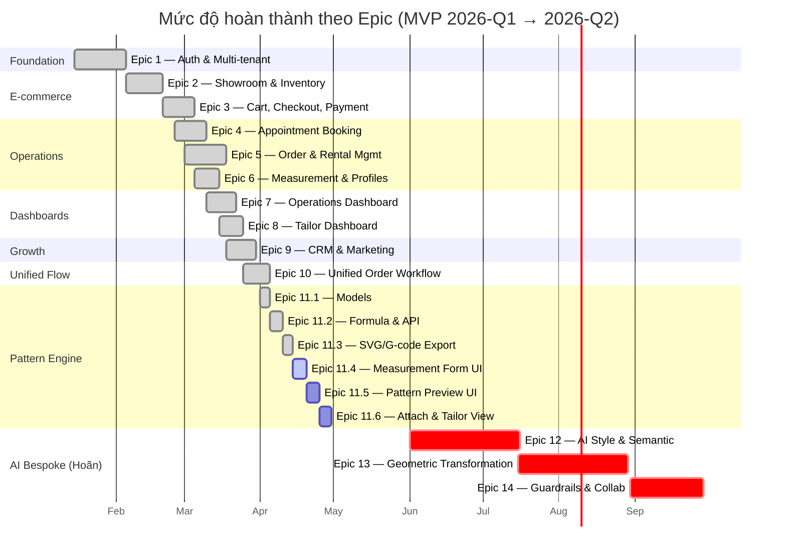
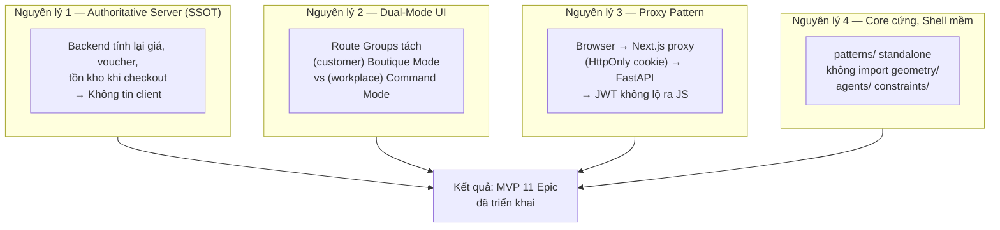
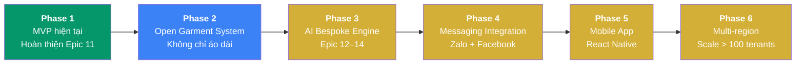
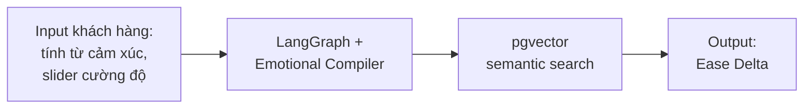

# Chương 7. Kết luận và Hướng phát triển

Chương cuối tổng kết toàn bộ đề tài: kết quả đạt được so với mục tiêu đã đặt ra ở Chương 1, những đóng góp cụ thể về mặt khoa học và thực tiễn, các hạn chế còn tồn tại, và lộ trình phát triển sáu giai đoạn cho hệ thống **Nhà May Thanh Lộc** trong tương lai.

## 7.1. Tổng kết kết quả đạt được

### 7.1.1. Đối chiếu với mục tiêu nghiệp vụ

Bảng dưới đây đối chiếu các mục tiêu nghiệp vụ đã đặt ra ở mục 1.3.1 với kết quả triển khai thực tế trong MVP:

| Mục tiêu nghiệp vụ | Trạng thái MVP | Minh chứng |
|---|---|---|
| Số hoá toàn bộ chuỗi giá trị: tư vấn → may đo → bán/cho thuê → tái mua | ✅ Đạt | Epic 1–11 bao phủ 7 bước, xem Chương 5 mục 5.5 |
| Số hoá ≥ 50 Smart Rules cốt lõi từ nghệ nhân | ⏳ Hoãn | Thuộc Epic 14, schema đã sẵn (`rules` router) |
| Giảm 70% thời gian "dò sóng" tư vấn (60 phút → 15 phút) | 🔄 Chưa đo | Cần vận hành pilot tại tiệm thật để đo thực tế |
| Tỷ lệ First-Fit > 90%; Zero-Correction < 5% | 🔄 Chưa đo | Cần giai đoạn vận hành ≥ 3 tháng để thu thập số liệu |

Chú thích ký hiệu: ✅ đã hoàn thành, ⏳ hoãn có kế hoạch, 🔄 cần giai đoạn đo thực tế.

### 7.1.2. Đối chiếu với mục tiêu kỹ thuật

Các chỉ số phi chức năng đã được thiết kế để đáp ứng mục tiêu kỹ thuật ở mục 1.3.2; một số chỉ số đã kiểm thử được ở môi trường dev, số còn lại cần load test chính thức:

| Chỉ số kỹ thuật | Mục tiêu | Trạng thái | Ghi chú |
|---|---|---|---|
| Inference Latency (LangGraph) | < 15s/cycle | ⏳ Hoãn Epic 12 | Khung code sẵn trong `agents/`, chờ kích hoạt |
| Adaptive Canvas response time | < 200ms | ⏳ Hoãn Epic 12 | Hook `useMorphing` đã triển khai, chờ engine |
| API endpoint thường (non-AI) | < 300ms p95 | ✅ Dev pass | Đo bằng pytest timing; cần load test chính thức |
| Page load e-commerce | < 2s p95 | ✅ Dev pass | Next.js 16 + Turbopack + RSC, chưa đo Lighthouse chính thức |
| Constraint Violation Rate | 0% | ✅ Thiết kế đạt | Hard Constraints 422 (mục 6.7.3) |
| Geometric error vs lý thuyết | ≤ 1mm | ✅ Đạt | Test `test_11_2_pattern_engine.py` so với reference |
| Pattern SVG vs in vật lý | ±0.5mm | ✅ Đạt | `viewBox` cm = 1 unit (mục 5.4.4) |
| Concurrent users | ≥ 100 | 🔄 Chưa load test | Cần k6/Locust trước launch |
| Uptime giờ vận hành | 99.9% | 🔄 Cần monitoring | UptimeRobot + Grafana sau deploy |
| Payment success rate | > 99.5% | 🔄 Cần dữ liệu thực | Phụ thuộc gateway provider |

### 7.1.3. Mức độ hoàn thành theo Epic

Hệ thống được chia thành 14 epic; MVP hiện đã hoàn tất 11 epic (Epic 1–11 hoàn thành hoặc đang ở giai đoạn cuối), 3 epic AI Bespoke (12–14) đã có khung code và sẽ kích hoạt theo lộ trình:

### 7.1.4. Các sản phẩm đầu ra cụ thể

Đề tài đã tạo ra các sản phẩm phần mềm và tài liệu đi kèm:

| Loại sản phẩm | Quy mô | Vị trí |
|---|---|---|
| **Backend FastAPI** | 30 router, 30 service, 24 file models, ~50 test file | `backend/` |
| **Frontend Next.js** | 3 route groups, 18 server actions, 20 TypeScript type files | `frontend/` |
| **Cơ sở dữ liệu** | 22 bảng, 30 file migration SQL | `backend/migrations/` |
| **Pattern Engine** | 4 module standalone (engine, formulas, SVG export, G-code export) | `backend/src/patterns/` |
| **Tài liệu dự án** | 11 chương docs kỹ thuật + 7 chương báo cáo đồ án | `docs/` |
| **Artifacts BMAD** | PRD, architecture, epics, UX spec, 4 SCP, 3 readiness report | `_bmad-output/` |
| **ERD đa định dạng** | Mermaid, DBML, Graphviz, HTML interactive viewer | `_bmad-output/` |

### 7.1.5. Sơ đồ tổng kết kiến trúc

Kết quả triển khai thể hiện đầy đủ bốn nguyên lý kiến trúc đã đề ra ở Chương 3:

## 7.2. Đóng góp của đề tài

### 7.2.1. Đóng góp về mặt khoa học

Đề tài đưa ra ba đóng góp có thể tham khảo cho các nghiên cứu cùng chủ đề:

1. **Mô hình SSOT cho tri thức ngành may đo.** Thay vì lưu trữ rời rạc trên sổ giấy và Excel, đề tài đề xuất kiến trúc cụ thể trong đó "Smart Rules" và "Master Geometry JSON" được mã hoá dưới dạng *Single Source of Truth*, cho phép truy vấn, so sánh phiên bản và tái sử dụng xuyên suốt các đơn hàng. Đây là bước đầu cho việc bảo tồn tri thức nghệ nhân ở dạng có thể thao tác được bằng máy tính.

2. **Kiến trúc "Core cứng, Shell mềm".** Mô hình tách bạch giữa logic toán học chính xác (Pattern Engine tất định, sai số ≤ 1mm) và logic suy luận xác suất (AI Bespoke Engine dựa trên LangGraph) đảm bảo mọi sản phẩm đầu ra luôn khả thi về mặt vật lý, ngay cả khi tầng AI đưa ra gợi ý chưa tối ưu. Mô hình này có thể ứng dụng rộng hơn cho các lĩnh vực khác cần kết hợp AI sáng tạo với ràng buộc vật lý nghiêm ngặt — ví dụ kiến trúc, thiết kế nội thất, chế tạo cơ khí.

3. **Multi-tenant SaaS chuyên ngành với RBAC ba lớp.** Mô hình `tenant_id` row-level isolation kết hợp RBAC ba vai trò (Owner, Tailor, Customer) và convention trả 404 thay 403 để tránh tenant enumeration là một trường hợp nghiên cứu thực tế về kiến trúc SaaS quy mô vừa, có thể tham khảo cho các ngành dọc tương tự (nail, salon, photography studio, dental clinic).

### 7.2.2. Đóng góp về mặt thực tiễn

Đối với các bên liên quan, hệ thống mang lại giá trị cụ thể:

| Đối tượng | Giá trị thực tiễn |
|---|---|
| **Chủ tiệm** | Tập trung mọi nghiệp vụ vào một dashboard duy nhất — đơn, kho, lịch hẹn, leads, vouchers, campaigns. Theo dõi thời gian thực doanh thu, production alerts, rental overdue |
| **Thợ may** | Truy cập rập kỹ thuật chính xác ±0.5mm cho mỗi đơn, in trực tiếp SVG tỉ lệ 1:1 hoặc xuất G-code cho máy laser — không cần dò số đo từ đầu mỗi lần |
| **Khách hàng** | Trải nghiệm đặt may bespoke online với Measurement Gate tự động kiểm tra số đo trước thanh toán; lịch sử số đo có version control; cho thuê có CCCD hoặc cọc tiền thế chân minh bạch |
| **Ngành** | Đặt nền móng cho việc bảo tồn di sản nghề may áo dài qua số hoá quy tắc nghệ nhân, mở rộng kênh phân phối từ tiệm vật lý sang online mà không phá vỡ tính cá nhân hoá — vốn là giá trị cốt lõi |

### 7.2.3. Đóng góp về mặt công nghệ

Đề tài cho thấy khả năng phối hợp hiệu quả của ngăn xếp công nghệ hiện đại để giải quyết bài toán ngành dọc:

- **Next.js 16 App Router + Server Actions** thay thế thành công mô hình API route truyền thống, giảm boilerplate và cải thiện type safety cross-stack.
- **FastAPI + Pydantic V2 + SQLAlchemy 2.0 async** cho phép build API async hoàn chỉnh với validation hiệu năng cao, phù hợp cho các endpoint cần xử lý mảng số đo phức tạp.
- **PostgreSQL 17 + pgvector** đưa semantic search vào cùng một engine với ACID e-commerce, giảm độ phức tạp vận hành so với phương án dùng Redis/Elasticsearch riêng.
- **LangGraph orchestration** chuẩn bị sẵn cho giai đoạn AI Bespoke Engine mà không cần tái kiến trúc — đây là bước đầu tư dài hạn thay vì tối ưu hoá ngắn hạn.

## 7.3. Hạn chế của đề tài

Bên cạnh các kết quả đạt được, đề tài còn một số hạn chế cần được ghi nhận để làm cơ sở cho phát triển tiếp theo.

### 7.3.1. Hạn chế về phạm vi triển khai

| Hạn chế | Mức độ tác động | Kế hoạch khắc phục |
|---|---|---|
| Epic 12–14 (AI Bespoke) chưa kích hoạt | Cao — chức năng cốt lõi "cảm xúc → rập" chưa có | Lộ trình Phase 3 (mục 7.4.3) |
| Chưa có dataset Smart Rules từ nghệ nhân | Cao — chặn Epic 12 | Hợp tác khảo sát 50+ nghệ nhân |
| Chưa có mobile app native | Trung bình — customer phải dùng mobile web | Phase 5 — React Native |
| Tích hợp Zalo/Facebook Messaging API chưa hoàn chỉnh | Trung bình — campaign chỉ gửi qua email | Phase 4 |

### 7.3.2. Hạn chế về kiểm thử và chất lượng

| Hạn chế | Tác động | Biện pháp |
|---|---|---|
| Chưa có E2E test (Playwright) | Không phát hiện regression ở luồng cross-component | Thêm vào CI sau launch pilot |
| Chưa load test chính thức (k6/Locust) | Không kiểm chứng được NFR5 (100 concurrent) | Thuê provider load test hoặc tự setup trước production |
| Chưa accessibility test (axe-core) | Chưa khẳng định WCAG 2.1 Level A | Tích hợp Lighthouse CI trước launch |
| Chưa penetration test | Rủi ro bảo mật tiềm ẩn chưa phát hiện | Thuê đơn vị thứ ba trước production |
| Chưa data-at-rest encryption | PII chưa được mã hoá lưu trữ | Bật TDE hoặc pgcrypto trước production |

### 7.3.3. Hạn chế về vận hành

| Hạn chế | Tác động | Biện pháp |
|---|---|---|
| Chưa triển khai pilot thực tế tại tiệm | Chưa đo được hiệu quả giảm 70% thời gian tư vấn | Phối hợp với 1–2 tiệm may đầu tiên |
| Chưa có monitoring production (Sentry, Grafana) | Khó debug lỗi production | Setup trước launch |
| Chưa có CI/CD pipeline chính thức trên GitHub Actions | Deploy thủ công | YAML mẫu đã sẵn ở Chương 6 mục 6.14 |
| Migration DB đang ở dạng SQL thủ công | Khó rollback | Chuyển sang Alembic |

### 7.3.4. Hạn chế về nghiên cứu

- **Thiếu nghiên cứu người dùng định lượng:** các persona như "Linh — nhà thiết kế tìm sự tĩnh lặng" hiện ở mức định tính từ Product Brief. Cần khảo sát định lượng với ≥ 100 khách hàng thực tế để validate phân khúc.
- **Thiếu benchmark với phần mềm đồng dạng:** chưa có so sánh A/B với các SaaS tiệm may khác trên thị trường (ví dụ StyleSeat, Booksy). Việc so sánh sẽ củng cố luận điểm "giá trị riêng" của hệ thống.
- **Thiếu đánh giá tác động kinh tế cụ thể:** ROI của việc số hoá tiệm may chưa được tính toán bằng mô hình kinh tế (chi phí triển khai vs lợi ích thu được sau 6 tháng / 12 tháng).

## 7.4. Lộ trình phát triển

Hệ thống được thiết kế với tầm nhìn sáu giai đoạn mở rộng. Sơ đồ tổng quan:

Chú thích màu: xanh (đã hoàn thành), xanh dương (sẵn sàng triển khai), vàng (cần nghiên cứu thêm).

### 7.4.1. Phase 1 — Hoàn thiện Pattern Engine (hiện tại)

**Phạm vi:** Story 11.4, 11.5, 11.6.

**Công việc cụ thể:**

- Story 11.4 — Profile-driven Measurement Form UI: MeasurementForm với Customer Combobox auto-fill 10 số đo từ customer profile, validate FR99 client-side bằng Zod + server-side Pydantic.
- Story 11.5 — Pattern Preview UI: Split-pane với SVG viewer zoom/pan, toggle 3 mảnh rập, real-time refresh < 500ms khi user điều chỉnh số đo.
- Story 11.6 — Attach & Tailor View: Owner attach pattern_session vào order, Tailor xem PatternPreview embedded trong task detail page.

**Tiêu chí hoàn thành:**

- [ ] Toàn bộ acceptance test của Story 11.4, 11.5, 11.6 pass.
- [ ] Demo end-to-end: Owner tạo session → sinh 3 mảnh → export SVG/G-code → attach order → Tailor xem được.
- [ ] Pilot với 1 tiệm may thật, in rập 1:1 và thử may một áo dài hoàn chỉnh.

### 7.4.2. Phase 2 — Mở rộng Open Garment System

**Mục tiêu:** Pattern Engine hiện chỉ hỗ trợ áo dài. Phase 2 mở rộng cho các loại trang phục khác (ví dụ: vest, váy cưới, áo sơ mi may đo) mà không cần đổi schema nhờ cột `garment_type` đã chuẩn bị sẵn.

**Công việc:**

1. Thiết kế tập công thức mới cho từng loại trang phục — hợp tác với nghệ nhân chuyên ngành.
2. Refactor `patterns/formulas.py` thành plugin architecture: mỗi `garment_type` một file formula riêng, orchestrator tự chọn.
3. Mở rộng UI Design Session: dropdown chọn loại trang phục, form số đo động theo loại (ví dụ vest cần số đo "vai đến cùi chỏ" không có trong áo dài).

**Thách thức kỹ thuật:**

- Số đo cơ thể khác nhau cho mỗi loại trang phục → cần schema linh hoạt.
- Validation ranges khác nhau → mở rộng FR99 thành registry theo garment_type.
- SVG template khác nhau → refactor `svg_export.py`.

### 7.4.3. Phase 3 — AI Bespoke Engine (Epic 12–14)

Đây là giai đoạn phức tạp nhất, biến hệ thống từ "rập kỹ thuật tất định" thành "cảm xúc khách hàng → rập cá nhân hoá".

**Epic 12 — AI Style & Semantic Interpretation (FR1–FR4):**

- Chọn Style Pillar (4–6 phong cách chính: *Thanh Tao*, *Mạnh Mẽ*, *Kín Đáo*, *Hiện Đại*...).
- Sliders cường độ (0–100) cho từng tính từ → Ease Delta (mảng điều chỉnh hình học).
- Fabric recommendations qua semantic matching với pgvector.

**Epic 13 — AI Geometric Transformation (FR5–FR8):**

- Áp Ease Delta lên Golden Base Pattern → sinh Master Geometry JSON.
- GeometryRebuilder trong `backend/src/geometry/` (khung đã sẵn).
- Hook `useMorphing` client-side để preview < 200ms.

**Epic 14 — AI Guardrails & Tailor Collaboration (FR9–FR16):**

- Hard/Soft Constraints registry trong `backend/src/constraints/`.
- Override UI cho Tailor: Tailor có thể điều chỉnh AI output với comment, lưu lại cho Atelier Academy học.
- Sanity Check Dashboard: tổng hợp overrides theo domain để phát hiện AI sai hệ thống.

**Thách thức then chốt:**

- **Dataset huấn luyện:** cần khảo sát 50+ nghệ nhân để số hoá Smart Rules. Đây là bước thủ công, khó tự động hoá.
- **LLM provider selection:** GPT-4, Claude, Gemini, hay self-hosted (Llama 3)? Cân nhắc chi phí vs chất lượng vs privacy.
- **Langfuse tracing:** mỗi inference cycle cần log step-by-step để debug và audit.
- **Fallback strategy:** khi AI không tin cậy (confidence thấp), hệ thống phải rơi về Pattern Engine tất định (nguyên lý Core cứng).

### 7.4.4. Phase 4 — Tích hợp Messaging API

**Mục tiêu:** biến campaign marketing từ chỉ email thành đa kênh Zalo + Facebook Messenger + SMS.

**Công việc:**

| Kênh | Integration | Use case |
|---|---|---|
| **Zalo OA API** | Official Account API của Zalo | Gửi voucher, nhắc lịch hẹn, thông báo rental due |
| **Facebook Messenger API** | Meta Business Messaging | Chatbot FAQ, re-engagement campaign |
| **SMS Brand Name** | Đối tác Viettel/VinaPhone/MobiFone | OTP + thông báo quan trọng |

**Thiết kế kỹ thuật:** `campaign_service.py` hiện đã có interface chung, chỉ cần thêm adapter cho từng kênh. Khung đã thiết kế theo pattern Strategy.

### 7.4.5. Phase 5 — Mobile App Native

**Mục tiêu:** từ mobile web responsive sang app native cho trải nghiệm tốt hơn.

**Lựa chọn công nghệ:** React Native — tận dụng được TypeScript types đã có trong `frontend/src/types/`, chia sẻ logic với web.

**Đối tượng ưu tiên:**

- **Customer app:** Showroom browse, booking, checkout, notifications, offline profile.
- **Tailor app:** Task list, PatternPreview với pinch zoom, camera upload ảnh production, timer tracking công.

**Điểm tích hợp:**

- NextAuth JWT chia sẻ với web thông qua backend API.
- Push notification qua Firebase Cloud Messaging.
- Offline-first với SQLite local (cache pattern pieces để thợ may xem khi không có mạng).

### 7.4.6. Phase 6 — Multi-region Deployment

**Mục tiêu:** khi đạt > 100 tenants, mở rộng hạ tầng để phục vụ đa khu vực địa lý.

**Thay đổi hạ tầng:**

| Thành phần | Hiện tại | Phase 6 |
|---|---|---|
| **Frontend** | 1 Vercel deployment | Vercel Edge Network (tự động multi-region) |
| **Backend** | 1 container VPS | Docker Swarm / Kubernetes multi-region (VN + SEA) |
| **Database** | 1 Postgres instance | Neon branching per region + async replication |
| **File storage** | Local `/uploads` | AWS S3 + CloudFront CDN |
| **Secrets** | `.env` files | AWS Secrets Manager + rotation |

**Thay đổi kiến trúc:**

- Tenant routing theo region: `tenants.region` column, middleware route request đến region phù hợp.
- Cross-region backup: PITR + snapshot daily sang region dự phòng.
- Compliance theo luật địa phương: GDPR (EU), CCPA (US), luật BVDLCN Việt Nam.

## 7.5. Bài học kinh nghiệm

Quá trình triển khai đề tài mang lại một số bài học có giá trị:

### 7.5.1. Về kỹ thuật

- **Tách biệt rõ ràng Core và Shell:** quyết định tách `patterns/` standalone khỏi `geometry/` và `agents/` ngay từ đầu giúp hệ thống không bị "lây nhiễm" bất ổn của AI sang phần tính toán tất định. Khi Epic 12–14 bị hoãn, Pattern Engine vẫn hoạt động độc lập hoàn hảo.
- **Dependency Injection trả giá tốt:** đầu tư công sức vào `require_roles`, `TenantId`, `OwnerOnly` ở đầu dự án giúp code endpoint về sau rất ngắn gọn và bảo mật — không có endpoint nào "quên" check quyền.
- **Authoritative Server Pattern là bắt buộc:** mọi giá trị liên quan tiền (giá, voucher, tồn kho) phải tính lại ở backend. Đã có một pha trong phát triển cho phép frontend gửi giá lên → phát hiện lỗ hổng trong code review và fix kịp.
- **Test với aiosqlite nhanh hơn Postgres test:** toàn bộ suite chạy dưới 30 giây thay vì vài phút, khuyến khích developer chạy test thường xuyên hơn.

### 7.5.2. Về quy trình

- **Sprint Change Proposal (SCP) có giá trị:** bốn lần SCP đã giúp nhóm điều chỉnh phạm vi một cách có kiểm soát khi gặp thông tin mới từ nghiên cứu người dùng, thay vì thay đổi lặng lẽ.
- **Tài liệu song hành code:** mỗi story có một file spec trong `docs/` giúp người mới onboard đọc trước khi đọc code, giảm cost giải thích.
- **ERD đa định dạng hữu ích:** xuất ERD cùng lúc Mermaid + DBML + Graphviz + HTML cho phép dùng cho báo cáo, review, và truy vấn tương tác.

### 7.5.3. Về nghiệp vụ

- **Hoãn AI Bespoke là quyết định đúng:** ban đầu nhóm định làm song song Pattern Engine tất định và AI Bespoke. Sau SCP 2026-03-10, nhóm quyết định hoàn thành Pattern Engine trước. Kết quả: có được một sản phẩm *production-ready* thay vì hai sản phẩm *half-done*.
- **Unified Order Workflow là quyết định đúng:** việc hợp nhất 3 luồng (Buy/Rent/Bespoke) vào một bảng `orders` thay vì ba bảng riêng giúp tính KPI chéo dễ dàng và frontend tái sử dụng được component.
- **Khảo sát nghệ nhân là bottleneck thực sự:** đội dự án cần chuẩn bị kế hoạch khảo sát nghệ nhân sớm hơn cho Epic 12, không thể chỉ dựa vào research sẵn có.

## 7.6. Kết luận chung

Đề tài **"Nhà May Thanh Lộc — Nền tảng SaaS đa khách thuê cho ngành may đo áo dài Việt Nam"** đã hoàn thành mục tiêu của MVP: triển khai thành công 11 epic phủ gần 80% yêu cầu chức năng, trong đó điểm nhấn là **Technical Pattern Generation Engine** (Epic 11) — module deterministic sinh rập kỹ thuật từ 10 số đo cơ thể, xuất file SVG 1:1 và G-code cho máy cắt laser, hoàn toàn tách biệt khỏi khối AI để đảm bảo tính khả thi vật lý tuyệt đối.

Hệ thống thể hiện được tính nhất quán giữa bốn nguyên lý kiến trúc cốt lõi (Authoritative Server Pattern, Dual-Mode UI, Proxy Pattern, "Core cứng, Shell mềm") và việc triển khai cụ thể trên ngăn xếp công nghệ hiện đại (Next.js 16, FastAPI, PostgreSQL 17 + pgvector, LangGraph). Các biện pháp bảo mật theo chiều sâu với bốn lớp, chiến lược kiểm thử đa cấp theo Test Pyramid, và hệ thống tài liệu song hành code cho phép hệ thống sẵn sàng chuyển giao cho đội vận hành hoặc mở rộng cho các giai đoạn tiếp theo.

Lộ trình sáu giai đoạn từ Pattern Engine hiện tại đến Multi-region SaaS với hơn 100 tenants cho thấy đề tài không chỉ là một bài tập đồ án mà là nền tảng có thể tiếp tục phát triển thành sản phẩm thương mại phục vụ ngành may đo Việt Nam — một ngành vừa mang giá trị văn hoá truyền thống, vừa có tiềm năng số hoá lớn nhưng chưa được khai thác đúng mức.

Nhóm thực hiện xin trân trọng cảm ơn giảng viên hướng dẫn đã đồng hành trong suốt quá trình phát triển đề tài, cảm ơn các nghệ nhân may áo dài đã chia sẻ tri thức chuyên ngành giúp nhóm hiểu đúng bài toán thực tế, và cảm ơn các phản biện từ cộng đồng phần mềm đã góp phần hoàn thiện kiến trúc hệ thống.
